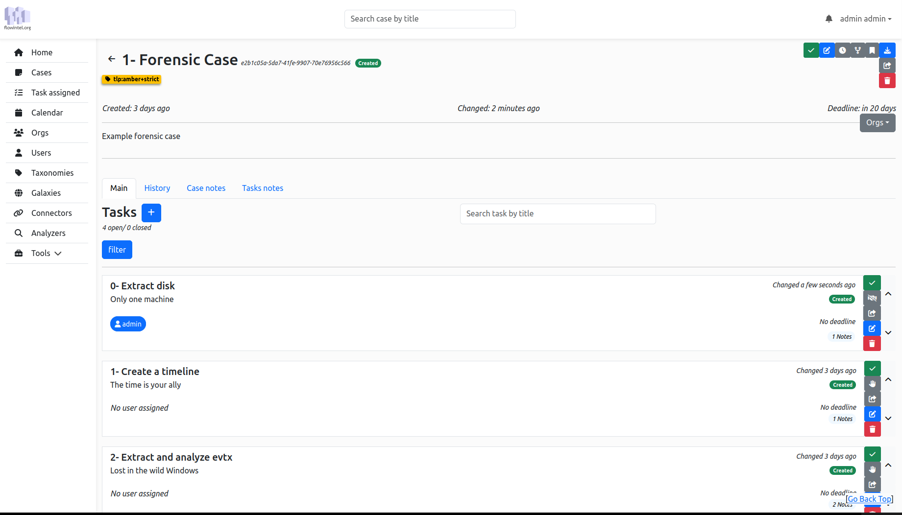

Flowintel is an open-source platform designed to assist analysts in organizing their cases and tasks. It features a range of tools and functionalities to enhance workflow efficiency. 

## Features

- **Case and Task Management**: Tailored for security analysts, enabling efficient tracking and organization.

- **Rich Documentation Tools**: Includes Markdown and Mermaid integration for detailed notes, with export options like PDF.

- **Integration with MISP standard**: Seamless connection with [MISP taxonomies](https://github.com/MISP/misp-taxonomies) and [MISP galaxy](https://www.misp-galaxy.org/).

- **Calendar and Notifications**: Features an efficient calendar view and notifications for timely task management.

- **Templating System**: Provides templates for cases and tasks, creating a playbook and process repository for cybersecurity.

- **Flexible Data Export**: Offers modules for exporting data to platforms like [MISP](https://www.misp-project.org/), [AIL](https://www.ail-project.org/), and more.

- **Accessible API**: Exposes an API for easy interaction with FlowIntel's functionalities.

- **Advanced Analysis Modules**: Leverages MISP modules for automated enrichment, threat intelligence, and data correlation.

- **User and Workflow Management**: Supports organizational structuring, task assignments, and a queueing system for efficient workload distribution.

- **Comprehensive Audit Logging**: Maintains a full audit trail of all actions, ensuring transparency and compliance.



## Quick start

Copy the **default configuration**:

```
cd flowintel
cp conf/config.py.default conf/config.py
cp conf/config_module.py.default conf/config_module.py
```

Change the **configuration** in  `conf/config.py`

Run the **installation** script `./install.sh`

**Start** the application with `./launch.sh -l`

#### Account

- email: `admin@admin.admin`

- password: `admin`

## Documentation

A more detailed documentation can be found here: [https://flowintel.github.io/flowintel-doc](https://flowintel.github.io/flowintel-doc)

There is also a recorded training [available on YouTube](https://www.youtube.com/watch?v=Dx03GqW1SN0) 


## Using vite

To build assets using vite:

```bash
cd app/assets
npm run build:static
```

## Roadmap
Overview of features currently under development.
https://github.com/orgs/flowintel/projects/5


## License

This software is licensed under [GNU Affero General Public License version 3](http://www.gnu.org/licenses/agpl-3.0.html)

```
Copyright (C) 2022-2023 CIRCL - Computer Incident Response Center Luxembourg
Copyright (C) 2022-2023 David Cruciani
```

## Funding

Flowintel is co-funded by [CIRCL](https://www.circl.lu/) and by the European Union under [FETTA](https://www.circl.lu/pub/press/20240131/) (Federated European Team for Threat Analysis) project.


