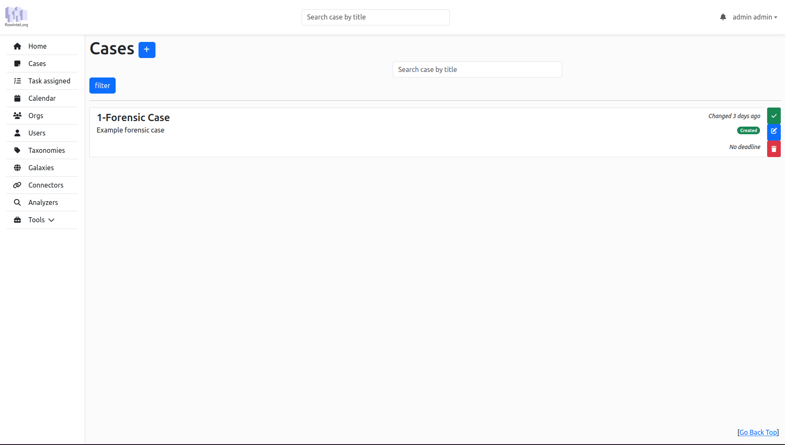

# Flowintel-cm

FlowIntel CM is an open-source platform designed to assist analysts in organizing their cases and tasks. It features a range of tools and functionalities to enhance workflow efficiency. 

## Features

- **Case and Task Management**: Tailored for security analysts, enabling efficient tracking and organization.
- **Rich Documentation Tools**: Includes Markdown and Mermaid integration for detailed notes, with export options like PDF.
- **Integration with MISP standard**: Seamless connection with [MISP taxonomies](https://github.com/MISP/misp-taxonomies) and [MISP galaxy](https://www.misp-galaxy.org/).
- **Calendar and Notifications**: Features an efficient calendar view and notifications for timely task management.
- **Templating System**: Provides templates for cases and tasks, creating a playbook and process repository for cybersecurity.
- **Flexible Data Export**: Offers modules for exporting data to platforms like [MISP](https://www.misp-project.org/), [AIL](https://www.ail-project.org/), and more.
- **Accessible API**: Exposes an API for easy interaction with FlowIntel CM's functionalities.




## Installation

```
./install.sh
./launch.sh -i # To init the db\
./launch.sh -l
```

## 

## Configuration

Go to `config.py` and change just like you want to.

## 

## Account

- email: `admin@admin.admin`

- password: `admin`

After login go to `Users->New User` and create a new user with admin right. Then go back to `Users` and delete `admin` user

## 

## Screen

A screen is created to notify recurrent case. To access it:

```bash
screen -r fcm
```

## Importer

Import a case and its tasks:

```json
{
  "title": "Super Case",
  "description": "My super case for the documentation",
  "uuid": "0b1f9a85-0d38-46a1-b9dd-1eeea1608308",
  "deadline": null,
  "recurring_date": null,
  "recurring_type": null,
  "tasks": [
    {
      "title": "Prepare a super tea",
      "description": "Keep it as hot as possible",
      "uuid": "ddd271b4-d7f8-4af0-a9b3-46ad52aca1bf",
      "notes": "# Preparation\n- add one sugar\n",
      "url": "",
      "deadline": null
    }
  ]
}
```

## Api

#### Case

`/api/case/doc`

##### Admin

`/api/admin/doc`

#### Templating

`/api/template/doc`

#### Importer

`/api/importer/doc`

## Screenshots

### My Assignment


### Calendar


### Template


### Importer


### Orgs


### Users


## License

This software is licensed under [GNU Affero General Public License version 3](http://www.gnu.org/licenses/agpl-3.0.html)

Copyright (C) 2022-2023 CIRCL - Computer Incident Response Center Luxembourg
Copyright (C) 2022-2023 David Cruciani
