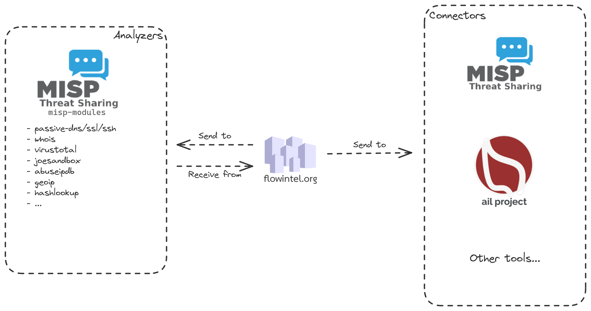
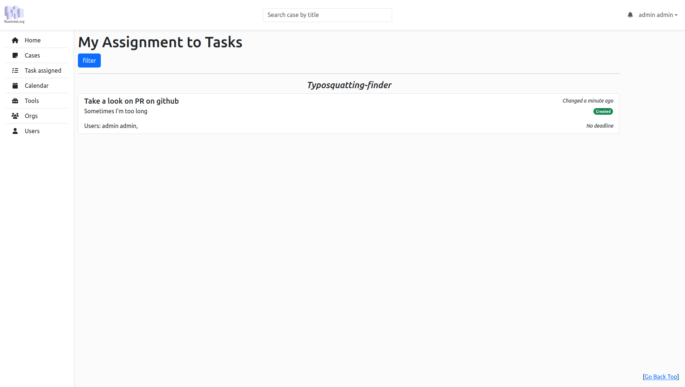
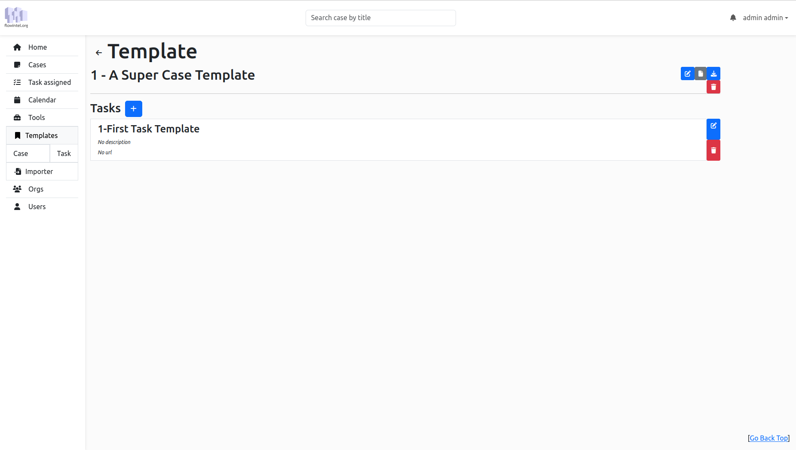
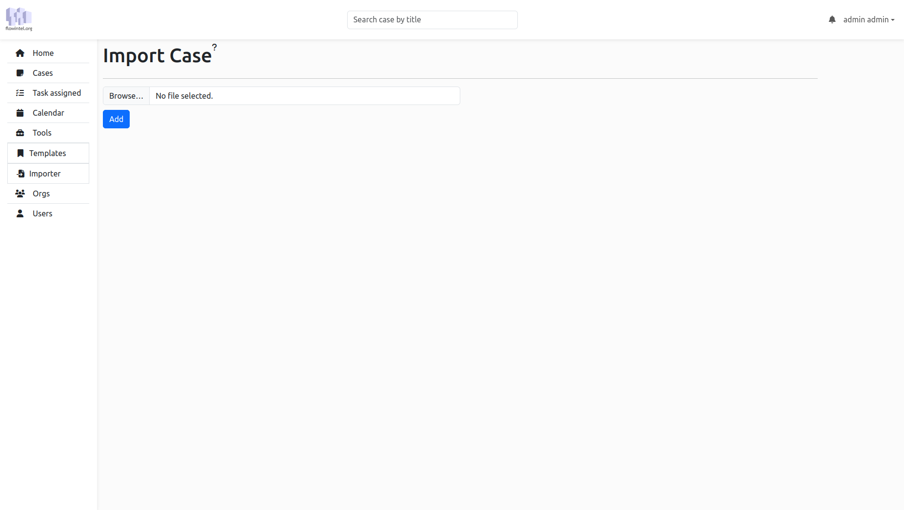
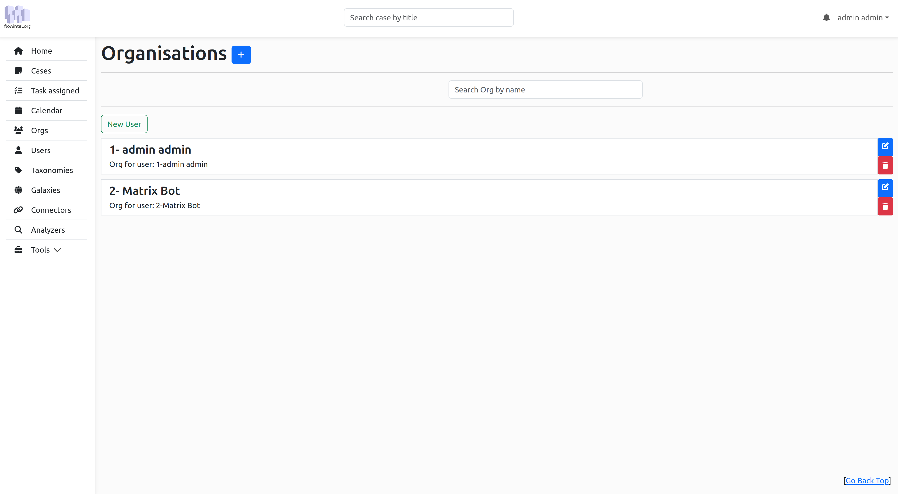
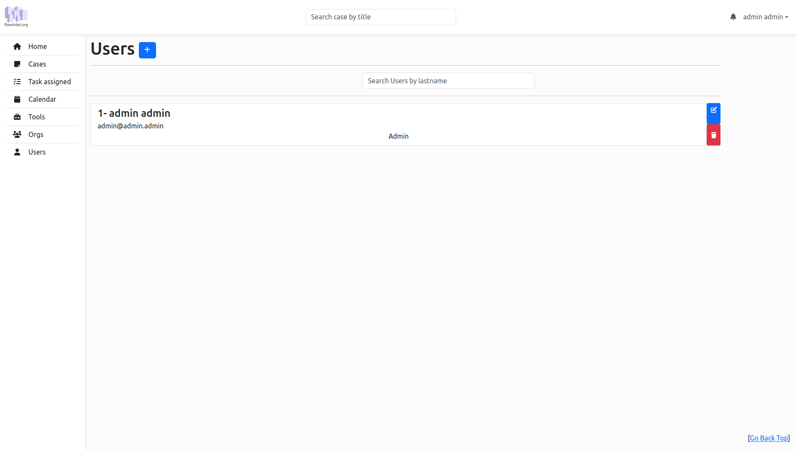

flowIntel is an open-source platform designed to assist analysts in organizing their cases and tasks. It features a range of tools and functionalities to enhance workflow efficiency. 

## Features

- **Case and Task Management**: Tailored for case handlers, investigators and security analysts, enabling efficient tracking and organization.
- **Rich Documentation Tools**: Includes Markdown and Mermaid integration for detailed notes, with export options like PDF and DOCX.
- **Integration with MISP standard**: Seamless connection with [MISP taxonomies](https://github.com/MISP/misp-taxonomies) and [MISP galaxy](https://www.misp-galaxy.org/).
- **Calendar and Notifications**: Features an efficient calendar view and notifications for timely task management.
- **Templating System**: Provides templates for cases and tasks, creating a playbook and process repository for cybersecurity.
- **Flexible Data Export**: Offers modules for exporting data to platforms like [MISP](https://www.misp-project.org/), [AIL](https://www.ail-project.org/), and more.
- **Accessible API**: Exposes an API for easy automation and of processes, interaction with FlowIntel CM's functionalities and interaction with other forensic tools, and streamline the collection and analysis of data.
- Support for **external analysers** (MISP-modules, such as Passive DNS, Passive SSL, JoeSandbox, AbuseIPDB) and **external connectors** (MISP, AIL).
- Basic **organisation and user management**, including queueing system and task assignment.
- Full **audit trail** of all actions.


## Quick start

Change the **configuration** `/conf/config.py`

run the **installation** script `./install.sh`

**Start** the application with `./launch.sh -l`

#### Account

- email: `admin@admin.admin`

- password: `admin`

## Analyzers vs Connectors



Analyzers receive data from flowintel and can send data to flowintel to enrich notes of cases or tasks.

Connectors can only receive data from flowintel. In the case of MISP, this will result in the creation of an event with a flowintel-cm-case object for a case and a flowintel-cm-task object for a task.

## Screen

A screen is created to notify recurrent case. To access it:

```bash
screen -r fcm
```

## Importer

Import a case and its tasks:

```json
{
  "title": "Super Case",
  "description": "My super case for the documentation",
  "uuid": "0b1f9a85-0d38-46a1-b9dd-1eeea1608308",
  "deadline": null,
  "recurring_date": null,
  "recurring_type": null,
  "tasks": [
    {
      "title": "Prepare a super tea",
      "description": "Keep it as hot as possible",
      "uuid": "ddd271b4-d7f8-4af0-a9b3-46ad52aca1bf",
      "notes": "# Preparation\n- add one sugar\n",
      "url": "",
      "deadline": null
    }
  ]
}
```

## Api

#### Case

`/api/case/doc`

##### Admin

`/api/admin/doc`

#### Templating

`/api/template/doc`

#### Importer

`/api/importer/doc`

## Screenshots

### My Assignment



### Calendar


### Template



### Importer



### Orgs



### Users



## License

This software is licensed under [GNU Affero General Public License version 3](http://www.gnu.org/licenses/agpl-3.0.html)

```
Copyright (C) 2022-2023 CIRCL - Computer Incident Response Center Luxembourg
Copyright (C) 2022-2023 David Cruciani
```

## Funding


