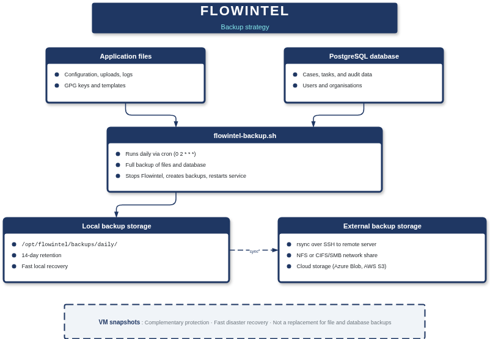

# Flowintel backup and restore

## Introduction

Regular backups are essential for protecting your Flowintel case management data against hardware failures, data corruption, accidental deletion, or security incidents. This document describes best practices for backing up and restoring Flowintel installations.

A complete Flowintel backup consists of two components:

1. **File system backup**: Application files, uploads, configurations, and logs
2. **Database backup**: Case data, users, tasks, and audit information

## Backup strategy



### Backup frequency and retention

Flowintel uses a daily backup approach:

- **Daily backups**: Full backup of database and file system
- **Retention**: Backups are retained for 14 days

Adjust the retention period based on your organisation's compliance requirements and available storage capacity.

### Backup storage location

All backups are stored in `/opt/flowintel/backups`:

```
/opt/flowintel/backups/
└── daily/          # Daily database and file backups
```

**Important**: The backup directory is on the same server as Flowintel. This provides fast local recovery but does not protect against server-level failures. See the "External backup storage" section for offsite backup options.

### Virtual machine snapshots

If Flowintel is running on a virtual machine (VMware, KVM, Azure, AWS, etc.), configure regular VM snapshots as an additional layer of protection.

**Important**: VM snapshots are not a replacement for file and database backups. They complement each other:

- **VM snapshots**: Fast disaster recovery, complete system restoration
- **File/database backups**: Granular recovery, long-term retention, platform-independent

## Prerequisites

Before configuring backups, ensure you have:

- [ ] Sufficient disk space in `/opt/flowintel` for backup storage
- [ ] Root or sudo access for backup configuration
- [ ] PostgreSQL administrative access (for database backups)
- [ ] Flowintel installation at `/opt/flowintel/flowintel`

Check available disk space:

```bash
df -h /opt/flowintel
```

You need at least 2-3 times the current data size available for backups and rotation.

## Prepare your system for backups

### Create backup directory structure

Set up the backup directory structure with permissions that allow both the Flowintel user and the postgres user to write backups to the same location.

Start by creating the directory tree:

```bash
sudo mkdir -p /opt/flowintel/backups/daily
```

Set ownership so the Flowintel user owns the directory and the postgres group has write access. This is necessary because the database dump runs as the postgres user, while the file system backup runs as the Flowintel user.

```bash
# Replace 'yourusername' with the Flowintel user
sudo chown -R yourusername:postgres /opt/flowintel/backups
sudo chmod 775 /opt/flowintel/backups
sudo chmod 775 /opt/flowintel/backups/daily
```

Create a shared log file where both users can record backup results:

```bash
sudo touch /opt/flowintel/backups/backup.log
sudo chown yourusername:postgres /opt/flowintel/backups/backup.log
sudo chmod 664 /opt/flowintel/backups/backup.log
```

Finally, add the Flowintel user to the postgres group so it can read the database dump files that postgres creates:

```bash
sudo usermod -a -G postgres yourusername
```

**Note**: The group change takes effect on next login. If you need it immediately, log out and back in or run `newgrp postgres`.

### Daily backup script

Install the daily backup script

```bash
# Copy from Flowintel
sudo cp /opt/flowintel/flowintel/doc/flowintel-backup.sh /opt/flowintel/backups/flowintel-backup.sh

# Make it executable
sudo chmod +x /opt/flowintel/backups/flowintel-backup.sh

# Test the backup script:
sudo /opt/flowintel/backups/flowintel-backup.sh
```

## Backup scheduling

Set up automated daily backups using cron. The script runs as root because it needs to stop/start Flowintel:

```bash
sudo vi /etc/crontab
```

Add:

```bash
# Daily backup at 2:00 AM
0 2 * * * root /opt/flowintel/backups/flowintel-backup.sh
```

## Retention time

The backup script automatically removes backups older than the configured retention period. This is controlled by the `RETENTION_DAYS` variable near the top of the script:

```bash
# In /opt/flowintel/backups/flowintel-backup.sh
RETENTION_DAYS=14
```

With the default setting, backups are kept for 14 days before being deleted. If your organisation requires a longer or shorter retention window, edit `flowintel-backup.sh` and change the value to suit your needs.

## Verifying backups

### Test backup integrity

After a backup completes, check that the resulting files are valid. The backup script stores its output in `/opt/flowintel/backups/daily/` with timestamped filenames. List the directory to find the most recent backup:

```bash
ls -lh /opt/flowintel/backups/daily/
```

To verify the file system archive, list its contents without extracting. If the command produces a file listing, the archive is intact:

```bash
tar -tzf /opt/flowintel/backups/daily/flowintel_files_20260130_020001.tar.gz | head -20
```

For the database dump, decompress and display the first few lines. You should see SQL statements beginning with `--` comments and `SET` commands:

```bash
gunzip -c /opt/flowintel/backups/daily/flowintel_db_20260130_020001.sql.gz | head -20
```

### Monitor backup logs

Check backup logs regularly:

```bash
tail -50 /opt/flowintel/backups/backup.log
```

## External backup storage

Backups stored on the same server as Flowintel do not protect against server failures, disk failures, or site-level disasters. You should implement one or more of the following external backup strategies:

- **Remote server sync with rsync**: Synchronise backups to a remote backup server using rsync over SSH
- **Mount remote storage**: Mount a remote NFS or CIFS/SMB share at `/opt/flowintel/backups`
- **Cloud storage**: Upload backups to cloud providers such as Azure Blob Storage, AWS S3, or Google Cloud Storage

## Restore procedures

If you need to recover from data loss, corruption, or a failed upgrade, the steps below walk through restoring the database and file system from a daily backup. Always restore the database first, then the files, so that the application and its data are consistent when Flowintel starts.

This guide covers full restores only. If you need to recover individual items (for example a single case export or just the uploads directory), restore the backup to a separate temporary location and copy the specific files you need back into the live installation. Do not extract a full backup over a running system when you only need part of it.

Before you begin, identify the backup you want to restore. List the contents of the backup directory and note the timestamp of the backup set you need:

```bash
ls -lh /opt/flowintel/backups/daily/
```

Each backup produces two files with matching timestamps: a database dump (`flowintel_db_*.sql.gz`) and a file system archive (`flowintel_files_*.tar.gz`). Use the same timestamp for both when restoring.

### Database restore

Stop Flowintel so that no new data is written while the database is being replaced:

```bash
sudo systemctl stop flowintel
```

If you are restoring to a clean state (for example after corruption or a failed migration), drop and recreate the database. Skip this step if you only need to roll back specific data and the existing database is still intact:

```bash
sudo -u postgres psql

DROP DATABASE flowintel;
CREATE DATABASE flowintel OWNER flowintel;
\q
```

Restore the database from the compressed SQL dump. This pipes the decompressed output directly into PostgreSQL, which replays all the SQL statements to recreate tables and data:

```bash
gunzip -c /opt/flowintel/backups/daily/flowintel_db_20260130_020001.sql.gz | sudo -u postgres psql flowintel
```

### File system restore

The file system archive contains the full Flowintel directory, including configuration files, uploaded attachments, GPG keys, and templates. Extract it from the installation root:

```bash
cd /opt/flowintel
tar -xzf backups/daily/flowintel_files_20260130_030001.tar.gz
```

After extracting, reset ownership and permissions so that the Flowintel service user can access all restored files:

```bash
# Replace 'yourusername' with the Flowintel service user
sudo chown -R yourusername:yourusername /opt/flowintel/flowintel
sudo chmod 750 /opt/flowintel/flowintel
```

### Restart and verify

Start Flowintel and confirm the service is running:

```bash
sudo systemctl start flowintel
sudo systemctl status flowintel
```

Open the web interface and verify that your cases, tasks, and uploaded files are present. Check the application log for any errors:

```bash
tail -50 /opt/flowintel/flowintel/logs/record.log
```
