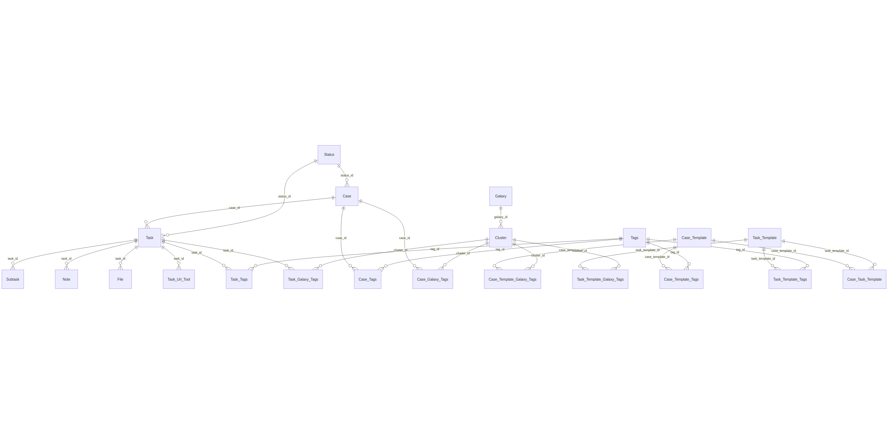
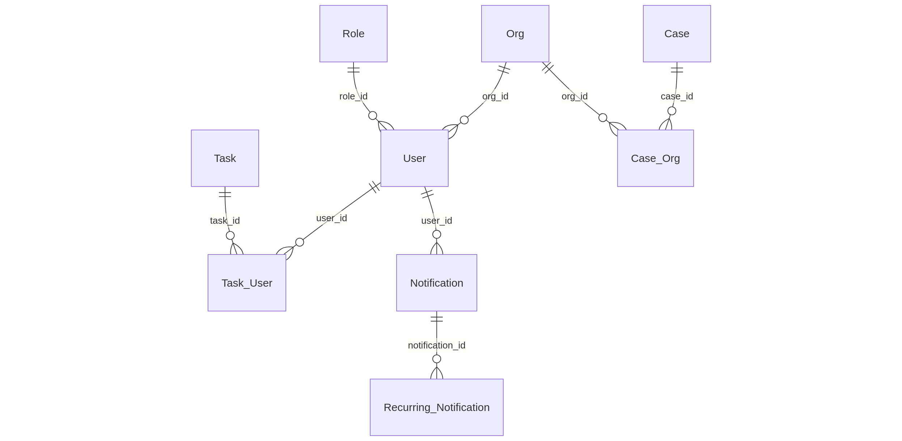

# Contributor documentation

Information that is useful if you want to contribute to the project.


# Database

## Database model


```
erDiagram
  Org ||--o{ User : "org_id"
  Role ||--o{ User : "role_id"

  Case ||--o{ Task : "case_id"
  Status ||--o{ Case : "status_id"
  Status ||--o{ Task : "status_id"

  User ||--o{ Task_User : "user_id"
  Task ||--o{ Task_User : "task_id"

  Task ||--o{ Subtask : "task_id"
  Task ||--o{ Note : "task_id"
  Task ||--o{ File : "task_id"
  Task ||--o{ Task_Url_Tool : "task_id"

  Case ||--o{ Case_Org : "case_id"
  Org  ||--o{ Case_Org : "org_id"

  Notification ||--o{ Recurring_Notification : "notification_id"
  User ||--o{ Notification : "user_id"

  Case_Template ||--o{ Case_Task_Template : "case_template_id"
  Task_Template ||--o{ Case_Task_Template : "task_template_id"

  Case ||--o{ Case_Tags : "case_id"
  Tags ||--o{ Case_Tags : "tag_id"

  Task ||--o{ Task_Tags : "task_id"
  Tags ||--o{ Task_Tags : "tag_id"

  Case_Template ||--o{ Case_Template_Tags : "case_template_id"
  Tags ||--o{ Case_Template_Tags : "tag_id"

  Task_Template ||--o{ Task_Template_Tags : "task_template_id"
  Tags ||--o{ Task_Template_Tags : "tag_id"

  Galaxy ||--o{ Cluster : "galaxy_id"

  Case ||--o{ Case_Galaxy_Tags : "case_id"
  Cluster ||--o{ Case_Galaxy_Tags : "cluster_id"

  Task ||--o{ Task_Galaxy_Tags : "task_id"
  Cluster ||--o{ Task_Galaxy_Tags : "cluster_id"

  Case_Template ||--o{ Case_Template_Galaxy_Tags : "case_template_id"
  Cluster ||--o{ Case_Template_Galaxy_Tags : "cluster_id"

  Task_Template ||--o{ Task_Template_Galaxy_Tags : "task_template_id"
  Cluster ||--o{ Task_Template_Galaxy_Tags : "cluster_id"

  Connector ||--o{ Connector_Instance : "connector_id"
  Connector_Icon ||--o{ Icon_File : "icon_file_id"

  Case_Misp_Object ||--o{ Misp_Attribute : "case_misp_object_id"
```

## Case / tasks



```
erDiagram
  Case ||--o{ Task : "case_id"
  Status ||--o{ Case : "status_id"
  Status ||--o{ Task : "status_id"

  Task ||--o{ Subtask : "task_id"
  Task ||--o{ Note : "task_id"
  Task ||--o{ File : "task_id"
  Task ||--o{ Task_Url_Tool : "task_id"

  %% Tags on cases & tasks
  Case ||--o{ Case_Tags : "case_id"
  Task ||--o{ Task_Tags : "task_id"
  Tags ||--o{ Case_Tags : "tag_id"
  Tags ||--o{ Task_Tags : "tag_id"

  %% Galaxy/Cluster on cases & tasks
  Galaxy ||--o{ Cluster : "galaxy_id"
  Case ||--o{ Case_Galaxy_Tags : "case_id"
  Task ||--o{ Task_Galaxy_Tags : "task_id"
  Cluster ||--o{ Case_Galaxy_Tags : "cluster_id"
  Cluster ||--o{ Task_Galaxy_Tags : "cluster_id"

  %% Templates linked to tasks in cases (optional view)
  Case_Template ||--o{ Case_Task_Template : "case_template_id"
  Task_Template ||--o{ Case_Task_Template : "task_template_id"

  %% Template tagging (optional view)
  Case_Template ||--o{ Case_Template_Tags : "case_template_id"
  Task_Template ||--o{ Task_Template_Tags : "task_template_id"
  Tags ||--o{ Case_Template_Tags : "tag_id"
  Tags ||--o{ Task_Template_Tags : "tag_id"

  %% Template galaxy clusters (optional view)
  Case_Template ||--o{ Case_Template_Galaxy_Tags : "case_template_id"
  Task_Template ||--o{ Task_Template_Galaxy_Tags : "task_template_id"
  Cluster ||--o{ Case_Template_Galaxy_Tags : "cluster_id"
  Cluster ||--o{ Task_Template_Galaxy_Tags : "cluster_id"
```

### Users



```
erDiagram
  Org ||--o{ User : "org_id"
  Role ||--o{ User : "role_id"

  %% Users assigned to tasks
  User ||--o{ Task_User : "user_id"
  Task ||--o{ Task_User : "task_id"

  %% Case visibility to organisations
  Case ||--o{ Case_Org : "case_id"
  Org  ||--o{ Case_Org : "org_id"

  %% Notifications (user-scoped) & recurring schedules
  User ||--o{ Notification : "user_id"
  Notification ||--o{ Recurring_Notification : "notification_id"
```