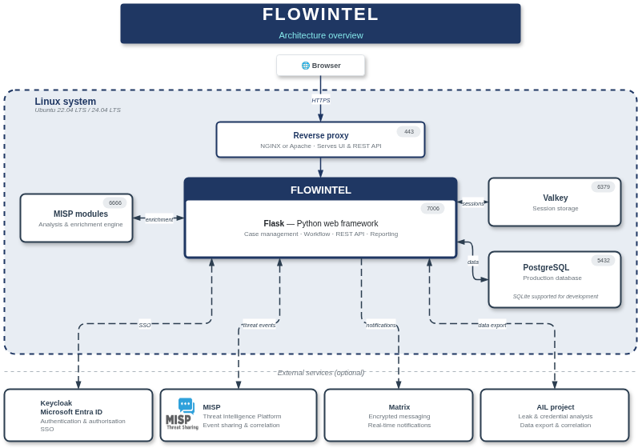
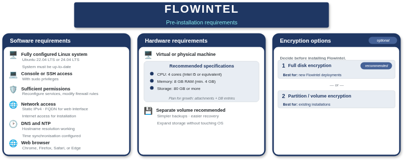
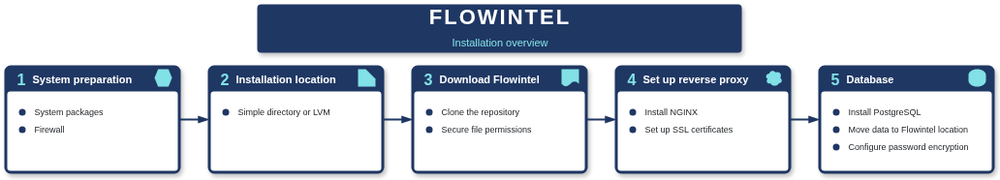
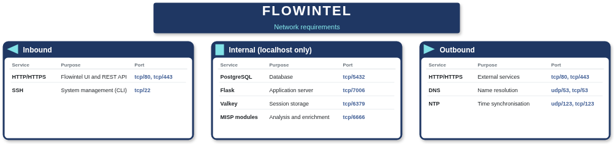
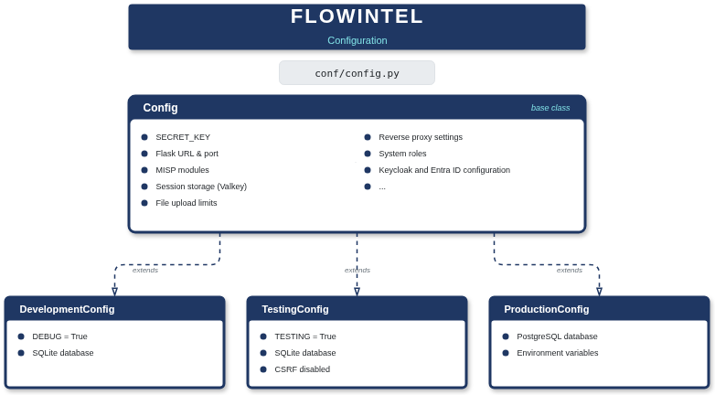
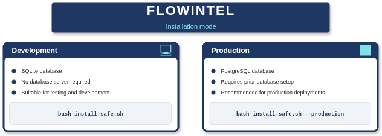
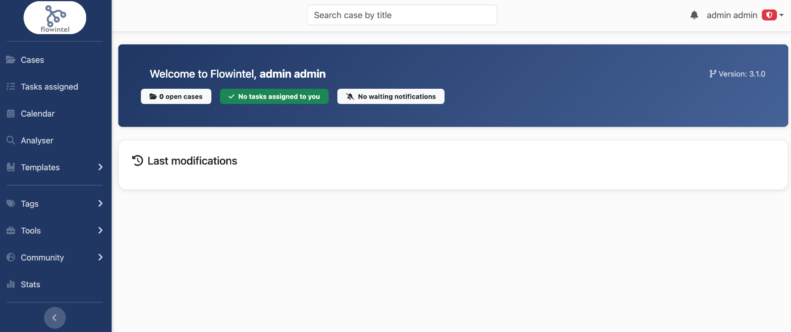

# Flowintel installation manual

## Documentation set

This installation manual is part of a broader documentation set that covers installing, configuring, and using Flowintel. The set also includes:

- [Flowintel encryption guide](encryption-guide.md), which explains the encryption options to consider before installation
- [Flowintel backup and restore](backup-restore.md), a guide to managing backups and restoring data
- [Flowintel user manual](user-manual.md), which covers both the configuration of Flowintel for your organisation and day-to-day use during case handling

## What is Flowintel?

**Flowintel** is an open-source platform for security analysts to organise cases and tasks. It provides workflow tools to track investigations, document findings, and collaborate within teams.

### Technical components

Flowintel is built with:

- **Flask**: Python web framework
- **PostgreSQL**: Production database (SQLite supported for development)
- **Valkey**: Session storage
- **MISP modules**: Analysis and enrichment engine

Flowintel follows a common pattern for Python web applications. The Flask application runs behind an application server and is exposed to users through a web server such as NGINX or Apache, which acts as a reverse proxy.

### Supported operating systems

Flowintel runs on Ubuntu Linux 22.04 LTS and 24.04 LTS. Other Debian-based distributions may work but are not officially tested.

### Architecture



## Pre-installation

### System requirements



#### Software requirements

- **Operating system**
    - A fully configured Linux system
    - Ubuntu 22.04 LTS or 24.04 LTS
    - The system must be up to date
- **Installation access**
    - During installation, you need:
        - Console or SSH access with sudo privileges
        - Ability to reconfigure system services
        - Permission to modify firewall rules
- **Network requirements**
    - One static IPv4 address; you can disable IPv6 if it is not used in your environment
    - Fully qualified domain name (FQDN) for accessing the web interface
    - **Internet connectivity**
        - The following domains must be accessible during installation:
            - `*.ubuntu.com` (package repositories)
            - `*.github.com`, `*.github.io`, `*.githubusercontent.com` (source code)
            - `*.pypi.org`, `*.python.org`, `*.pythonhosted.org` (Python packages)
        - After installation, internet access is only needed for updates.
    - **MISP modules enrichment services** (optional)
        - If you want to use MISP modules to enrich objects using analysers, you need access to the enrichment services such as CIRCL Passive DNS, VirusTotal, and similar platforms.
        - Some of these enrichment services require accounts and API keys. Setting up the analysers is covered in the user manual.
    - **MISP, AIL or Matrix connectivity** (optional)
        - If you plan to integrate Flowintel with MISP, AIL or Matrix, network access to these servers is required.
        - Installing or configuring MISP, AIL or Matrix is not part of this manual.
    - **Entra ID** (optional)
        - If you plan to set up SSO with Microsoft Entra ID, you need access to the Microsoft authentication services, at least `graph.microsoft.com` and `login.microsoftonline.com`.
- **DNS resolution**
    - The system must be able to resolve hostnames. Point the Linux system to corporate DNS servers or use public resolvers.
- **Time synchronisation**
    - Configure NTP to keep the system time accurate. This is critical for audit logging and session management.
- **Web browser**
    - Once the installation is complete, you can access Flowintel from any modern web browser (Chrome, Firefox, Safari, Edge).

#### Hardware requirements

Flowintel runs on both physical and virtual machines. While it doesn't demand heavy resources, plan for storage growth as case attachments and database entries accumulate over time.

- **Recommended specifications**
    - CPU: Intel Core i5 or equivalent (4 cores)
    - Memory: 8 GB RAM (minimum 4 GB)
    - Storage: 80 GB or more
- **Storage considerations**
    - Install Flowintel on a separate volume or partition. This makes:
        - Backups simpler and faster
        - System recovery easier
        - Disk expansion straightforward without touching the OS
    - Estimate storage needs based on:
        - Number of expected cases per year
        - Average attachment size per case
        - Retention period for closed cases

#### Encryption requirements (optional)

If your environment requires data-at-rest encryption (for GDPR compliance, law enforcement agency policies, or other security requirements), you must consider the encryption options **before** installing Flowintel.

Refer to the [Flowintel encryption guide](encryption-guide.md) for detailed instructions.

There are two encryption options:
- Option 1: **full disk encryption**: Best for new installations. Encrypt the entire system during Ubuntu installation. Follow option 1 in the encryption guide to install the Linux system with full disk encryption, then continue with this installation guide.
- Option 2: **partition encryption**: For existing systems. Encrypt `/opt/flowintel` where all Flowintel data will be stored. Install the Linux system according to your organisation's policies, then follow option 2 in the encryption guide to set up an encrypted volume.

### Required installation skills

Flowintel installation is console-based and involves configuring Linux services. The person performing the installation should have:

- **Linux administration** knowledge (medium to advanced)
    - Package management with apt
    - Service management with systemd
    - File permissions and ownership
    - Log file navigation and troubleshooting
- Experience with **networking** (medium)
    - Static IP configuration
    - Firewall rules (ufw or iptables)
    - SSL certificate installation
    - Basic DNS and routing concepts
- Knowledge of **web applications** (medium)
    - Python virtual environments
    - Web server configuration (NGINX or Apache)
    - Database setup and user management
    - Environment variable configuration
- **Tools and interfaces**
    - Comfortable working in the terminal or via SSH
    - Basic text editor skills (nano, vim, or similar)

### Pre-installation checklist

Before starting the installation, verify you have:

- [ ] SSH or console access to Ubuntu 22.04/24.04 system
- [ ] Sudo privileges on the system
- [ ] Internet access to required domains
- [ ] Static IP address configured
- [ ] FQDN defined for the web interface
- [ ] The hardware meets the minimum requirements (8 GB RAM, 80 GB storage)
- [ ] NTP configured and time synchronised
- [ ] DNS resolution working
- [ ] SSL certificate available (or plan to use self-signed)
- [ ] Firewall rules configured
- [ ] Decision on encryption options

### Installation source

Flowintel is installed directly from its Git repository. There is no installer package or pre-built binary. The installation process clones the repository and sets up dependencies using standard Python and Linux tools.

# Installing Linux services

Before installing Flowintel itself, you need to set up several Linux services it depends on. This section walks through each service in the order shown below.

- Prepare the Linux system 
- Create the installation location
- Download Flowintel
- Set up the reverse proxy (NGINX)
- Set up the database (PostgreSQL)



## System preparation

Start by updating the operating system and installing the packages that Flowintel and its build process depend on. You will also configure the host firewall so that only the required ports are open.

**Virtual machine users**: If you're installing on a VM, create a snapshot before proceeding. This allows you to revert to a known good state if something goes wrong during installation.

### Packages

Make sure your Linux system is fully updated:

```bash
# Update Ubuntu packages
sudo apt update
sudo apt upgrade -y
```

Install Git and basic dependencies:

```bash
# Git and basic dependencies
sudo apt install -y git curl wget build-essential
```

### Configure firewall

Set up UFW (Uncomplicated Firewall) to allow only necessary inbound traffic:

```bash
# Install UFW if not already present
sudo apt install -y ufw

# Allow SSH (adjust port if you use a non-standard SSH port)
sudo ufw allow ssh

# Allow HTTP and HTTPS
sudo ufw allow http
sudo ufw allow https

# Enable firewall
sudo ufw enable

# Verify firewall status
sudo ufw status
```

After executing the `ufw status` command, you should see output showing SSH (22/tcp), HTTP (80/tcp), and HTTPS (443/tcp) are allowed.

```bash
Status: active

To                         Action      From
--                         ------      ----
22/tcp                     ALLOW       Anywhere
80/tcp                     ALLOW       Anywhere
443                        ALLOW       Anywhere
```

**Note**: If you're connected via SSH, ensure SSH is allowed before enabling the firewall to avoid locking yourself out.

**Remote PostgreSQL**: If you run PostgreSQL on a separate server rather than on the same machine as Flowintel, you also need to allow inbound traffic on port 5432 from the Flowintel server. Restrict the rule to the specific source IP so the database is not exposed to the wider network:

```bash
# On the PostgreSQL server (replace with the Flowintel server's IP)
sudo ufw allow from 10.0.0.5 to any port 5432
```



## Installation location

Flowintel stores its application files, configuration, and uploaded attachments under a single directory tree. Choosing the right location now makes future backups, storage expansion, and disaster recovery much simpler.

For better organisation and easier backups, create a dedicated partition or mount point for Flowintel.

### Option 1: Simple directory (quick setup for testing)

If you want to get Flowintel running quickly for testing or development, a simple directory is sufficient.

```bash
# Create installation directory
sudo mkdir -p /opt/flowintel

# Set ownership (replace 'yourusername' with your actual username)
sudo chown -R yourusername:yourusername /opt/flowintel
```

### Option 2: LVM partition (recommended for production)

For production environments, use a dedicated LVM partition to keep Flowintel data separate from the operating system. The Logical Volume Manager, or LVM, is a Linux-based storage management technology that adds an abstraction layer between physical disks and filesystems, enabling flexible, dynamic storage allocation. It gives you flexibility with backups, snapshots, and future expansion.

```bash
# Install LVM tools if not present
sudo apt install -y lvm2

# Create physical volume on the disk
sudo pvcreate /dev/sdb

# Create volume group named 'flowintel-vg'
sudo vgcreate flowintel-vg /dev/sdb

# Create logical volume (use 100% of available space, or specify size like -L 50G)
sudo lvcreate -n flowintel-lv -l 100%FREE flowintel-vg

# Format with ext4
sudo mkfs.ext4 /dev/flowintel-vg/flowintel-lv

# Create mount point
sudo mkdir -p /opt/flowintel

# Mount the filesystem
sudo mount /dev/flowintel-vg/flowintel-lv /opt/flowintel

# Add to /etc/fstab for automatic mounting on boot
echo '/dev/flowintel-vg/flowintel-lv /opt/flowintel ext4 defaults 0 2' | sudo tee -a /etc/fstab

# Set ownership (replace 'yourusername' with your actual username)
sudo chown -R yourusername:yourusername /opt/flowintel
```

Verify the mount:

```bash
df -h /opt/flowintel
```

**Expanding LVM volumes** (when additional storage is needed)

A key advantage of LVM is that you can expand storage without downtime. If you need more space in the future:

```bash
# Add a new physical disk to the volume group (for example /dev/sdc)
sudo pvcreate /dev/sdc
sudo vgextend flowintel-vg /dev/sdc

# Extend the logical volume (add all free space from new disk)
sudo lvextend -l +100%FREE /dev/flowintel-vg/flowintel-lv

# Resize the filesystem to use the new space
sudo resize2fs /dev/flowintel-vg/flowintel-lv

# Verify new size
df -h /opt/flowintel
```

This process can be performed while Flowintel is running, but it is best to schedule it during a maintenance window.

## Download Flowintel

Flowintel is distributed as a Git repository rather than a packaged installer. You clone the repository, optionally check out a tagged release, and then lock down the file permissions.

### Clone the repository

Download Flowintel from GitHub:

```bash
# Download Flowintel into /opt/flowintel
cd /opt/flowintel
git clone https://github.com/flowintel/flowintel.git
cd flowintel
```

The repository is now cloned to `/opt/flowintel/flowintel`. All subsequent commands assume you're working from this directory.

### Install a specific version

Flowintel uses Git tags to mark releases. You can find the list of available versions at:

https://github.com/flowintel/flowintel/tags

Each tag corresponds to a release (e.g. `3.1.0`), with release notes available at `https://github.com/flowintel/flowintel/releases/tag/<version>`.

To install a specific version instead of the latest development code, pass the tag to `git clone`:

```bash
cd /opt/flowintel
git clone --branch 3.1.0 --single-branch https://github.com/flowintel/flowintel.git
cd flowintel
```

Replace `3.1.0` with the tag of the version you want to install. Using `--single-branch` avoids downloading the full history of other branches.

### Secure file permissions

Set appropriate permissions on the Flowintel application directory to prevent unauthorised access:

```bash
# Set secure permissions (owner read/write/execute, group read/execute, no access for others)
sudo chmod 750 /opt/flowintel/flowintel
```

You should see the following output when you run `ls -l /opt/flowintel/`:
```
drwxr-x--- 10 yourusername yourusername 4096 Jan 30 08:00 /opt/flowintel/flowintel
```

This restricts access to the owner and group members, preventing other users on the system from reading sensitive configuration files or data.

**Important**: Do not apply chmod 750 to `/opt/flowintel` if you relocate the PostgreSQL data directory to `/opt/flowintel/database` (covered in the database section). This would prevent PostgreSQL from accessing the database. Only apply the permission restrictions to `/opt/flowintel/flowintel`.

## Setup the reverse proxy

NGINX sits between users and the Flask application, handling TLS termination, static file serving, and request buffering. While you can access Flask directly during development, running Flowintel behind a reverse proxy is strongly recommended for production.

**Note**: If you're just testing Flowintel, you can skip this section and access Flask directly at `http://localhost:7006`. For production deployments, continue with the NGINX setup below.

### Set up NGINX

```bash
# Install and enable nginx
sudo apt install -y nginx
sudo systemctl enable nginx
sudo systemctl start nginx
```

Replace **flowintel.yourdomain.com** with your actual hostname (**your-actual-domain.com**) throughout this guide. If you're setting this up for internal use without public DNS, add an entry to your DNS server or use local hosts files on client machines.

### NGINX configuration file

Flowintel includes an NGINX configuration template. Copy it to the NGINX sites-available directory:

```bash
sudo cp /opt/flowintel/flowintel/doc/flowintel.nginx /etc/nginx/sites-available/flowintel
```

Replace `flowintel.yourdomain.com` with your actual domain name:

```bash
sudo sed -i 's/flowintel.yourdomain.com/your-actual-domain.com/g' /etc/nginx/sites-available/flowintel
```

### SSL certificates

You need to configure SSL certificates for HTTPS access before enabling the site. Choose one of the following options based on your requirements:

#### Option 1: Self-signed certificate (testing/internal use)

For testing or internal deployments, generate a self-signed certificate:

```bash
# Create directory for certificates
sudo mkdir -p /etc/nginx/ssl

# Generate self-signed certificate (valid for 365 days)
sudo openssl req -x509 -nodes -days 365 -newkey rsa:2048 \
  -keyout /etc/nginx/ssl/flowintel.key \
  -out /etc/nginx/ssl/flowintel.crt \
  -subj "/C=BE/ST=Brussels/L=Brussels/O=Your Organisation/CN=flowintel.yourdomain.com"

# Set proper permissions
sudo chmod 600 /etc/nginx/ssl/flowintel.key
sudo chmod 644 /etc/nginx/ssl/flowintel.crt
```

**Note**: Self-signed certificates will show a browser warning that users must accept. This option is suitable for testing or internal networks where all users can be instructed to accept the certificate.

#### Option 2: Let's Encrypt (free, automated)

For production environments with internet-accessible servers, use Let's Encrypt for free, trusted certificates:

```bash
# Install certbot
sudo apt install -y certbot python3-certbot-nginx

# Ensure port 80 is accessible from the internet for verification
# Check firewall settings if needed

# Obtain and install certificate (certbot will modify your nginx config)
sudo certbot --nginx -d flowintel.yourdomain.com

# Follow the prompts:
# - Enter your email address for renewal notifications
# - Agree to terms of service
# - Choose whether to redirect HTTP to HTTPS (recommended: Yes)

# Verify certificate installation
sudo certbot certificates

# Test automatic renewal
sudo certbot renew --dry-run
```

Certbot automatically sets up a systemd timer for renewal. Verify it's active:

```bash
sudo systemctl status certbot.timer
```

**Note**: Let's Encrypt certificates are valid for 90 days and renew automatically 30 days before expiration. You'll receive email notifications if renewal fails.

#### Option 3: Organisational certificate authority

If your organisation provides SSL certificates from an internal or commercial CA:

1. Obtain the certificate (`.crt` or `.pem`) and private key (`.key`) from your CA
2. Copy them to the server:
   ```bash
   sudo mkdir -p /etc/nginx/ssl
   sudo cp your-cert.crt /etc/nginx/ssl/flowintel.crt
   sudo cp your-key.key /etc/nginx/ssl/flowintel.key
   sudo chmod 600 /etc/nginx/ssl/flowintel.key
   sudo chmod 644 /etc/nginx/ssl/flowintel.crt
   ```
3. The NGINX configuration is already set to use `/etc/nginx/ssl/flowintel.crt` and `/etc/nginx/ssl/flowintel.key`

**Note**: With this option, you'll need to manually renew certificates before they expire. Set a reminder based on your certificate's validity period.

### Enable the site and test configuration

Now that SSL certificates are in place, enable the site and test the configuration:

```bash
# Enable the site
sudo ln -s /etc/nginx/sites-available/flowintel /etc/nginx/sites-enabled/

# Test configuration
sudo nginx -t
```

A successful test with `nginx -t` shows:

```
nginx: the configuration file /etc/nginx/nginx.conf syntax is ok
nginx: configuration file /etc/nginx/nginx.conf test is successful
```

If the test passes, reload NGINX:

```bash
# Reload NGINX
sudo systemctl reload nginx
```

## Database

This section covers installing PostgreSQL, creating the Flowintel database and user, and configuring authentication. Flowintel requires PostgreSQL for production use. While SQLite works for development and testing, PostgreSQL provides better performance, concurrency handling, and data integrity for production environments.

### Install PostgreSQL

Install PostgreSQL and required packages:

```bash
sudo apt install -y postgresql postgresql-contrib
```

### Move PostgreSQL data directory (optional, but recommended for production)

By default, PostgreSQL stores data in `/var/lib/postgresql`. For better organisation and to keep all Flowintel-related data together, move the PostgreSQL data directory to `/opt/flowintel/database`.

**Note**: Only perform these steps if you want to store database files on the dedicated Flowintel partition. Skip this section if you prefer to use the default PostgreSQL location.

```bash
# Stop PostgreSQL
sudo systemctl stop postgresql

# Create database directory
sudo mkdir -p /opt/flowintel/database

# Copy existing PostgreSQL data
sudo rsync -av /var/lib/postgresql/ /opt/flowintel/database/

# Rename original directory as backup
sudo mv /var/lib/postgresql /var/lib/postgresql.bak

# Create symlink from original location to new location
sudo ln -s /opt/flowintel/database /var/lib/postgresql

# Set correct ownership
sudo chown -R postgres:postgres /opt/flowintel/database

# Verify the symlink
ls -la /var/lib/ | grep postgresql
```

You should see:
```
lrwxrwxrwx 1 root root   24 Jan 30 08:00 postgresql -> /opt/flowintel/database
```

Start PostgreSQL and verify it works:

```bash
# Start PostgreSQL
sudo systemctl start postgresql

# Check status
sudo systemctl status postgresql
```

You should see output showing PostgreSQL is active:

```
● postgresql.service - PostgreSQL RDBMS
     Loaded: loaded (/usr/lib/systemd/system/postgresql.service; enabled; preset: enabled)
     Active: active (exited) since Fri 2026-01-30 07:30:17 UTC; 5s ago
    Process: 11276 ExecStart=/bin/true (code=exited, status=0/SUCCESS)
   Main PID: 11276 (code=exited, status=0/SUCCESS)
        CPU: 2ms

Jan 30 07:30:17 flowintel-dev systemd[1]: Starting postgresql.service - PostgreSQL RDBMS...
Jan 30 07:30:17 flowintel-dev systemd[1]: Finished postgresql.service - PostgreSQL RDBMS.
```

If PostgreSQL starts successfully, remove the backup:

```bash
sudo rm -rf /var/lib/postgresql.bak
```

**Note**: If PostgreSQL fails to start after moving the data directory, see the troubleshooting section on PostgreSQL data directory relocation.

### Configure password encryption

Before creating database users, decide which password encryption method to use. PostgreSQL offers two options:

- Option 1: **SCRAM-SHA-256 (recommended)**: The most secure method, supported in PostgreSQL 10 and later. Use this for new installations.
- Option 2: **MD5 (legacy)**: Considered cryptographically weak but acceptable for local-only connections where credentials are never transmitted over a network.

You can determine your PostgreSQL version by running `sudo -u postgres psql -c 'SELECT version();'`.

#### Option 1: SCRAM-SHA-256 (recommended)

Configure PostgreSQL to use SCRAM-SHA-256 for password encryption (replace `16` with your PostgreSQL version: 14, 15, or 16):

```bash
sudo vi /etc/postgresql/16/main/postgresql.conf
```

Find and set (or add if missing):

```
password_encryption = scram-sha-256
```

#### Option 2: MD5 (legacy)

MD5 is the default in most PostgreSQL installations. If you choose to use MD5, no configuration change is needed. However, for clarity, you can explicitly set it (replace `16` with your PostgreSQL version: 14, 15, or 16):

```bash
sudo vi /etc/postgresql/16/main/postgresql.conf
```

Find and set (or add if missing):

```
password_encryption = md5
```

**Note**: For maximum security, use SCRAM-SHA-256. Use MD5 only if you have compatibility concerns or are running an older PostgreSQL version (pre-10).

### Configure authentication

By default, PostgreSQL only accepts local connections. For production deployments where Flowintel runs on the same server, this is secure and requires minimal configuration.

Edit the PostgreSQL host-based authentication file to allow the flowintel user to connect (replace `16` with your PostgreSQL version: 14, 15, or 16):

```bash
sudo vi /etc/postgresql/16/main/pg_hba.conf
```

Add this line before the "local all all peer" line, using the authentication method that matches your password encryption choice:

**If you configured SCRAM-SHA-256:**

```
# Add this line before the "local all all peer" line
local   flowintel       flowintel                               scram-sha-256
```

**If you configured MD5:**

```
# Add this line before the "local all all peer" line
local   flowintel       flowintel                               md5
```

Restart PostgreSQL to apply changes:

```bash
sudo systemctl restart postgresql
```

### Create database and user

PostgreSQL uses peer authentication by default, which means you need to switch to the `postgres` system user to run database commands.

Create a dedicated database user and database for Flowintel:

```bash
# Switch to postgres user
sudo -u postgres psql

# In the PostgreSQL prompt, run these commands:
CREATE USER flowintel WITH PASSWORD 'your_secure_password_here';
CREATE DATABASE flowintel OWNER flowintel;
GRANT ALL PRIVILEGES ON DATABASE flowintel TO flowintel;

# Grant schema permissions
\c flowintel
GRANT ALL ON SCHEMA public TO flowintel;

# Exit PostgreSQL
\q
```

**Security note**: Replace `your_secure_password_here` with a strong password. You'll need this password later when configuring Flowintel.

The user password will be encrypted using the method you configured in the previous step (SCRAM-SHA-256 or MD5).

### Test the connection

Verify you can connect to the database with the flowintel user:

```bash
psql -U flowintel -d flowintel -h localhost -W
```

Enter the password you created earlier. 

```bash
psql (16.13 (Ubuntu 16.13-0ubuntu0.24.04.1))
SSL connection (protocol: TLSv1.3, cipher: TLS_AES_256_GCM_SHA384, compression: off)
Type "help" for help.

flowintel=>
```

If you see the PostgreSQL prompt, the setup is working correctly. Type `\q` to exit.


# Configure Flowintel for installation

With the system packages, reverse proxy, and database in place, the next step is to configure the Flowintel application. These settings must be in place before you run the installation script.

## Create configuration files

Flowintel includes default configuration templates that need to be copied and customised for your installation:

```bash
cp conf/config.py.default conf/config.py
cp conf/config_module.py.default conf/config_module.py
```

These files will be edited in the next steps to match your environment and requirements.

## Configure the base application settings

Flowintel uses `conf/config.py` for application settings. The file contains a base configuration class and separate classes for development, testing, and production environments.

Once Flowintel is installed, some of these settings can also be changed through the web interface. Others can only be modified by editing the configuration file directly. This section covers only the settings needed to get Flowintel up and running; detailed configuration options are documented in the user manual.




### Base configuration

Open the configuration file:

```bash
vi conf/config.py
```

The first section of the file contains the base `Config` class. The settings below apply to all environments (development, testing, and production).

```python
class Config:
```

#### Secret key

The `SECRET_KEY` is used for session encryption and CSRF protection. Generate a strong random key. If you have the configuration file open in an editor, run this command in a separate terminal session:

```bash
python3 -c 'import secrets; print(secrets.token_hex(32))'
```

Copy the output and replace the default value in the configuration file:

```python
SECRET_KEY = 'your_generated_key_here'
```

#### Flask application binding

Flowintel is a Flask application and you need to configure on which IP address and which port it listens. `FLASK_URL` sets the IP address Flask binds to, and `FLASK_PORT` sets the port number.

For production with NGINX, keep `127.0.0.1` to ensure Flask only accepts connections from the reverse proxy. If you need to access Flask directly during testing, change to `0.0.0.0`, but never expose this in production.

```python
FLASK_URL = '127.0.0.1'
FLASK_PORT = 7006
```

#### MISP enrichment modules

The MISP modules provide analysis and enrichment via external services. `MISP_MODULE` sets the address and port where the modules are running. The default value of `127.0.0.1:6666` is correct for most installations. Only change this if the MISP modules run on a different server or port.

```python
MISP_MODULE = '127.0.0.1:6666'
```

#### Session storage

When a user logs in to Flowintel, the application creates a session to track their authentication state and preferences. Sessions need to be stored somewhere so that they persist across page loads and survive application restarts. Flowintel uses Valkey for this purpose.

Valkey is an in-memory data store (a community fork of Redis) that keeps session data in RAM for fast access. It runs as a separate service alongside Flowintel and handles all session reads and writes.

```python
VALKEY_IP = os.getenv('VALKEY_IP', '127.0.0.1')
VALKEY_PORT = os.getenv('VALKEY_PORT', '6379')
SESSION_TYPE = "redis"
```

The default settings work for most installations where Valkey runs on the same server. You only need to change these if Valkey is on a different host.

**Note**: `SESSION_TYPE` is set to `"redis"` because Valkey is compatible with Redis and uses the same client protocol.

**Note**: The Flowintel installation script installs and starts Valkey automatically. No separate setup is needed.

#### File upload limits

Users can attach files to cases and tasks (for example evidence, screenshots, or reports). These files are stored on disk in the `uploads/files/` directory within your Flowintel installation, not in the database.

The `FILE_UPLOAD_MAX_SIZE` setting controls the maximum size of a single uploaded file, expressed in bytes:

```python
FILE_UPLOAD_MAX_SIZE = int(os.getenv('FILE_UPLOAD_MAX_SIZE', 5 * 1024 * 1024))  # 5MB default
```

Adjust this based on your storage capacity and the types of files your analysts typically attach. If you increase this limit, also update the NGINX `client_max_body_size` directive in `/etc/nginx/sites-available/flowintel` to match, otherwise NGINX will reject uploads before they reach Flowintel. The default value in the included NGINX template is `50M`:

```nginx
client_max_body_size 50M;
```

After changing the value, test and reload the NGINX configuration with `sudo nginx -t && sudo systemctl reload nginx`.

#### Reverse proxy settings

When running Flowintel behind a reverse proxy, Flask needs to know how to extract the real client IP address and other request details from HTTP headers that the proxy adds. Without this configuration, Flask will only see connections coming from `127.0.0.1` and won't be able to determine the actual client IP, protocol (HTTP vs HTTPS), or hostname.

Start by enabling proxy support with `BEHIND_PROXY`. This tells Flask to use Werkzeug's `ProxyFix` middleware, which reads the `X-Forwarded-*` headers that NGINX adds to each request.

The `PROXY_X_FOR` setting controls how many proxy servers are between your users and Flowintel. If you're running NGINX directly on the same server as Flowintel, set this to `1`. If users connect through a corporate proxy first and then reach your NGINX server, set it to `2`. `PROXY_X_PROTO` tells Flask to trust the `X-Forwarded-Proto` header so it can distinguish HTTP from HTTPS requests. `PROXY_X_HOST` trusts the `X-Forwarded-Host` header so Flask knows the original hostname the user requested. `PROXY_X_PREFIX` trusts the `X-Forwarded-Prefix` header, which is only needed if Flowintel is served under a URL sub-path (the default `0` disables it).

```python
BEHIND_PROXY = os.getenv('BEHIND_PROXY', 'true').lower() == 'true'
PROXY_X_FOR = int(os.getenv('PROXY_X_FOR', 1))       # Number of proxies to trust
PROXY_X_PROTO = int(os.getenv('PROXY_X_PROTO', 1))   # Trust X-Forwarded-Proto
PROXY_X_HOST = int(os.getenv('PROXY_X_HOST', 1))     # Trust X-Forwarded-Host
PROXY_X_PREFIX = int(os.getenv('PROXY_X_PREFIX', 0)) # Trust X-Forwarded-Prefix
```

#### Flowintel system roles

Flowintel has three built-in roles (Admin, Editor, and Read only) that cannot be deleted through the interface. The `SYSTEM_ROLES` setting lists their database identifiers. You should not need to change this value.

```python
SYSTEM_ROLES = [1, 2, 3]
```

### Initial user accounts

When Flowintel runs for the first time, it creates two built-in user accounts: an administrator and a bot account. These accounts are defined by `INIT_ADMIN_USER` and `INIT_BOT_USER` in the configuration file. You can change the names and email addresses before the first run, but the settings are only read during the initial bootstrapping of the application. Once the accounts exist in the database, changes to these values have no effect.

**Administrator account**

The administrator account is the first account you use to log in after installation. It has full administrative privileges.

```python
INIT_ADMIN_USER = {
    "first_name": "admin",
    "last_name": "admin",
    "email": "admin@admin.admin",
    "password": "admin"
}
```

**Important**: Change the administrator password immediately after your first login. The default credentials are publicly documented and represent a serious security risk. Navigate to your user profile in the web interface to set a strong password.

**Bot account**

The bot account is used internally for Matrix chat notifications. Flowintel creates this account during installation regardless of whether you plan to use Matrix.

```python
INIT_BOT_USER = {
    "first_name": "Matrix",
    "last_name": "Bot",
    "email": "neo@admin.admin"
}
```

If you do not intend to use Matrix notifications, you can leave this account as it is. It does not need to be deleted and has no administrative privileges.


### Database configuration

The configuration file includes settings for both development and production databases. The installation script automatically uses the appropriate configuration based on the installation mode you chose.

#### Option 1: SQLite (development and testing only)

```python
class DevelopmentConfig(Config):
    DEBUG = True
    SQLALCHEMY_DATABASE_URI = "sqlite:///flowintel.sqlite"
```

The SQLite database file is stored in `instance/flowintel.sqlite` within your Flowintel directory. 

**Important**: SQLite is **not recommended for production use**. It lacks the performance, concurrency handling, and data integrity features required for production deployments.

#### Option 2: PostgreSQL (production)

The `ProductionConfig` class is used with PostgreSQL:

```python
class ProductionConfig(Config):
    db_user = os.getenv('DB_USER', 'flowintel')
    db_password = os.getenv('DB_PASSWORD', 'your_secure_password_here')
    db_host = os.getenv('DB_HOST', 'localhost')
    db_port = os.getenv('DB_PORT', '5432')
    db_name = os.getenv('DB_NAME', 'flowintel')
    
    SQLALCHEMY_DATABASE_URI = f"postgresql://{db_user}:{db_password}@{db_host}:{db_port}/{db_name}"
```

Update the database name, username, and password to match the PostgreSQL database you created earlier. For production deployments, it is strongly recommended to supply these values through environment variables rather than writing them directly into the configuration file. This keeps credentials out of source-controlled files and makes it easier to manage different environments. The next section explains how to set up environment variables.

### Using environment variables

Instead of hardcoding values in `config.py`, you can use environment variables. This keeps sensitive data such as database passwords and secret keys out of the configuration file itself, which is particularly important if the Flowintel directory is ever backed up, copied, or placed under version control. Environment variables also make it straightforward to change settings without editing code.

The configuration already supports environment variables through `os.getenv()`. You can provide them in two ways:

#### Option 1: System environment variables

Set variables in your shell before starting Flowintel:

```bash
export DB_PASSWORD='your_secure_password_here'
export SECRET_KEY='your_secret_key'
export FLASKENV='production'
```

This approach is simple and works well when Flowintel is managed by a systemd service file that includes an `EnvironmentFile` directive or when variables are set in the user's shell profile. However, variables defined this way only persist for the current session unless you add them to a file such as `~/.bashrc` or `/etc/environment`. They can also be visible to other processes running under the same user through `/proc`, which may be a concern in shared environments.

#### Option 2: .env file (recommended)

Create a `.env` file in the Flowintel directory:

```bash
vi .env
```

Add your configuration:

```bash
# Database settings
DB_USER=flowintel
DB_PASSWORD=your_secure_password_here
DB_HOST=localhost
DB_PORT=5432
DB_NAME=flowintel

# Flask environment
FLASKENV=production
```

Set appropriate permissions to protect sensitive values:

```bash
chmod 600 .env
```

The `.env` file is the recommended approach because all settings live in a single, clearly defined location. The file is loaded automatically when Flowintel starts, so variables persist across reboots without any additional shell configuration. It is also easy to back up or copy to a new server. To keep the credentials secure, restrict the file permissions with `chmod 600` (as shown above) and add `.env` to your `.gitignore` file if you are tracking the installation with Git.

## Development, testing and production settings

The main differences between environments:

| Setting | Development | Testing | Production |
|---------|-------------|---------|------------|
| DEBUG | True (shows detailed errors) | False | False (never enable in production) |
| TESTING | False | True (disables CSRF checks) | False |
| Database | SQLite (`flowintel.sqlite`) | SQLite (`flowintel-test.sqlite`) | PostgreSQL (server) |
| SECRET_KEY | Can use default | Can use default | Must be unique and strong |
| FLASK_URL | Can use 0.0.0.0 | Can use 0.0.0.0 | Should be 127.0.0.1 (behind NGINX) |
| Error display | Full stack traces shown | Full stack traces shown | Generic error pages |
| BEHIND_PROXY | Direct access to Flask | Direct access to Flask | Access via NGINX |
| Sample cases | Imported | Not imported | Not imported |

Sample test cases are included in development installations to give new users something to explore immediately. Production and testing installations skip this import. This is not controlled by the configuration file but by the installation mode you choose when running the installation script.

The testing configuration uses a separate SQLite database to avoid interfering with development data. It also disables CSRF token validation (`WTF_CSRF_ENABLED = False`) so that automated tests can submit forms without generating tokens.

Never run production with `DEBUG = True`. This exposes sensitive information and creates security vulnerabilities.


## Microsoft Entra ID SSO (optional)

Flowintel supports single sign-on via Microsoft Entra ID (formerly Azure AD). When enabled, users can sign in with their Microsoft account instead of a local password. Local accounts still work alongside SSO.

### Azure portal setup

Before configuring Flowintel, register an application in the [Azure portal](https://portal.azure.com/):

1. Go to Microsoft Entra ID → App registrations → **New registration**
2. Set the **Name** to something like `Flowintel`
3. Set **Supported account types** to *Accounts in this organizational directory only*
4. Add a **Redirect URI** (Web platform):
   ```
   https://flowintel.yourdomain.com/account/entra/callback
   ```
5. After registration, note the **Directory (tenant) ID** and **Application (client) ID** from the Overview page
6. Under **Certificates & secrets → New client secret**, create a secret and note its value immediately (it is only shown once)
7. Under **API permissions**, add:
   - `Microsoft Graph → Delegated → User.Read` (usually present by default)
   - `Microsoft Graph → Delegated → GroupMember.Read.All`
   - Click **Grant admin consent**

### Entra ID group setup

Flowintel uses Entra ID group membership to assign roles. Create the following security groups in your Entra ID tenant, then add users to the appropriate group:

| Entra ID group | Flowintel role | Notes |
|---|---|---|
| `FlowintelAdmin` | Editor | Account is created as **Editor**; all admins receive a notification to promote the user to Admin manually |
| `FlowintelEditor` | Editor | Standard analyst access |
| `FlowintelCaseAdmin` | CaseAdmin | Can manage cases and approve tasks |
| `FlowintelQueueAdmin` | QueueAdmin | Can manage queues and approve tasks |
| `FlowintelQueuer` | Queuer | Can submit tasks for approval in privileged cases |
| `FlowintelReadOnly` | Read Only | View-only access |

When a user signs in for the first time, Flowintel checks their group memberships in the order listed above. The first matching group determines their role. Users not in any of these groups are denied access.

If a user is a member of multiple groups (for example both `FlowintelQueueAdmin` and `FlowintelReadOnly`), the higher-priority group wins. `FlowintelReadOnly` is checked last so it only applies when none of the more specific groups match.

If your organisation uses different group names, you can customise the mappings with the environment variables shown below.

Flowintel synchronises roles on every SSO login. If a user's Entra ID group membership changes, their Flowintel role is updated the next time they sign in. Be aware that if you manually promote an SSO user to a higher role within Flowintel, that change will be overwritten at their next login unless their Entra ID group membership has also been updated.

### Flowintel configuration for Entra ID

Add the following to your `.env` file (or set the equivalent environment variables):

```bash
# Entra ID App
ENTRA_ID_ENABLED=true
ENTRA_TENANT_ID=<your-directory-tenant-id>
ENTRA_CLIENT_ID=<your-application-client-id>
ENTRA_CLIENT_SECRET=<your-client-secret>
ENTRA_REDIRECT_URL=https://flowintel.yourdomain.com/account/entra/callback
```

The `ENTRA_REDIRECT_URL` must exactly match the redirect URI registered in the Azure portal, including the scheme (`https://`). If Flowintel runs behind a reverse proxy, make sure this URL reflects the public-facing address rather than the internal `127.0.0.1` address.

The group and role name mappings can be customised if your Entra ID groups are named differently:

```bash
# Entra ID group names
ENTRA_GROUP_ADMIN=FlowintelAdmin
ENTRA_GROUP_EDITOR=FlowintelEditor
ENTRA_GROUP_READONLY=FlowintelReadOnly
ENTRA_GROUP_CASE_ADMIN=FlowintelCaseAdmin
ENTRA_GROUP_QUEUE_ADMIN=FlowintelQueueAdmin
ENTRA_GROUP_QUEUER=FlowintelQueuer

# Flowintel role names for the custom roles
ENTRA_ROLE_CASE_ADMIN=CaseAdmin
ENTRA_ROLE_QUEUE_ADMIN=QueueAdmin
ENTRA_ROLE_QUEUER=Queuer
```

### SSO behaviour

When Entra ID SSO is enabled (`ENTRA_ID_ENABLED=true`), a **Sign in with Microsoft** button appears on the Flowintel login page. The first time a user signs in through SSO, Flowintel automatically creates a local account for them based on their Entra ID profile.

Users whose highest-priority group is `FlowintelAdmin` are initially created with the **Editor** role rather than Admin. This is a deliberate safeguard: it ensures that no one receives full administrative access automatically, reducing the risk of accidental privilege escalation. All existing Flowintel administrators receive a notification so they can review the new account and promote the user to Admin once they have verified the request is legitimate.

SSO accounts rely entirely on the organisation's Microsoft account for authentication. This means they cannot use the local password reset feature or change the email address associated with their Flowintel account. Administrators can still edit SSO user accounts through the web interface, for example to change a user's role or organisation, but they cannot set a local password for them.

## GPG report signing (optional)

Flowintel can digitally sign case reports with a GPG key. When configured, every generated report includes a detached GPG signature that recipients can verify independently. If you do not need signed reports, skip this section, report generation works without it.

You can either create a new key or use an existing key.

### Create a signing key

Generate a dedicated GPG key for the user account that runs Flowintel. When prompted, select **RSA and RSA** as the key type and set the key size to **4096** bits. For the expiry, you can either set the key not to expire or choose a specific date, depending on your organisation's key-rotation policy.

```bash
gpg --full-generate-key
```

If Flowintel runs as a systemd service under a dedicated user (for example `yourusername`), generate the key as that user so it is stored in the correct keyring:

```bash
sudo -u yourusername gpg --full-generate-key
```

When GPG asks for a user ID, use a dedicated email address (for example `flowintel-signing@flowintel.yourdomain.com`) so the key is clearly linked to the application rather than to an individual person.

Set a passphrase when prompted. You will need to enter this passphrase in the Flowintel configuration file later.

After generation, GPG displays the key location and the path to the revocation certificate. Copy the revocation certificate to a secure, offline location; you will need it if the key is ever compromised.

Verify the key was created by listing all keys on the keyring:

```bash
gpg --list-keys --keyid-format long
```

#### Export the public key

Recipients of signed reports need your public key to verify the signature. Export it in armored (text) format so it can be shared by email, published on a website, or uploaded to a key server:

```bash
gpg --export --armor flowintel-signing@flowintel.yourdomain.com > flowintel-signing-public.asc
```

Distribute `flowintel-signing-public.asc` to anyone who needs to verify your signed reports.

#### Verify a signature externally

When a recipient downloads a signed report from Flowintel, they receive two files: the report itself (for example `case-report.pdf`) and a detached signature file (for example `case-report.pdf.sig`). To verify the signature outside of Flowintel:

1. Import the Flowintel public key (only needed once):

    ```bash
    gpg --import flowintel-signing-public.asc
    ```

2. Verify the signature against the report:

    ```bash
    gpg --verify case-report.pdf.sig case-report.pdf
    ```

3. GPG prints the result. A valid signature looks like:

    ```
    gpg: Signature made Mon 30 Mar 2026 10:00:00 AM UTC
    gpg:                using RSA key ABCDEF1234567890ABCDEF1234567890ABCDEF12
    gpg: Good signature from "flowintel-signing@flowintel.yourdomain.com"
    ```

    If the signature does not match, GPG prints `BAD signature`. In that case, the report may have been modified after signing.

### Use an existing key

If you already have a GPG key pair on another machine (for example your workstation), you can export it and transfer it to the Flowintel server.

#### Export the key pair

On the machine that holds the key, export both the public and private key to armored files. Replace `flowintel-signing@flowintel.yourdomain.com` with the email address or fingerprint of your key:

```bash
gpg --export --armor flowintel-signing@flowintel.yourdomain.com > flowintel-signing-public.asc
gpg --export-secret-keys --armor flowintel-signing@flowintel.yourdomain.com > flowintel-signing-private.asc
```

Transfer both files to the Flowintel server using a secure method such as `scp`:

```bash
scp flowintel-signing-public.asc flowintel-signing-private.asc yourusername@flowintel-server:/tmp/
```

After the transfer, delete the exported private key file from the source machine.

#### Import the keys on the server

On the Flowintel server, import the public key first, then the private key. If Flowintel runs as a dedicated user, import as that user so the keys end up in the correct keyring:

```bash
sudo -u yourusername gpg --import /tmp/flowintel-signing-public.asc
sudo -u yourusername gpg --import /tmp/flowintel-signing-private.asc
```

Verify that both keys were imported:

```bash
sudo -u yourusername gpg --list-keys --keyid-format long
sudo -u yourusername gpg --list-secret-keys --keyid-format long
```

The output should show the key with `sec` (secret/private) and `pub` (public) entries. If you only see `pub`, the private key was not imported correctly.

Once the import is confirmed, remove the key files from the temporary location.

### Configure Flowintel for report signing

Open `conf/config.py` and set the GPG settings:

```python
# GPG report signing
GPG_BINARY = "/usr/bin/gpg"                 # Absolute path to the gpg binary
GPG_HOME = "/home/yourusername/.gnupg"      # Path to the GPG keyring directory
GPG_KEY_ID = "flowintel-signing@flowintel.yourdomain.com"  # Fingerprint or email of the signing key
GPG_PASSPHRASE = "your_passphrase_here"     # Passphrase for the key (leave empty if unprotected)
```

| Setting | Description |
|---------|-------------|
| `GPG_BINARY` | Absolute path to the `gpg` binary (for example `/usr/bin/gpg`). Using an absolute path avoids issues with restricted `PATH` environments under gunicorn or systemd. Defaults to `gpg` if left empty. |
| `GPG_HOME` | Absolute path to the `.gnupg` directory that holds the signing key. Leave empty to use the default keyring of the process owner. |
| `GPG_KEY_ID` | Fingerprint or email address that identifies the signing key. Must match a key present in the keyring. |
| `GPG_PASSPHRASE` | Passphrase that unlocks the private key. Leave empty if the key has no passphrase. |

Leave all three settings empty to disable signing. When `GPG_KEY_ID` is empty, Flowintel skips signing entirely and reports are generated without a signature.

### Disabling signing

`GPG_KEY_ID` is the only setting that controls whether signing is active. Setting `GPG_HOME` or `GPG_PASSPHRASE` to an empty string does **not** disable signing:

- An empty `GPG_HOME` causes GPG to fall back to the default keyring (`~/.gnupg`). If a matching key exists there, signing will still succeed.
- An empty `GPG_PASSPHRASE` does not prevent signing either. The `gpg-agent` process caches passphrases across sessions, so GPG can unlock the key without being given the passphrase again. This cache persists until the agent is restarted or its timeout expires.

To fully disable signing, clear `GPG_KEY_ID`:

```python
GPG_KEY_ID = ""
```

If you want to stop the `gpg-agent` from caching passphrases (for example during testing), you can flush its cache:

```bash
gpgconf --kill gpg-agent
```

## MISP connector configuration (optional)

Flowintel can export case and task data to a MISP instance through its connector system. The settings in this section do not set up the connection to MISP itself; they control the default values that Flowintel applies when it creates or updates events on your MISP server. The actual connector (URL, API key, and organisation) is configured later through the web interface.

If you do not plan to use the MISP connector, you can leave these settings at their defaults.

### File export behaviour

The `MISP_EXPORT_FILES` setting controls whether file attachments are included when Flowintel exports a case or task to MISP. When set to `True`, any files uploaded to a case or task (for example evidence, screenshots, or documents) are attached as attributes on the corresponding MISP event. When set to `False`, only structured data such as observables, notes, and metadata is exported and file attachments are skipped.

```python
MISP_EXPORT_FILES = os.getenv('MISP_EXPORT_FILES', 'false').lower() == 'true
```

The default is `False`. Enable this if your analysts need file evidence included in MISP events.

### Event threat level

Every MISP event carries a threat level that indicates its severity. The `MISP_EVENT_THREAT_LEVEL` setting determines which threat level Flowintel assigns by default when it creates a new event. MISP uses the following scale:

| Value | Meaning   |
|-------|-----------|
| 1     | High      |
| 2     | Medium    |
| 3     | Low       |
| 4     | Undefined |

```python
MISP_EVENT_THREAT_LEVEL = 4
```

The default is `4` (Undefined). Adjust this to match the classification that best fits your organisation's workflow. Analysts can still change the threat level on individual events within MISP after export.

### Event analysis state

MISP events also carry an analysis state that tracks how far the investigation has progressed. The `MISP_EVENT_ANALYSIS` setting determines the default state assigned to newly created events. MISP uses the following values:

| Value | Meaning  |
|-------|----------|
| 0     | Initial  |
| 1     | Ongoing  |
| 2     | Complete |

```python
MISP_EVENT_ANALYSIS = 0
```

The default is `0` (Initial). Events exported from Flowintel typically start as Initial and are progressed to Ongoing or Complete within MISP as the analysis develops.

### Automatic local tags

The `MISP_ADD_LOCAL_TAGS_ALL_EVENTS` setting defines a list of local tags that Flowintel automatically applies to every MISP event it creates or updates. Local tags are visible only on your own MISP instance and are never synchronised with other servers, which makes them well suited for internal workflow tracking and source attribution.

The value accepts either a single string or a list of strings:

```python
# Single tag
MISP_ADD_LOCAL_TAGS_ALL_EVENTS = 'curation:source="flowintel"'

# Multiple tags
MISP_ADD_LOCAL_TAGS_ALL_EVENTS = [
    'workflow:state="incomplete"',
    'curation:source="flowintel"'
]
```

The default is `'curation:source="flowintel"'`, which marks every exported event as originating from Flowintel. Set this to an empty string or an empty list if you do not want any tags applied automatically.

## Module configuration (optional)

The `conf/config_module.py` file contains settings for optional features. The default settings work for standard installations.

You only need to edit `config_module.py` if you're using:

- **SMTP**: For sending email notifications
- **Matrix**: For Matrix chat notifications
- **Computer-assisted generation**: For AI-powered content generation features

If you're not using these features, leave the file unchanged.

# Installing Flowintel

## Run the installation script

Flowintel includes an installation script that sets up the Python environment, installs dependencies, and initialises the database.

### Python virtual environment

Flowintel runs inside a Python virtual environment. A virtual environment is an isolated copy of the Python interpreter and its package library, kept in a self-contained directory within the project. This isolation means that the packages Flowintel needs do not interfere with system-level Python libraries or with other Python applications on the same server.

The main advantages are:

- **Dependency isolation**: Each application keeps its own set of packages at the exact versions it requires, so an upgrade for one project cannot break another.
- **Clean uninstallation**: Because everything lives inside a single directory, removing the virtual environment removes all installed packages with it.
- **No root privileges for packages**: Python packages are installed under the project directory rather than in system paths, so `pip install` does not need `sudo`.
- **Reproducibility**: The `requirements.txt` file pins dependencies, ensuring that a fresh installation produces the same environment every time.

The installation script creates the virtual environment automatically. The directory name is hardcoded as `env` in both the installer and the system scripts (`VENV_DIR="env"`), so you do not need to create or activate it yourself. If the `env/` directory does not already exist when you run the installer, the script creates it for you. It then installs all libraries listed in `requirements.txt` into the virtual environment and copies the Python binary into `env/bin/python`, so that Flowintel always uses its own interpreter regardless of any system-wide Python changes.

When you start Flowintel through `launch.sh` or the systemd service, the scripts reference `env/bin/python` directly, which means the virtual environment is used without requiring manual activation.

### Installation mode 

The installation script supports two installation modes:



**Development mode (default)**:
- Uses SQLite database
- Suitable for testing and development
- Easier to set up, no database server required
- Installs sample cases

**Production mode**:
- Uses PostgreSQL database
- Recommended for production deployments
- Requires PostgreSQL to be installed and configured first (see previous sections)

Choose the appropriate installation mode:

Option 1: **Development installation (default)**

```bash
# Assuming you are still in /opt/flowintel/flowintel
bash install.safe.sh
```

Option 2: **Production installation**

Make sure you have completed the PostgreSQL setup and configuration steps before running this command.

```bash
# Assuming you are still in /opt/flowintel/flowintel
bash install.safe.sh --production
```

### Installation progress

The installation takes several minutes depending on your internet connection and system performance. On modern systems, expect the process to complete in 10 to 15 minutes. You'll see progress messages as each component is installed.

Several steps in the script require elevated privileges, so it will prompt you for your **sudo password** during execution.

This script performs the following actions:

1. Creates a Python virtual environment in the `env/` directory
2. Installs all required Python packages from `requirements.txt`
3. Sets up the database schema (SQLite for development, PostgreSQL for production)
4. Creates initial user accounts
5. Loads MISP taxonomies and galaxy data
6. Configures MISP modules

### Successful installation

Successful installation output should look like this:

```bash
THIS APP IS IN PRODUCTION MODE.
  Created: Forensic Case
  Created: New Compromised Workstation
[INFO] Ran ./launch.sh -ip (production init) successfully
[INFO] install.safe.sh completed successfully
[INFO] 
[INFO] Production installation complete!
[INFO] To start Flowintel in production mode, run:
[INFO]   bash launch.sh -p
[INFO] 
[INFO] Or configure as a systemd service (see installation manual).
```

### Verify the installation

Before moving on, confirm that Flowintel can start and respond to requests. Run it briefly in the foreground:

```bash
bash launch.sh -l
```

In a second terminal session, check that Flask is listening:

```bash
curl -s -o /dev/null -w "%{http_code}" http://127.0.0.1:7006/
```

A response code of `200` or `302` confirms that the application is running. If you get `000` or the connection is refused, review the terminal output from `launch.sh` for error messages.

# Starting Flowintel

## Run Flowintel manually

The method for starting Flowintel manually depends on which installation mode you chose:

**Development mode:**

```bash
cd /opt/flowintel/flowintel
bash launch.sh -l
```

The `-l` flag runs Flowintel in the foreground with log output visible. You'll see startup messages, and Flask will bind to the address and port specified in your configuration (default `127.0.0.1:7006`).

**Production mode:**

```bash
cd /opt/flowintel/flowintel
bash launch.sh -p
```

The `-p` flag runs Flowintel in production mode using Gunicorn as the WSGI server. By default, the launch script starts 4 worker processes. Each worker handles requests independently, so more workers allow Flowintel to serve more users at the same time.

A common rule of thumb is to set the worker count to (2 x CPU cores) + 1. For a 4-core server, that would be 9 workers. To change the default, edit `launch.sh` and update the `-w` value in the Gunicorn command (in the production function):

```bash
gunicorn -w 9 'app:create_app()' -b $APP_URL:$APP_PORT --access-logfile -
```

Avoid setting the worker count too high on systems with limited memory, as each worker runs a separate copy of the application.

Once Flowintel is running, restart NGINX so it recognises the backend service is available:

```bash
sudo systemctl restart nginx
```

Press `Ctrl+C` to stop Flowintel.

## Run Flowintel as a service

For production use, run Flowintel as a systemd service so it starts automatically on boot and restarts if it crashes.

Flowintel ships with three systemd service templates in the `doc/` directory:

- `flowintel.service` : the main application (Gunicorn)
- `flowintel-misp-modules.service` : the MISP modules enrichment service
- `flowintel-notifications.service` : the notification service

Copy all three to the systemd directory:

```bash
sudo cp /opt/flowintel/flowintel/doc/flowintel.service /etc/systemd/system/
sudo cp /opt/flowintel/flowintel/doc/flowintel-misp-modules.service /etc/systemd/system/
sudo cp /opt/flowintel/flowintel/doc/flowintel-notifications.service /etc/systemd/system/
```

Edit all three service files to replace `yourusername` with the actual user that owns the Flowintel installation:

```bash
sudo sed -i 's/yourusername/your-actual-username/g' \
  /etc/systemd/system/flowintel.service \
  /etc/systemd/system/flowintel-misp-modules.service \
  /etc/systemd/system/flowintel-notifications.service
```

Alternatively, edit each file manually and replace both occurrences of `yourusername` with your actual username in the `User` and `Group` fields.

The main service file contains the following directives:

```ini
[Unit]
Description=Flowintel Case Management Platform
After=network.target postgresql.service valkey.service
Requires=postgresql.service valkey.service
Wants=flowintel-misp-modules.service flowintel-notifications.service

[Service]
Type=simple
User=yourusername
Group=yourusername
WorkingDirectory=/opt/flowintel/flowintel
Environment="PATH=/opt/flowintel/flowintel/env/bin:/usr/local/bin:/usr/bin:/bin"
Environment="FLASKENV=production"
Environment="HISTORY_DIR=/opt/flowintel/flowintel/history"
ExecStart=/opt/flowintel/flowintel/env/bin/gunicorn -w 4 "app:create_app()" -b 127.0.0.1:7006 --access-logfile -
Restart=on-failure
RestartSec=10s

[Install]
WantedBy=multi-user.target
```

The `[Unit]` section declares that Flowintel depends on PostgreSQL and Valkey; systemd will start those services first and stop Flowintel if either of them fails. The `Wants=` directive tells systemd to also start the MISP modules and notification services when Flowintel starts. `Type=simple` tells systemd that the process started by `ExecStart` is the main service process. `Restart=on-failure` means systemd will automatically restart Flowintel if it exits with a non-zero status, waiting 10 seconds (`RestartSec`) between attempts. `WantedBy=multi-user.target` ensures the service starts during normal multi-user boot.

The `ExecStart` directive uses Gunicorn with 4 worker processes. A common rule of thumb is to set the worker count to (2 x CPU cores) + 1. To change this, edit the `-w` value in the service file. The bind address (`127.0.0.1:7006`) should match the `FLASK_URL` and `FLASK_PORT` values in `conf/config.py`.

If you need to adjust resource limits (for example capping memory usage), you can add directives such as `MemoryMax=512M` or `CPUQuota=200%` in the `[Service]` section.

Enable and start the services:

```bash
sudo systemctl daemon-reload
sudo systemctl enable flowintel flowintel-misp-modules flowintel-notifications
sudo systemctl start flowintel
```

Starting the main `flowintel` service automatically pulls in the MISP modules and notification services because of the `Wants=` directive.

Check the service status:

```bash
sudo systemctl status flowintel
```

Successful output should look like this:

```
● flowintel.service - Flowintel Case Management Platform
     Loaded: loaded (/etc/systemd/system/flowintel.service; enabled; preset: enabled)
     Active: active (running) since Fri 2026-01-30 08:04:19 UTC; 22s ago
   Main PID: 14580 (gunicorn)
      Tasks: 5 (limit: 4545)
     Memory: 156.2M (peak: 160.0M)
        CPU: 2.340s
     CGroup: /system.slice/flowintel.service
             ├─14580 /opt/flowintel/flowintel/env/bin/python /opt/flowintel/flowintel/env/bin/gunicorn ...
             ├─14582 /opt/flowintel/flowintel/env/bin/python /opt/flowintel/flowintel/env/bin/gunicorn ...
             ├─14583 /opt/flowintel/flowintel/env/bin/python /opt/flowintel/flowintel/env/bin/gunicorn ...
             ├─14584 /opt/flowintel/flowintel/env/bin/python /opt/flowintel/flowintel/env/bin/gunicorn ...
             └─14585 /opt/flowintel/flowintel/env/bin/python /opt/flowintel/flowintel/env/bin/gunicorn ...
```

You should see `active (running)` in green. You can also verify the companion services:

```bash
sudo systemctl status flowintel-misp-modules
sudo systemctl status flowintel-notifications
```

If there are errors, check the logs:

```bash
sudo journalctl -u flowintel -f
sudo journalctl -u flowintel-misp-modules -f
sudo journalctl -u flowintel-notifications -f
```

Once Flowintel is running, restart NGINX so it recognises the backend service is available:

```bash
sudo systemctl restart nginx
```

# Accessing Flowintel

## First login

Open your web browser and navigate to:

```
https://flowintel.yourdomain.com
```

If you used a self-signed certificate, accept the browser security warning.

Log in with the default administrator credentials. If you customised the `INIT_ADMIN_USER` settings in the configuration file before installation, use those credentials instead.

- **Email**: `admin@admin.admin`
- **Password**: `admin`

After a successful login, Flowintel displays its welcome page:


**Security warning**: Change the administrator password immediately after your first login. Navigate to your user profile in the web interface and set a strong password. These default credentials are defined in the configuration file and are only used to bootstrap the initial account. Once you update the password through the web interface, the values in the configuration file are no longer read.

# Monitoring

## Log files for monitoring

For security monitoring and compliance, forward these log files to your SIEM or central syslog server:

- **NGINX** access and error logs
    - **Access log**: `/var/log/nginx/flowintel_access.log`
        - Contains all HTTP requests with timestamps, IPs, response codes, and user agents
        - Useful for detecting scanning, brute force attempts, and unusual access patterns
    - **Error log**: `/var/log/nginx/flowintel_error.log`
        - Contains NGINX errors, SSL issues, and upstream connection failures
        - Helpful for troubleshooting reverse proxy issues
- **Flowintel** application log
    - **Log file**: `/opt/flowintel/flowintel/logs/record.log`
        - Contains Flask access logs (requests, responses) and application-level events
        - Audit entries are prefixed with `AUDIT` and can be filtered with `grep AUDIT record.log`
        - Useful for compliance, forensic analysis, and tracking user actions such as case creation, task updates, and user changes

### Log rotation (optional)

Log rotation prevents log files from growing indefinitely and filling up the disk. Setting up rotation is optional, but recommended for any long-running installation.

NGINX logs are typically already rotated by the configuration that ships with the NGINX (or Apache) package (`/etc/logrotate.d/nginx`). You do not need to configure rotation for those files yourself.

The Flowintel application log and the backup log (if you run scheduled backups) are not covered by any default rotation policy. To rotate them, create a logrotate configuration file:

```bash
sudo vi /etc/logrotate.d/flowintel
```

Add the following content, replacing `yourusername` with the user account that runs Flowintel:

```
/opt/flowintel/flowintel/logs/record.log /opt/flowintel/backups/backup.log {
    weekly
    missingok
    rotate 52
    compress
    delaycompress
    notifempty
    create 0640 yourusername yourusername
}
```

| Directive | Meaning |
|-----------|---------|
| `weekly` | Rotate once per week |
| `missingok` | Do not report an error if a log file is missing (useful when the backup log does not exist yet) |
| `rotate 52` | Keep 52 rotated files (one year of weekly rotations) |
| `compress` | Compress rotated files with gzip |
| `delaycompress` | Wait one rotation cycle before compressing, so the most recent rotated file stays uncompressed |
| `notifempty` | Skip rotation if the log file is empty |
| `create 0640 yourusername yourusername` | After rotation, create a new log file with the specified permissions and ownership |

Test the configuration by running a dry run:

```bash
sudo logrotate --debug /etc/logrotate.d/flowintel
```


# Troubleshooting

## Installation errors

**Symptom**: Running `git clone https://github.com/flowintel/flowintel.git` fails with a permission error:

`fatal: could not create work tree dir 'flowintel': Permission denied`

**Common causes and solutions**:

1. **Wrong directory**

   You are not inside `/opt/flowintel`. Change to the correct directory first with `cd /opt/flowintel`.

2. **Insufficient permissions**

   Your user does not own the target directory. Set the correct ownership by running `sudo chown yourusername:yourusername /opt/flowintel`, replacing `yourusername` with the account that will run Flowintel.

## NGINX fails to start

**Symptom**: Running `sudo systemctl start nginx` fails or `sudo systemctl status nginx` shows `failed` status.

**Common causes and solutions**:

1. **Port already in use**
   
   Check if another service is using port 80 or 443:
   ```bash
   sudo lsof -i :80
   sudo lsof -i :443
   ```
   
   If Apache or another web server is running, stop it:
   ```bash
   sudo systemctl stop apache2
   sudo systemctl disable apache2
   ```

2. **Configuration syntax error**
   
   Test the NGINX configuration:
   ```bash
   sudo nginx -t
   ```
   
   Look for syntax errors in the output. Common mistakes and their error messages:
   
   **Missing semicolon:**
   ```
   nginx: [emerg] invalid number of arguments in "server_name" directive in /etc/nginx/sites-enabled/flowintel:21
   ```
   Fix: Add semicolon at the end of the line.
   
   **Certificate file not found:**
   ```
   nginx: [emerg] cannot load certificate "/etc/nginx/ssl/flowintel.crt": BIO_new_file() failed
   nginx: configuration file /etc/nginx/nginx.conf test failed
   ```
   Fix: Verify the certificate path and ensure files exist (see SSL certificates section above).
   
   **Invalid proxy_pass URL:**
   ```
   nginx: [emerg] invalid URL prefix in /etc/nginx/sites-enabled/flowintel:52
   ```
   Fix: Ensure `proxy_pass` includes the protocol (for example `http://127.0.0.1:7006;`).
   
   **Duplicate server block:**
   ```
   nginx: [warn] conflicting server name "flowintel.yourdomain.com" on 0.0.0.0:443
   ```
   Fix: You may have multiple configurations enabled. Check `/etc/nginx/sites-enabled/`.
   
   After fixing errors, test again with `sudo nginx -t`.

3. **SSL certificate files missing or wrong permissions**
   
   Verify certificate files exist:
   ```bash
   ls -la /etc/nginx/ssl/
   ```
   
   Permissions should be:
   - Private key (`.key`): `600` or `400`
   - Certificate (`.crt`): `644`
   
   Fix permissions if needed:
   ```bash
   sudo chmod 600 /etc/nginx/ssl/flowintel.key
   sudo chmod 644 /etc/nginx/ssl/flowintel.crt
   ```

4. **Check NGINX error log**
   
   View recent errors:
   ```bash
   sudo tail -50 /var/log/nginx/error.log
   ```

## PostgreSQL connection failures

**Symptom**: Flowintel fails to start with database connection errors in the logs.

**Common causes and solutions**:

1. **PostgreSQL service not running**
   
   Check PostgreSQL status:
   ```bash
   sudo systemctl status postgresql
   ```
   
   Start it if stopped:
   ```bash
   sudo systemctl start postgresql
   sudo systemctl enable postgresql
   ```

2. **Wrong database credentials**
   
   Verify the database password in your configuration matches what you set:
   ```bash
   psql -U flowintel -d flowintel -h localhost -W
   ```
   
   If this fails, reset the password:
   ```bash
   sudo -u postgres psql
   ALTER USER flowintel WITH PASSWORD 'your_secure_password_here';
   \q
   ```
   
   Update `conf/config.py` or your `.env` file with the new password.

3. **Authentication method mismatch**
   
   Check the `pg_hba.conf` file (replace `16` with your PostgreSQL version: 14, 15, or 16):
   ```bash
   sudo cat /etc/postgresql/16/main/pg_hba.conf | grep flowintel
   ```
   
   You should see:
   ```
   local   flowintel       flowintel                               md5
   ```
   
   If missing, add it and restart PostgreSQL:
   ```bash
   sudo systemctl restart postgresql
   ```

4. **Database doesn't exist**
   
   Verify the database exists:
   ```bash
   sudo -u postgres psql -c "\l" | grep flowintel
   ```
   
   If missing, create it:
   ```bash
   sudo -u postgres psql
   CREATE DATABASE flowintel OWNER flowintel;
   \q
   ```

5. **PostgreSQL data directory relocation failed**
   
   If you moved the PostgreSQL data directory to `/opt/flowintel/database` and PostgreSQL fails to start, restore the original setup:
   
   ```bash
   # Stop PostgreSQL
   sudo systemctl stop postgresql
   
   # Remove the symlink
   sudo rm /var/lib/postgresql
   
   # Restore the backup
   sudo mv /var/lib/postgresql.bak /var/lib/postgresql
   
   # Start PostgreSQL
   sudo systemctl start postgresql
   ```
   
   Common issues with data directory relocation:
   
   - **Incomplete copy**: Verify all files were copied with `rsync -av`
   - **Wrong permissions**: Ensure `/opt/flowintel/database` is owned by `postgres:postgres`
   - **SELinux/AppArmor**: On systems with mandatory access control, you may need to update policies
   - **Symlink path**: Verify the symlink points to the correct location with `ls -la /var/lib/postgresql`
   
   Check PostgreSQL logs for specific errors:
   ```bash
   sudo journalctl -u postgresql -n 50
   ```

6. **PostgreSQL cannot access data directory (permission denied)**
   
   If PostgreSQL fails to start with permission denied errors like:
   ```
   pg_ctl: could not access directory "/var/lib/postgresql/16/main": Permission denied
   ```
   
   This typically occurs when the PostgreSQL data directory has been relocated to `/opt/flowintel/database` and the parent directory permissions are too restrictive.
   
   **Cause**: If you applied `chmod 750` to `/opt/flowintel`, the postgres user (which is not the owner or in the group) cannot access `/opt/flowintel/database`.
   
   **Solution**: Ensure `/opt/flowintel` has appropriate permissions for postgres to access subdirectories:
   ```bash
   # Check current permissions
   ls -ld /opt/flowintel
   
   # If needed, adjust permissions to allow postgres user access
   sudo chmod 755 /opt/flowintel
   
   # Verify postgres user can access the database directory
   sudo -u postgres ls -la /opt/flowintel/database
   
   # Restart PostgreSQL
   sudo systemctl restart postgresql
   ```
   
   Alternatively, if you need stricter permissions on `/opt/flowintel`:
   - Keep `/opt/flowintel` with 755 permissions
   - Apply restrictive permissions (750) only to `/opt/flowintel/flowintel` (the application directory)
   - Leave `/opt/flowintel/database` accessible to the postgres user

## Flowintel cannot reach NGINX (502 Bad Gateway)

**Symptom**: Accessing Flowintel in the browser shows "502 Bad Gateway" error from NGINX.

**Common causes and solutions**:

1. **Flowintel service not running**
   
   Check if Flowintel is running:
   ```bash
   sudo systemctl status flowintel
   ```
   
   If stopped, check why it failed:
   ```bash
   sudo journalctl -u flowintel -n 50
   ```
   
   Start the service:
   ```bash
   sudo systemctl start flowintel
   ```

2. **Flask not listening on correct address/port**
   
   Verify Flask is listening on `127.0.0.1:7006`:
   ```bash
   sudo lsof -i :7006
   ```
   
   You should see Python listening. If not, check your `conf/config.py`:
   ```python
   FLASK_URL = "127.0.0.1"
   FLASK_PORT = 7006
   ```

3. **NGINX upstream configuration mismatch**
   
   Check the NGINX config points to the correct Flask address:
   ```bash
   grep "proxy_pass" /etc/nginx/sites-available/flowintel
   ```
   
   Should show:
   ```
   proxy_pass http://127.0.0.1:7006;
   ```
   
   If different, edit the file and reload NGINX:
   ```bash
   sudo vi /etc/nginx/sites-available/flowintel
   sudo nginx -t
   sudo systemctl reload nginx
   ```

4. **Firewall blocking local connections**
   
   Although rare, verify local connections aren't blocked:
   ```bash
   curl http://127.0.0.1:7006
   ```
   
   This should return HTML from Flask. If it times out, check firewall rules.

## NGINX logs "upstream sent duplicate header line: Date"

**Symptom**: The NGINX error log (`/var/log/nginx/flowintel_error.log`) contains repeated warnings like:

```
upstream sent duplicate header line: "Date: Mon, 30 Mar 2026 12:00:00 GMT",
previous value: "Date: Mon, 30 Mar 2026 12:00:00 GMT", ignored while reading
response header from upstream, client: 192.168.x.x, server: flowintel.example.com,
request: "GET /static/js/utils.js HTTP/2.0",
upstream: "http://127.0.0.1:7006/static/js/utils.js"
```

**This warning is harmless.** The Flask application server sends its own `Date` header, and NGINX adds one as well. NGINX detects the duplicate, logs a warning, and ignores the upstream value. It does not affect functionality or cause errors for users.

To silence the warnings, add `proxy_hide_header Date;` to the NGINX `location` block so NGINX strips the upstream `Date` header before processing:

```nginx
location / {
    proxy_pass http://127.0.0.1:7006;
    proxy_hide_header Date;
    # ... rest of your proxy settings
}
```

Then test and reload the configuration:

```bash
sudo nginx -t && sudo systemctl reload nginx
```

## Valkey connection errors

**Symptom**: Flowintel starts but login fails or sessions don't persist. Logs show Valkey connection errors.

**Common causes and solutions**:

1. **Valkey service not running**
   
   Check Valkey status:
   ```bash
   sudo systemctl status valkey
   ```
   
   Start if stopped:
   ```bash
   sudo systemctl start valkey
   sudo systemctl enable valkey
   ```

2. **Wrong Valkey address or port**
   
   Verify Valkey is listening:
   ```bash
   sudo lsof -i :6379
   ```
   
   Should show Valkey listening on port 6379. You can also test connectivity:
   ```bash
   nc -zv 127.0.0.1 6379
   ```
   
   Should respond with `Connection to 127.0.0.1 6379 port [tcp/*] succeeded!`. If not, check your configuration matches:
   ```python
   VALKEY_IP = "127.0.0.1"
   VALKEY_PORT = 6379
   ```

3. **Configuration mismatch**
   
   Check the `conf/config.py` file to ensure `SESSION_TYPE` is set correctly:
   ```bash
   grep SESSION_TYPE conf/config.py
   ```
   
   Should show `SESSION_TYPE = "redis"` (Valkey uses the Redis protocol).

## Permission denied errors

**Symptom**: Flowintel logs show "Permission denied" when trying to write files or access directories.

**Common causes and solutions**:

1. **Wrong file ownership**
   
   Fix ownership of the entire installation:
   ```bash
   sudo chown -R yourusername:yourusername /opt/flowintel/flowintel
   ```

2. **Logs directory not writable**
   
   Ensure logs directory exists and is writable:
   ```bash
   mkdir -p /opt/flowintel/flowintel/logs
   chmod 755 /opt/flowintel/flowintel/logs
   ```

3. **Uploads directory not writable**
   
   Create and set permissions:
   ```bash
   mkdir -p /opt/flowintel/flowintel/uploads
   chmod 755 /opt/flowintel/flowintel/uploads
   ```

## General troubleshooting steps

When facing issues:

1. **Check all services are running**
   ```bash
   sudo systemctl status nginx
   sudo systemctl status postgresql
   sudo systemctl status valkey
   sudo systemctl status flowintel
   ```

2. **Review logs in order**
   ```bash
   # NGINX errors
   sudo tail -50 /var/log/nginx/error.log
   
   # Flowintel application logs
   tail -50 /opt/flowintel/flowintel/logs/record.log
   
   # Systemd service logs
   sudo journalctl -u flowintel -n 50
   ```

3. **Test each component independently**
   - Can you connect to PostgreSQL with the flowintel user?
   - Is Valkey listening on port 6379?
   - Does Flask respond on localhost:7006?
   - Does NGINX configuration pass syntax check?

4. **Verify network connectivity**
   ```bash
   # Test NGINX is listening
   sudo netstat -tlnp | grep nginx
   
   # Test Flask is listening
   sudo netstat -tlnp | grep 7006
   ```

5. **Check disk space**
   ```bash
   df -h
   ```
   
   Full disks cause cryptic errors. Make sure you have at least 1 GB free.

If problems persist, check the GitHub issues page or contact your system administrator with the relevant log excerpts.

# Security hardening checklist

The steps above produce a working installation. The recommendations below go further and help reduce the attack surface of the server. Apply them based on your organisation's security policies.

## SSH access

- Disable password authentication and require SSH key pairs instead. In `/etc/ssh/sshd_config`:
  ```
  PasswordAuthentication no
  PubkeyAuthentication yes
  ```
  Restart the SSH service after making changes: `sudo systemctl restart sshd`.
- Change the default SSH port if your policy requires it, and update the UFW rule accordingly.
- Limit SSH access to specific source IP addresses or ranges where possible.

## Brute-force protection

Install fail2ban to block repeated failed login attempts for SSH and other services:

```bash
sudo apt install -y fail2ban
sudo systemctl enable fail2ban
sudo systemctl start fail2ban
```

The default configuration monitors SSH out of the box. Check the active jails with:

```bash
sudo fail2ban-client status
```

## Disable unused services

List all listening services and disable any that Flowintel does not need:

```bash
sudo ss -tlnp
```

Only the following ports should be open on a standard single-server installation:

| Port | Service | Purpose |
|------|---------|----------|
| 22 | SSH | Remote administration |
| 80 | NGINX | HTTP (redirects to HTTPS) |
| 443 | NGINX | HTTPS |
| 5432 | PostgreSQL | Database (local only, unless remote) |
| 6379 | Valkey | Session storage (local only) |
| 6666 | MISP modules | Enrichment (local only) |
| 7006 | Flask/Gunicorn | Application (local only, behind NGINX) |

Services listening on `127.0.0.1` are not exposed to the network. If you see anything unexpected, stop and disable it.

## PostgreSQL connection limits

Restrict the maximum number of database connections so the server does not run out of resources under heavy load. Edit the PostgreSQL configuration (replace `16` with your version):

```bash
sudo vi /etc/postgresql/16/main/postgresql.conf
```

Set a reasonable connection limit:

```
max_connections = 50
```

The default of 100 is more than most Flowintel installations need. Lower it to match the expected number of Gunicorn workers plus a small margin for maintenance connections.

Restart PostgreSQL after making changes:

```bash
sudo systemctl restart postgresql
```

## Automatic security updates

Enable unattended security updates so that critical patches are applied automatically:

```bash
sudo apt install -y unattended-upgrades
sudo dpkg-reconfigure -plow unattended-upgrades
```

This configures Ubuntu to download and install security updates automatically. Review `/etc/apt/apt.conf.d/50unattended-upgrades` to confirm the settings match your requirements.


# Upgrading Flowintel

This section covers how to upgrade Flowintel to a newer version. Flowintel uses Flask-Migrate (Alembic) for database schema changes, so every upgrade includes a migration step that applies any new or modified tables and columns automatically. The upgrade process differs slightly depending on whether you follow the latest development branch or pin to tagged releases.

## Before upgrading

1. **Read the release notes**. Check the [Flowintel releases page](https://github.com/flowintel/flowintel/releases) for breaking changes, new dependencies, or manual steps that apply to the version you are upgrading to.

2. **Stop Flowintel**. If Flowintel is running as a systemd service, stop it before making any changes:

   ```bash
   sudo systemctl stop flowintel
   ```

   If you are running Flowintel manually in a terminal, press `Ctrl+C` to stop it.

3. **Back up the database and files**. If you have already set up the automated backup script described in the [backup and restore guide](backup-restore.md), run it manually before proceeding:

   ```bash
   sudo /opt/flowintel/backups/flowintel-backup.sh
   ```

   If you have not yet configured the backup script, create a quick manual backup instead.

   **SQLite (development)**:

   ```bash
   mkdir -p instance/backup
   cp instance/flowintel.sqlite instance/backup/$(date +"%Y_%m_%d").sqlite
   ```

   **PostgreSQL (production)**:

   ```bash
   mkdir -p instance/backup
   sudo -u postgres pg_dump -F c -b -v flowintel > instance/backup/$(date +"%Y_%m_%d")_pg.sql
   ```

   For full backup and restore procedures, including file system archives and retention, see the [backup and restore guide](backup-restore.md).

4. **Back up the configuration files**. Copy `conf/config.py` and `conf/config_module.py` so you can compare them with the updated defaults after the upgrade:

   ```bash
   cp conf/config.py conf/config.py.pre-upgrade
   cp conf/config_module.py conf/config_module.py.pre-upgrade
   ```

## Option 1: Upgrade using the update script

Flowintel includes an `update.sh` script that automates most of the upgrade process. It pulls the latest code from Git, backs up the database, runs database migrations, updates the MISP taxonomy and galaxy submodules, upgrades Python dependencies, and restarts the MISP modules.

**Development environment:**

```bash
cd /opt/flowintel/flowintel
bash update.sh
```

**Production environment:**

```bash
cd /opt/flowintel/flowintel
bash update.sh --env production
```

The script performs the following steps:

1. Stops any running Flowintel screen sessions
2. Pulls the latest code with `git pull`
3. Backs up the database (SQLite copy or PostgreSQL dump) into `instance/backup/`
4. Runs `flask db upgrade` to apply pending database migrations
5. Updates the MISP taxonomy and galaxy submodules
6. Upgrades the `pytaxonomies`, `pymispgalaxies`, and `pymisp` Python packages
7. Reloads taxonomy and galaxy data into the database
8. Upgrades and restarts the MISP modules

**Note**: The script uses `git pull`, so it always pulls the most recent commits on your current branch (typically `main`). If you want to upgrade to a specific tagged release instead, use the manual method described below.

After the script completes, start Flowintel again:

```bash
# Development
bash launch.sh -l

# Production (manual)
bash launch.sh -p

# Production (systemd service)
sudo systemctl start flowintel
```

Once Flowintel is running, confirm that the new version is active:

```bash
curl -s http://127.0.0.1:7006/api/swagger.json \
  | python3 -c "import sys,json; print(json.load(sys.stdin)['info']['version'])"
```

The output should match the version you upgraded to.

## Option 2: Upgrade to a specific version

If you originally installed Flowintel from a specific Git tag (as described in the "Install a specific version" section), you can upgrade to a newer tagged release rather than tracking the latest development branch.

Fetch all available tags from the remote repository:

```bash
cd /opt/flowintel/flowintel
git fetch --tags
```

List the available versions:

```bash
git tag --list --sort=-v:refname
```

Check out the desired version:

```bash
git checkout tags/3.2.0
```

After switching to the new tag, complete the remaining upgrade steps manually:

1. **Install updated Python dependencies**:

   ```bash
   source env/bin/activate
   pip install -r requirements.txt
   ```

2. **Run database migrations**:

   ```bash
   # Development
   bash migrate.sh --env development -u

   # Production
   bash migrate.sh --env production -u
   ```

3. **Update submodules and reload data**:

   ```bash
   git submodule update --remote
   pip install -U pytaxonomies pymispgalaxies pymisp
   python3 app.py -utg
   python3 app.py -py
   ```

4. **Upgrade and restart MISP modules**:

   ```bash
   pip install -U misp-modules
   python3 app.py -mm
   ```

5. **Start Flowintel** using the appropriate method for your environment (see above).

6. **Verify the upgrade**. Once Flowintel is running, confirm that the new version is active:

   ```bash
   curl -s http://127.0.0.1:7006/api/swagger.json \
     | python3 -c "import sys,json; print(json.load(sys.stdin)['info']['version'])"
   ```

   The output should match the version you upgraded to (for example `3.2.0`).

## Check for configuration changes

New versions occasionally introduce new settings in the configuration files. After upgrading, compare the default templates with your current configuration:

```bash
diff conf/config.py conf/config.py.default
diff conf/config_module.py conf/config_module.py.default
```

If the defaults contain settings that are not present in your configuration, add them. The release notes normally document new or changed configuration options.

## Database migrations

Flowintel uses Flask-Migrate (which wraps Alembic) to manage database schema changes. Each release that modifies the database includes one or more migration scripts in the `migrations/versions/` directory. The `flask db upgrade` command (called by both `update.sh` and `migrate.sh -u`) applies these migrations in sequence, bringing your database schema up to date with the application code.

If a migration fails, PostgreSQL leaves the database in its pre-migration state thanks to transactional DDL. SQLite does not support transactional DDL, so a failed migration on a development database may leave the schema in a partially modified state — restore from your backup in that case. Consult the release notes or the issue tracker for guidance.

To check which migration your database is currently on:

```bash
source env/bin/activate
export FLASKENV=production  # or development
flask db current
```

To see which migrations are pending:

```bash
flask db history --rev-range current:head
```

### Migration fails with "column already exists"

**Symptom**: Running `flask db upgrade` (either directly or through `update.sh`) fails with an error like:

```
sqlalchemy.exc.OperationalError: (psycopg2.errors.DuplicateColumn)
column "version" of relation "case__template" already exists
```

**Cause**: The database schema already contains the column or table that the migration is trying to create, but Alembic's revision tracking has not been updated to reflect this. This can happen when schema changes were applied manually, when a previous upgrade was interrupted after the SQL ran but before Alembic recorded the new revision, or when the database was restored from a backup that was newer than the migration history.

**Solution**: If you have verified that the database schema is already up to date (for example because you are already running the latest version), you can tell Alembic to mark all migrations as applied without executing any SQL:

```bash
source env/bin/activate
export FLASKENV=production  # or development
flask db stamp head
```

This updates Alembic's revision table (`alembic_version`) to point to the latest migration without making any schema changes. After stamping, re-run the upgrade to confirm there are no further pending migrations:

```bash
flask db upgrade
```

**When not to use this**: Only use `flask db stamp head` when you are certain the database schema matches the current code. If you are genuinely behind on migrations (for example upgrading across several versions), stamping will skip those migrations and leave the schema incomplete. In that case, investigate which specific migration is failing and resolve the conflict manually.

### "Error in misp-modules" during upgrade

**Symptom**: During the upgrade (either through `update.sh` or the manual steps), the output includes:

```
[+] Create/Update MISP-Modules...
[-] Error in misp-modules. It might not running.
```

**Cause**: This is a timing issue. The update script starts the MISP modules server in a background `screen` session and then immediately tries to query it. If the server has not finished starting by the time Flowintel queries it, the connection is refused and this error is printed.

**Impact**: The error is **harmless**. Flowintel itself is upgraded correctly; only the MISP module database entries are not refreshed during this particular run. The modules will be registered automatically the next time Flowintel starts and successfully connects to the MISP modules server.

**Solution**: No action is needed. If you want to force a refresh, wait a few seconds for the MISP modules server to finish starting and then run:

```bash
source env/bin/activate
python3 app.py -mm
```

## Rolling back an upgrade

If the upgrade causes problems, you can revert to the previous version. For a full restore (database and files), follow the restore procedures in the [backup and restore guide](backup-restore.md). The summary below covers the essential steps:

1. Stop Flowintel.
2. Restore the database from the backup you created before upgrading (see the [backup and restore guide](backup-restore.md) for detailed instructions).
3. Check out the previous Git tag or commit:

   ```bash
   git checkout tags/3.1.0
   ```

4. Reinstall the previous version's dependencies:

   ```bash
   pip install -r requirements.txt
   ```

5. Downgrade the database schema to match the previous version:

   ```bash
   bash migrate.sh --env production -d
   ```

6. Restore your pre-upgrade configuration files if needed.
7. Start Flowintel.


# Uninstalling Flowintel

This section describes how to completely remove Flowintel and all associated services from your system.

**Warning**: This process is destructive and irreversible. All case data, configurations, and user files will be permanently deleted. Make sure you have backups if you need to preserve any data.

## Before uninstalling

Create a backup if you need to preserve any data. Refer to the backup and restore documentation for detailed backup procedures. As a quick reference, you can create a PostgreSQL database dump with:

```bash
sudo -u postgres pg_dump flowintel > flowintel_backup_$(date +%Y%m%d).sql
```

To back up uploaded files and configuration as well:

```bash
tar czf flowintel_files_$(date +%Y%m%d).tar.gz \
  /opt/flowintel/flowintel/uploads \
  /opt/flowintel/flowintel/conf/config.py \
  /opt/flowintel/flowintel/.env
```

## Stop all services

Stop all running Flowintel services:

```bash
# Stop Flowintel and its companion services
sudo systemctl stop flowintel flowintel-misp-modules flowintel-notifications
sudo systemctl disable flowintel flowintel-misp-modules flowintel-notifications

# Stop NGINX
sudo systemctl stop nginx

# Stop PostgreSQL
sudo systemctl stop postgresql

# Stop Valkey
sudo systemctl stop valkey
```

## Remove Flowintel application

Remove the systemd service files:

```bash
sudo rm /etc/systemd/system/flowintel.service
sudo rm /etc/systemd/system/flowintel-misp-modules.service
sudo rm /etc/systemd/system/flowintel-notifications.service
sudo systemctl daemon-reload
```

Remove the application directory:

```bash
sudo rm -rf /opt/flowintel
```

## Remove NGINX

Remove NGINX and its configuration:

```bash
# Remove NGINX package
sudo apt remove --purge nginx nginx-common nginx-core -y

# Remove configuration files
sudo rm -rf /etc/nginx

# Remove log files
sudo rm -rf /var/log/nginx

# Remove default web root
sudo rm -rf /var/www/html
```

## Remove PostgreSQL

Remove PostgreSQL and all database data:

```bash
# Remove PostgreSQL packages
sudo apt remove --purge postgresql postgresql-* -y

# Remove data directory
sudo rm -rf /var/lib/postgresql

# Remove configuration directory
sudo rm -rf /etc/postgresql

# Remove log files
sudo rm -rf /var/log/postgresql
```

## Remove Valkey

Remove Valkey service and files:

```bash
# Stop and disable service
sudo systemctl stop valkey
sudo systemctl disable valkey

# Remove systemd service file
sudo rm /etc/systemd/system/valkey.service
sudo systemctl daemon-reload

# Remove Valkey binary
sudo rm /usr/local/bin/valkey-server
sudo rm /usr/local/bin/valkey-cli

# Remove configuration
sudo rm -rf /etc/valkey

# Remove data directory
sudo rm -rf /var/lib/valkey

# Remove log files
sudo rm -rf /var/log/valkey
```

## Clean up remaining files

Remove any remaining configuration or temporary files:

```bash
# Clean package cache
sudo apt clean
sudo apt autoremove -y
```

## Verify removal

Check that all services have been removed:

```bash
# Check systemd services
systemctl list-units --all | grep -E 'flowintel|valkey'

# Check for remaining processes
ps aux | grep -E 'flowintel|valkey|nginx|postgres'

# Check for remaining files
ls -la /opt/flowintel 2>/dev/null || echo "Directory removed"
ls -la /etc/nginx 2>/dev/null || echo "NGINX config removed"
ls -la /var/lib/postgresql 2>/dev/null || echo "PostgreSQL data removed"
```

All checks should show that files and services have been removed.

## Final cleanup

Remove any remaining dependencies that are no longer needed:

```bash
sudo apt autoremove -y
sudo apt autoclean
```

The uninstallation is now complete. Your system has been returned to its pre-Flowintel state.