# Flowintel Technical Specifications and System Architecture

## 1. Introduction

This document describes the technical design of Flowintel.

It covers the overall architecture, the structural view (classes, components and deployment), the behavioural view (use cases, sequences, states and activities) and the data model (conceptual, logical and physical).

---

## 2. System overview

Flowintel is an **open-source platform for incident response and case management**. Analysts create and share investigation cases, split them into tasks and subtasks, and add notes, files and external references. They classify the work with taxonomies and galaxies, and enrich observables through MISP modules. Repeatable work is driven by reusable templates. Cases can be synchronised with MISP and other platforms through connectors. The platform is available through a web interface and a REST API.

---

### 2.1 System architecture

Flowintel is organised as a modular monolith with a layered internal architecture. What does this mean?

- **Monolith.** The whole application is built and run as a single Python and Flask process. Gunicorn runs several worker processes, and a reverse proxy (NGINX or Apache) sits in front. There is no separate frontend application and no set of microservices. All features live in one codebase, which keeps operation, monitoring and backup simple.
- **Modular.** The application is split into feature modules, built as Flask blueprints. Each module owns one functional area and is mounted under its own URL prefix (such as `/case`, `/admin`, `/account` and more). The boundaries between features are therefore clear.
- **Layered.** Inside each module the code follows the same layers:

  | Layer | Responsibility | Where to find it in the code |
  |---|---|---|
  | **Presentation / View** | HTTP routing, request handling, HTML rendering | `case.py`, `admin.py`, `account.py` (blueprint routes) and Jinja2 templates under `app/templates/` |
  | **API** | Programmatic REST interface (`flask-restx`, Swagger at `/api/`) | `case_api.py`, `task_api.py`, `admin_api.py`, `validation_api.py` |
  | **Input validation** | Form definition and server-side validation | `form.py` (Flask-WTF and WTForms), `*_core_api.py` verifiers |
  | **Business logic / Service (Core)** | Domain operations, coordination, authorisation | `CaseCore.py`, `TaskCore.py`, `admin_core.py`, `account_core.py`, `common_core.py` |
  | **Data / Persistence** | Object-relational mapping and queries | `app/db_class/db.py` (SQLAlchemy models) |
  | **Database** | Durable storage | PostgreSQL in production; SQLite for development |

  A normal request does not pass through all six layers in a straight line. It enters through one of the two entry layers: the Presentation/View layer for the web interface, or the API layer for the REST interface. The entry layer checks the input (via the Input validation layer), then calls the Core service, which uses the Data / Persistence layer (the SQLAlchemy models) to read from or write to the Database. The View layer returns a Jinja2 page, and the API layer returns a JSON document. So the API layer is an alternative to the View layer, not a step after it, and input validation happens inside the entry layer before the Core is called. As an example, a web request runs `case.py` (View), checked by `form.py` (Input validation), then `CaseCore.py` (Service), then the models in `db.py` (DAO), then PostgreSQL.

  For readers familiar with **MVC**: the Model is the Data / Persistence layer (backed by the Database), the View is the Presentation / View layer and the API layer, and what MVC calls the Controller is split here into the Presentation / View and API layer route handlers, the Input validation layer, and a dedicated Business logic / Service (Core) layer.

#### 2.1.1 Technical components

Flowintel is a Python web application built on the Flask framework. It runs as a service on a Linux server and is reached through a standard web browser. It is built from a small number of well-established open-source components, each with a clear role. This keeps the operating cost predictable and avoids tying the organisation to a single supplier.

The diagram below gives a high-level overview of how these components fit together. Each one is described in the list that follows.

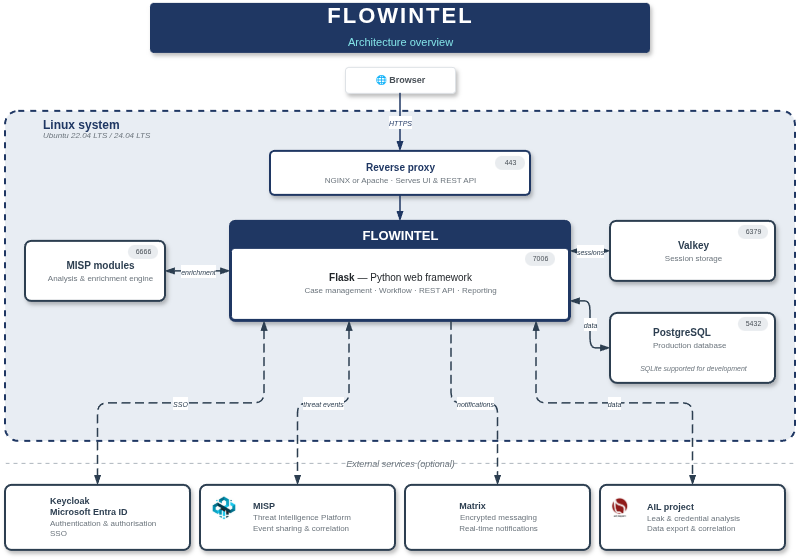

- **Flask application:** the Flowintel codebase itself, written in Python. It implements the case workflow, the user interface, the permissions and the links to external systems.
- **Gunicorn:** runs the Flask application as several worker processes that handle requests in parallel.
- **Reverse proxy (NGINX or Apache):** the public entry point. It terminates HTTPS, serves the static files and exposes both the web interface and the REST API to the network.
- **PostgreSQL:** the database that records cases, tasks, users, audit information and configuration. SQLite is used for development and demonstrations only.
- **Valkey:** an in-memory store, compatible with Redis, that holds user session data. Keeping sessions out of the database keeps the interface responsive and makes it easier to scale the application tier later.
- **misp-modules service:** an enrichment engine that pulls extra context on observables (IP addresses, domains, files and similar) from third-party sources such as VirusTotal or CIRCL PassiveDNS. It runs as a separate service and is called on demand.
- **MISP taxonomies and galaxies:** open vocabularies from the wider threat-intelligence community, so that classifications, attack techniques and threat-actor labels stay aligned with other organisations.
- **Notifications service:** a background worker that produces updates and alerts inside the interface, so analysts see new assignments and changes without refreshing the page.
- **Template repositories:** case and task templates so teams can keep their playbooks under version control, share them between instances and bring in templates published by other organisations.
- **GPG:** Flowintel can sign case reports. 
- **SQLAlchemy:** maps the Python models to relational tables and manages queries, relationships and transactions, which keeps the data model clear and the code mostly independent of low-level SQL.
- **Optional integrations:** single sign-on with Keycloak and Microsoft Entra ID, mailbox ingestion over IMAP, outbound webhooks, and links to MISP, AIL or Matrix. None of these are required; they are enabled only when the organisation has the matching infrastructure.

In a typical installation all these components run on the same host.

Some features are handled in one central place: authentication and sessions (Flask-Login and Flask-Session, stored in Valkey), CSRF protection (Flask-WTF), authorisation through role decorators (`@admin_required`, `@login_required`), database migrations (Flask-Migrate and Alembic), background notifications, logging to rotating files, and the links to external systems (MISP, misp-modules, Matrix, and the identity providers Keycloak and Microsoft Entra ID).

The diagram below zooms in on the Flowintel process itself. It shows the same components as the overview above, but grouped onto the layered structure introduced at the start of this section: a request enters through the reverse proxy and passes down through the presentation and API, business-logic and data-access layers before reaching the data stores and the optional external services.

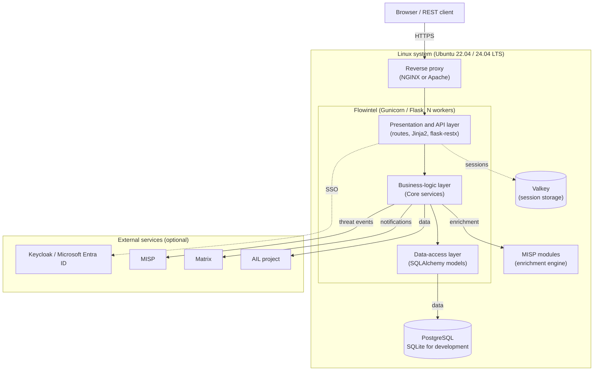

#### 2.1.2 How the components work together at runtime

A user's browser talks to the **reverse proxy** (NGINX or Apache) over HTTPS. The reverse proxy serves the static files itself and forwards the application requests to **Gunicorn**, which passes each request to one of its Flask worker processes. The workers are the runtime units of the application: separate Python processes, each able to handle a request on its own. They are deliberately stateless between requests, so all lasting state is kept in the backend services.

Operational data is stored in **PostgreSQL**: cases, tasks, notes, tags, assignments, history and connector metadata. User session data is stored in Valkey. When an analyst asks for enrichment on an observable, the worker calls the misp-modules service and stores the result back on the case. The notifications service runs alongside the application and creates the notification records shown in the interface. Users sign in with a local **account** or through single sign-on with Keycloak or Microsoft Entra ID, and a case can be synchronised with a MISP instance through a connector.

Each component runs as its own systemd service on the host, so the platform starts with the server and can be restarted one component at a time during maintenance.

Flowintel keeps two kinds of audit trail. Activity that belongs to a case (status changes, comments, file uploads, task updates) is stored in the database next to the case, so analysts can see the full history from the interface. Application events (logins, errors, background jobs) are written to rotating log files under `logs/`, with `logs/record.log` as the main file.

Backups are handled at the data layer: a regular dump of the PostgreSQL database, together with the `uploads/` folder, is enough to restore a working instance on a fresh server. For deployments that need protection of data at rest, Flowintel can be installed on encrypted volumes.

#### 2.1.3 Supported operating systems

Flowintel runs on Ubuntu Linux 22.04 LTS and 24.04 LTS. Other Debian-based distributions may work but are not officially tested.

#### 2.1.4 Implementation frameworks

Flowintel is a Python 3.12 application. The table below lists the main frameworks and libraries per area. It reflects the project dependencies (`requirements.in`, `app/assets/package.json`), not a planned stack.

| Concern | Framework / library | Notes |
|---|---|---|
| **Web framework (back-end)** | **Flask** | Application start `create_app()`, blueprint-based feature modules |
| **REST API** | **Flask-RESTX** | Namespaced REST API with an interactive Swagger UI at `/api/` |
| **ORM / data access** | **SQLAlchemy** and **Flask-SQLAlchemy** | Model classes in `app/db_class/db.py` |
| **Database migrations** | **Flask-Migrate** (Alembic) | Versioned schema changes under `migrations/` |
| **Templating (front-end)** | **Jinja2** (server-side) | HTML rendered on the server; templates under `app/templates/` |
| **UI toolkit / client JS** | **Bootstrap 5**, **jQuery**, **Vue 3** (progressive), **Chart.js**, **FullCalendar**, **CodeMirror**, **Mermaid** | Bundled with **Vite**. Vue is used for single interactive components, not as a SPA |
| **Forms and validation** | **Flask-WTF** and **WTForms** | Server-side form validation and CSRF protection |
| **Authentication / session** | **Flask-Login**, **Flask-Session**, **MSAL**, Keycloak (OIDC) | Local accounts, plus SSO through Microsoft Entra ID and Keycloak |
| **Session / cache store** | **Valkey** (Redis-compatible) | Server-side session storage; keeps session data out of the relational database |
| **Database** | **PostgreSQL** (production), **SQLite** (development and demos only) | Main relational data store |
| **WSGI server** | **Gunicorn** | Several worker processes (`-w 4` by default) bound to port 7006 |
| **Reverse proxy** | **NGINX** or **Apache** | TLS termination, static file delivery, request proxying; `ProxyFix` reads `X-Forwarded-*` |
| **Packaging / runtime** | **systemd** | `flowintel`, `postgresql` and `valkey` run as `systemd` services |
| **Threat-intelligence integration** | **PyMISP**, **misp-modules**, **pytaxonomies**, **pymispgalaxies** | MISP interoperability, taxonomies and galaxies, enrichment of observables |
| **Messaging / notification** | **matrix-nio** (including end-to-end encryption) | Matrix-based notifications |
| **Security / crypto** | **python-gnupg**, **Werkzeug** password hashing | GPG signing and encryption of reports; salted password hashes |
| **Scheduling** | **schedule** | Recurring notifications and periodic jobs |
| **Testing** | **pytest** | Test suite under `tests/` |

**Dependency management.** The Python dependencies are kept in two files. `requirements.in` is the short source list that the developers maintain by hand, and it names only the direct dependencies. `requirements.txt` is generated from `requirements.in` with `pip-compile` (part of pip-tools). It pins every package to an exact version and adds the indirect dependencies, so every install uses the same tested set. A few dependencies are pinned to a specific Git commit instead of a released version.

---

### 2.2 Structural view

The structural view describes what the system is made of. Flowintel has **multiple persistent model classes**, so the class diagram is split by subdomain instead of shown as one large diagram. The component and deployment diagrams then show how the modules and the runtime nodes fit together.

#### 2.2.1 Class diagram

The domain model falls into six subdomains. The diagrams show only the main attributes and methods. The association (join) classes are described in the data model section.

**(a) Identity and access: users, organisations and roles**

A `User` belongs to one `Org` and points to one `Role`. The `Role` holds a set of boolean permission flags (admin, read-only, org-admin, case-admin, queue-admin, queuer, audit-viewer, template-editor, misp-editor and importer). The `User` helper methods (`is_admin()`, `is_org_admin()` and so on) read these flags. An editor is a role that is not read-only.

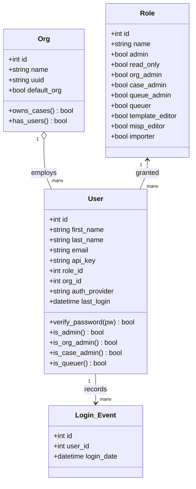

**(b) Case management: the main work items**

This is the core of the model. A `Case` owns many `Task`s, and deleting the case deletes its tasks. A `Task` owns `Subtask`s, `Note`s, URLs and tools, external references and links to MISP objects. Both `Case` and `Task` point to a `Status` and can hold `File`s. Cases are shared with organisations through `Case_Org`, and users are assigned to tasks through `Task_User`.

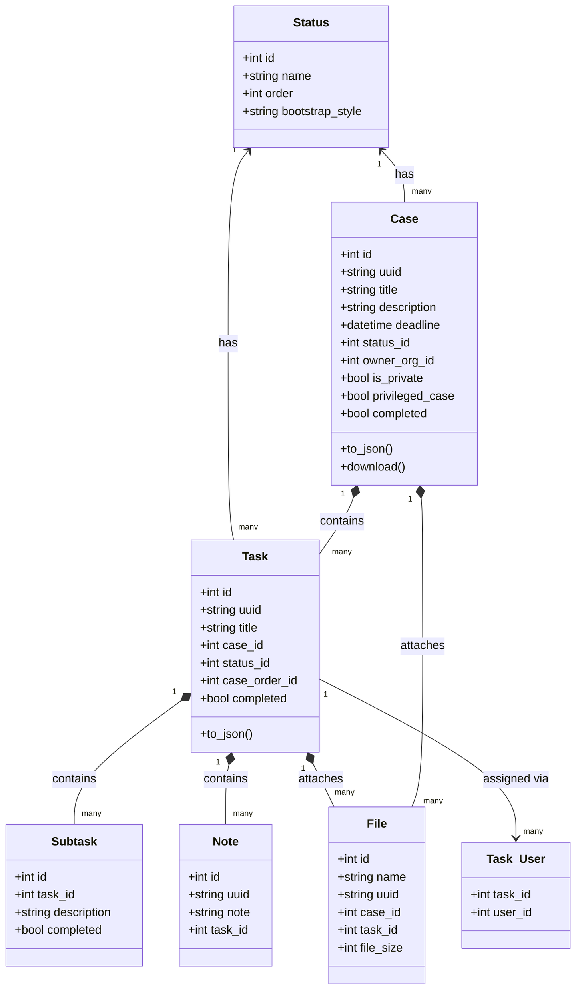

**(c) Templating: reusable playbooks**

`Case_Template` and `Task_Template` follow the same shape as cases and tasks, and are linked through `Case_Task_Template`. Templates are modelled by `Template_Repository` and `Template_Repository_Entry`. Reusable note skeletons
are stored in `Note_Template_Model`.

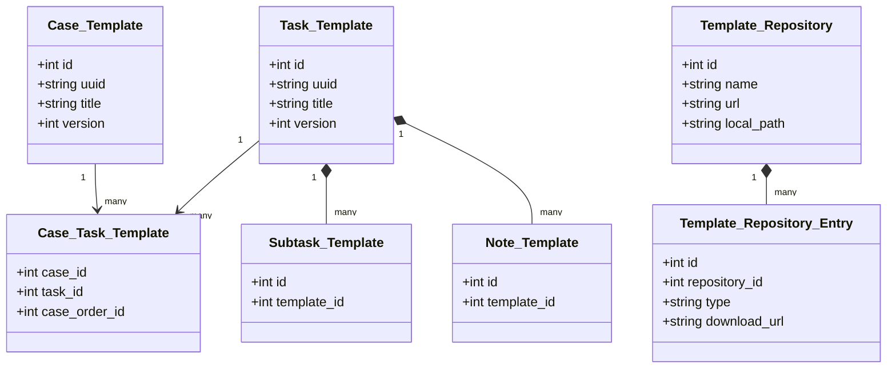

**(d) Classification: taxonomies, galaxies and custom tags**

A `Taxonomy` owns `Tags`, and a `Galaxy` owns `Cluster`s. Cases, tasks and their templates are tagged through separate association tables (for example `Case_Tags` and `Task_Galaxy_Tags`). Free-form `Custom_Tags` give labels outside the default vocabulary.

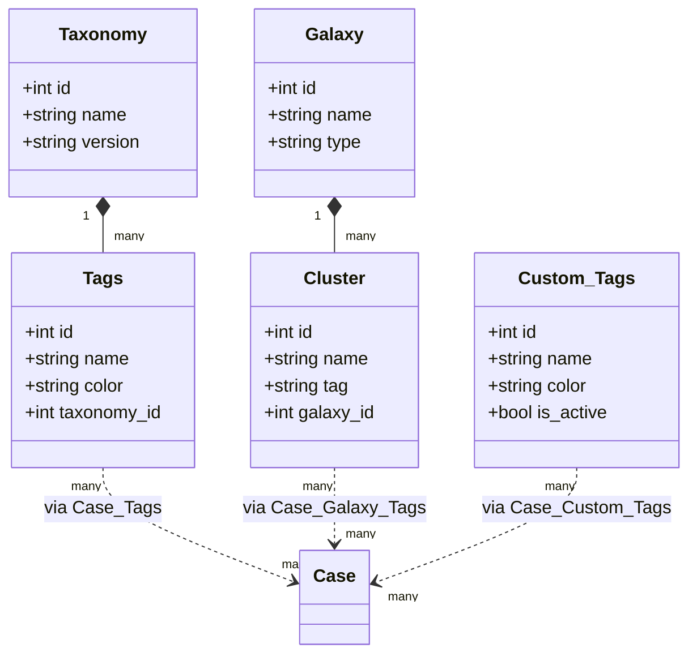

**(e) Integrations: connectors and enrichment**

A `Connector` (for example MISP) has many `Connector_Instance`s, which are the configured endpoints. Cases and tasks are linked to instances through `Case_Connector_Instance` and `Task_Connector_Instance`. Every synchronisation is recorded in `Connector_Sync_Log`. `Misp_Module` and `Misp_Module_Result` model the on-demand enrichment of observables.

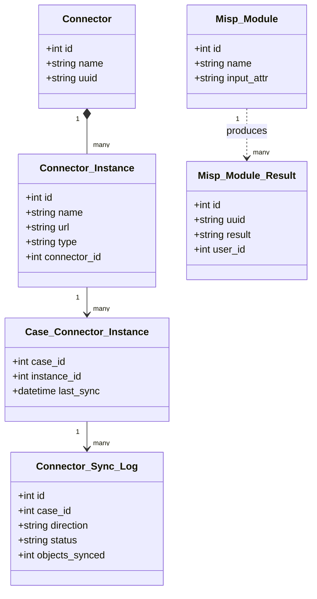

**(f) MISP objects: structured observables inside a case**

`Case_Misp_Object` holds a MISP object attached to a case, and each object has many `Misp_Attribute`s. Tasks refer to these objects through `Task_Misp_Object`. The identity of an object on a remote, synchronised MISP instance is tracked by the `*_Instance_Uuid` tables.

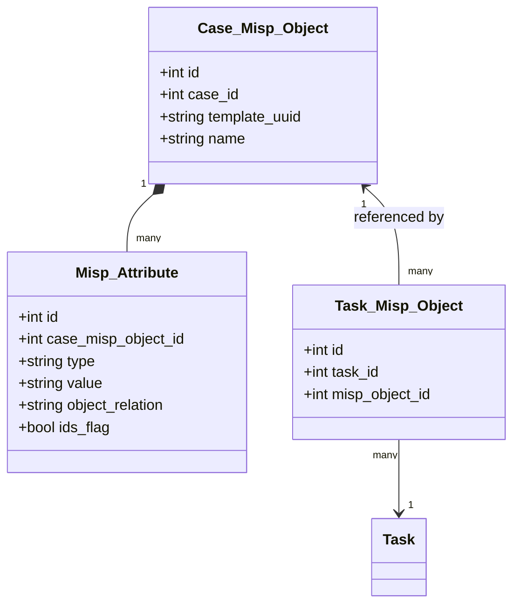

#### 2.2.2 Object diagram

An object diagram is a **snapshot at instance level**. It shows specific objects and their links at one moment in time. For a data-driven application like Flowintel, the shape at runtime follows directly from the class diagram above, so one example snapshot is enough for this section.

The snapshot below shows an example phishing investigation: case #42, owned by the CSIRT organisation, with two tasks, one assignee and one MISP object.

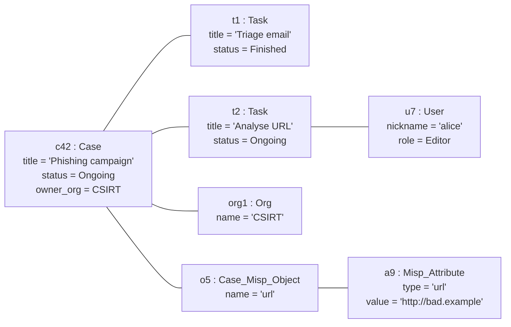

#### 2.2.3 Component diagram

The component diagram groups the Flask blueprints into **functional areas** and shows what they depend on, both the infrastructure and the external systems. Each area is a set of blueprints (named in brackets). All internal components run inside the single application process. The arrows are calls inside that process, except where they reach an external system over the network.

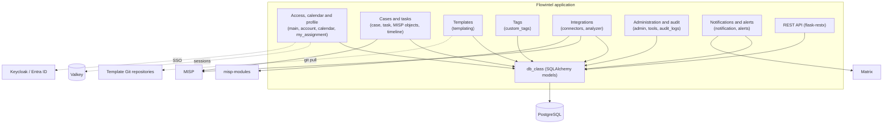

#### 2.2.4 Deployment diagram

The deployment diagram maps the software onto **runtime nodes**. In a normal single-host installation, every component runs on one Linux server, each as its own `systemd` service.

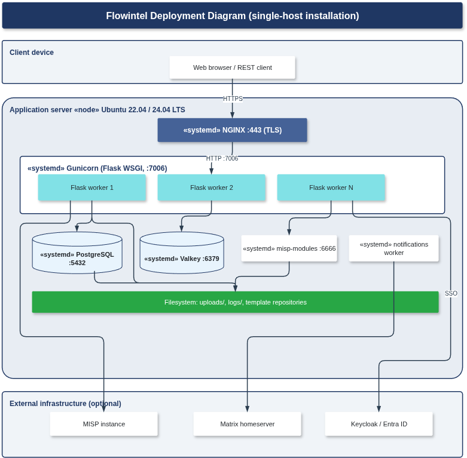

---

### 2.3 Behavioural view

#### 2.3.1 Use cases

The use cases below are based on the functional requirements for Flowintel.

**Actors.** The actors are the human roles from the permission system, plus the external systems that Flowintel connects to.

- **Any authenticated user.** Logs in, views the cases and tasks that are visible to their organisation, and manages their own profile and notifications.
- **Editor.** The everyday user, who creates and works on cases, tasks and their
  metadata.
- **Read Only user.** Views cases, tasks and the calendar, but cannot change them.
- **Org Admin.** Manages the user accounts of their own organisation.
- **Administrator.** Full control over users, organisations, connectors, custom tags, taxonomies, galaxies, statistics and audit logs.
- **Case Admin, Queue Admin and Queuer.** Run the four-eye (privileged case) workflow. A Queuer submits a task for approval, and a Queue Admin or Case Admin approves or rejects it.
- **Template Editor.** Manages case, task and note templates and the central template repositories.
- **MISP Editor.** Adds and edits MISP objects on cases and tasks.
- **Importer.** Imports data into cases and tasks, including creating a case from a MISP event.
- **Audit Viewer.** Reads the audit logs.
- **External systems.** MISP (event and attribute synchronisation, enrichment, and creating a case from an event) and the SSO identity providers Keycloak and Microsoft Entra ID.

**Common precondition.** Apart from UC-01 (Log in), every use case needs an authenticated user with a role or permission that allows the action. Whether a case is visible also depends on the user's organisation and on the private-case and privileged-case flags.

There are 29 use cases. To keep the diagram readable, it shows the actors and the functional areas they work in, instead of drawing all use cases at once. Each area groups several use cases.

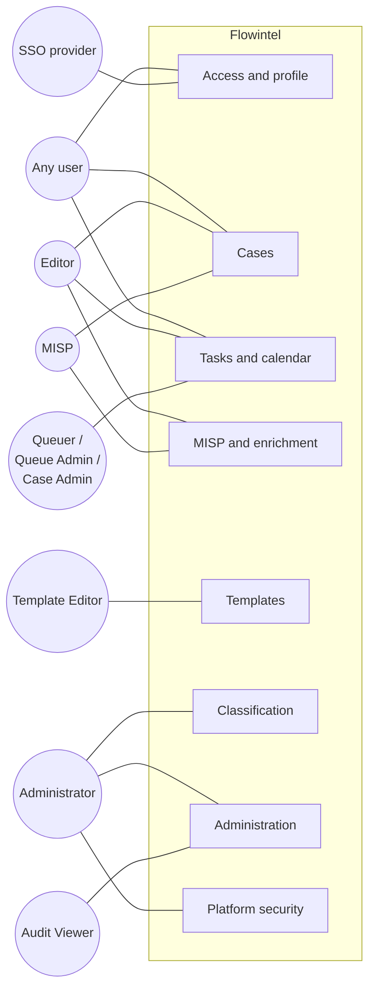

**Use-case catalogue**

The table lists all use cases with their primary actors, a short description and the main variations.

| ID | Use case | Primary actor(s) | Description | Alternative courses |
|---|---|---|---|---|
| UC-01 | Log in | Any user, SSO provider | Validate the credentials and start a session. The REST API uses an API key instead of a session. | Missing data; invalid credentials; forgotten password |
| UC-02 | Create cases | Editor, Admin, Case Admin | Create, edit, complete and delete cases. | Missing data; create from template; edit; delete; complete |
| UC-03 | List cases | Any user | List the cases the user is allowed to see. | Filter; no results |
| UC-04 | View case detailed information | Any user (view), Editor and Admin (actions) | View all case data and act on it. | Download; recurring; fork; template; link case; audit logs; import |
| UC-05 | Manage tasks | Editor, Admin, Case Admin, Queuer | Add, edit, complete and delete the tasks in a case. | Missing data; approve or reject; from template; edit; delete; complete; assignment; send to modules; change order; import |
| UC-06 | Manage task details | Editor, Admin | View and change one task. | Assign users; URLs and tools; status; subtasks; notes; connectors; files; import |
| UC-07 | Add meta information to a task | Editor, Admin | Add, view, change and delete task metadata (tags, notes, references). | Missing data; change; view; delete |
| UC-08 | List tasks | Any user | List and filter the tasks assigned to the user. | Filter; no results |
| UC-09 | View calendar | Any user | View the tasks in a calendar. | Filter; no results |
| UC-10 | Manage organisations | Admin | Create, view, edit and delete organisations. | Missing data; edit; delete; view |
| UC-11 | Manage users | Admin, Org Admin | Create, view, edit and delete users and assign their role and permissions. | Missing data; edit; delete; view |
| UC-12 | Manage connectors | Admin | Manage connectors and their instances (MISP, AIL). | Missing data; edit; delete; view; manage instance |
| UC-13 | MISP objects on a case | MISP Editor, Editor, Admin | Add, view, edit and delete MISP objects and their attributes on a case. | Wrong data; manage attributes; view; delete |
| UC-14 | Add MISP object from search | MISP Editor, Editor, Admin, MISP | Search MISP and add the matching results to a case or task. | Add to a new case; no results |
| UC-15 | Manage case templates | Template Editor, Admin | Create, view, edit and delete case templates. | Missing data; view; edit; delete |
| UC-16 | Manage task templates | Template Editor, Admin | Create, view, edit and delete task templates (subtasks, URLs and tools, notes, connectors). | Missing data; view; edit; delete |
| UC-17 | Manage note templates | Template Editor, Admin | Create, view, edit and delete note templates. | Missing data; view; edit; delete |
| UC-18 | Central repository of templates | Template Editor, Admin | Register template repositories and import case and task templates. | Manage repositories; add or compare a template; invalid template; permission denied |
| UC-19 | Manage custom tags | Admin | Create, view, edit and delete custom tags. | Missing data; view; edit; delete |
| UC-20 | Manage taxonomies | Admin | View, search and enable or disable taxonomies. | Enable or disable |
| UC-21 | Manage galaxies | Admin | View, search and enable or disable galaxies. | Enable or disable |
| UC-22 | List modules | Admin | List the available enrichment and notification modules. | None |
| UC-23 | View stats | Any user | View graphical statistics about the cases and the system. | None |
| UC-24 | Create case from MISP event | Editor, Admin, Importer, MISP | Create a case from a MISP event through a connector instance. | Missing data |
| UC-25 | Manage notifications | Any user | View and filter the notifications. | Mark read or unread; mark all read; delete |
| UC-26 | Manage profile information | Any user | View and edit the user's own profile. | Edit; missing data |
| UC-27 | View audit logs | Admin, Audit Viewer | View the per-case and system-wide audit logs. | Export the logs |
| UC-28 | Export case report | Editor, Admin | Export a case report. | Download; save to the case; attach to MISP; missing data |
| UC-29 | Encryption of data storage | System administrator (deployment) | Encrypt storage at operating-system and database level to protect data at rest. | None |

**Example: UC-11 Manage users, create-a-user flow**

| Use case | Precondition | Flow of events |
|---|---|---|
| UC-11 Manage users (create a user) | The administrator or org admin is authenticated and authorised. | 1. Open the "Add user" page; 2. Fill in the user details and select the role and organisation; 3. Submit to create the user. |

The sequence diagram and the collaboration diagram in the following subsections show this same flow (UC-11 Manage users) in more detail.

#### 2.3.2 Sequence diagram

**Generic overview: a typical request through the layers.** This shows the path that a normal interactive request follows, from the frontend, through the backend layers, to the data layer. It includes the session check that Flask-Login does against Valkey.

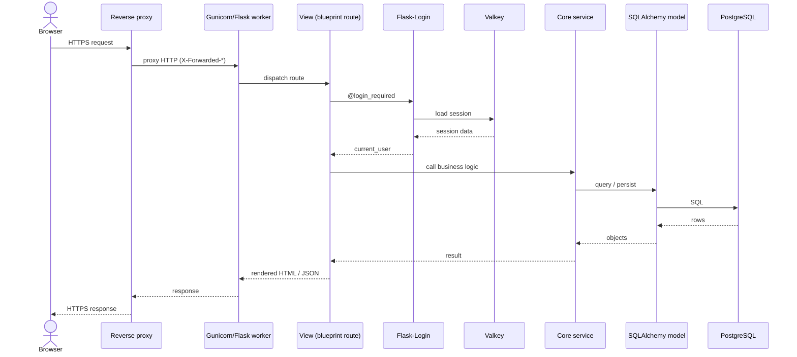

**Detailed flow: UC-11 Manage users, create a user.** This follows the create-a-user flow through the real Flowintel modules: `admin.py` (View), then the `@admin_required` check, then `RegistrationForm` (WTForms), then `admin_core.add_user_core` (Service), then the `User` model (DAO), then PostgreSQL. This matches the template's "FrontendView, FrontendController, BackendService, DAO, Data layer" chain.

Form validation includes a uniqueness check. The `validate_email` validator queries the `User` table, and if the email is already registered the form is rejected and no user is created. A unique index on the email column backs this up at the database level. The diagram below shows both outcomes: the email is new, or the email already exists.

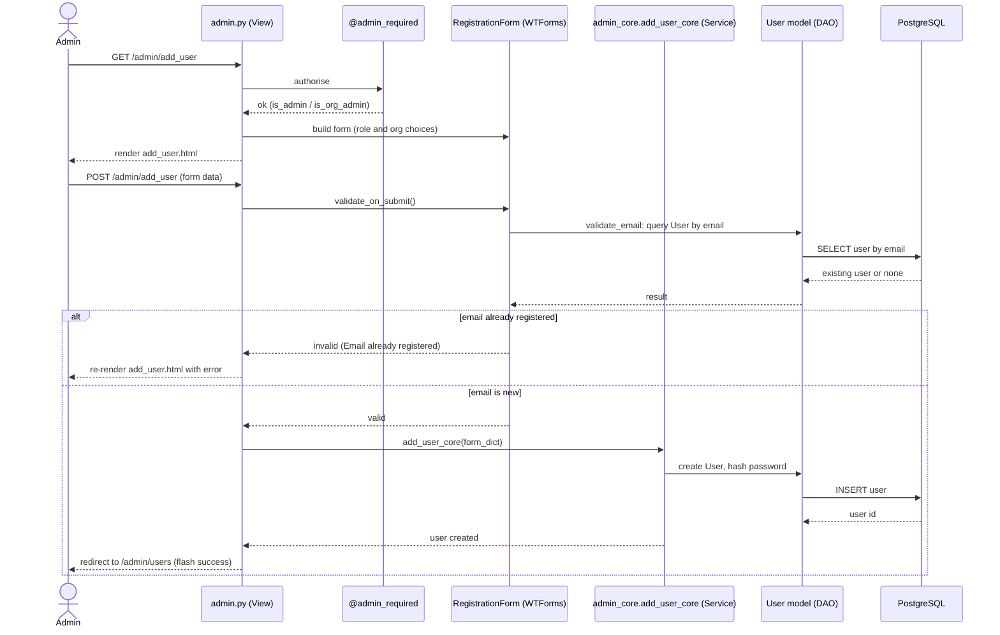

#### 2.3.3 Collaboration diagram

A collaboration (communication) diagram shows the same interactions as the sequence diagram for the create-a-user flow, but arranged around the links between the participants, with numbered messages instead of a time line. It carries the same information as the sequence diagram, so one example is enough (again UC-11 Manage users).

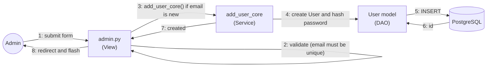

#### 2.3.4 Statechart diagram

This diagram shows the state changes behind UC-02 (Create cases) and UC-05 (Manage tasks). Tasks move through the nine `Status` values created at start-up (`Created`, `Requested`, `Approved`, `Ongoing`, `Request Review`, `Finished`, `Rejected`, `Recurring`, `Unavailable`). On a normal case a task follows Created, then Ongoing, then Finished. On a privileged (four-eye) case the approval comes first: a new task is Requested, and an approver sets it to Approved or Rejected. Only an approved task is worked on. When the work
is done the task goes to Request Review, and a reviewer sets it to Finished.

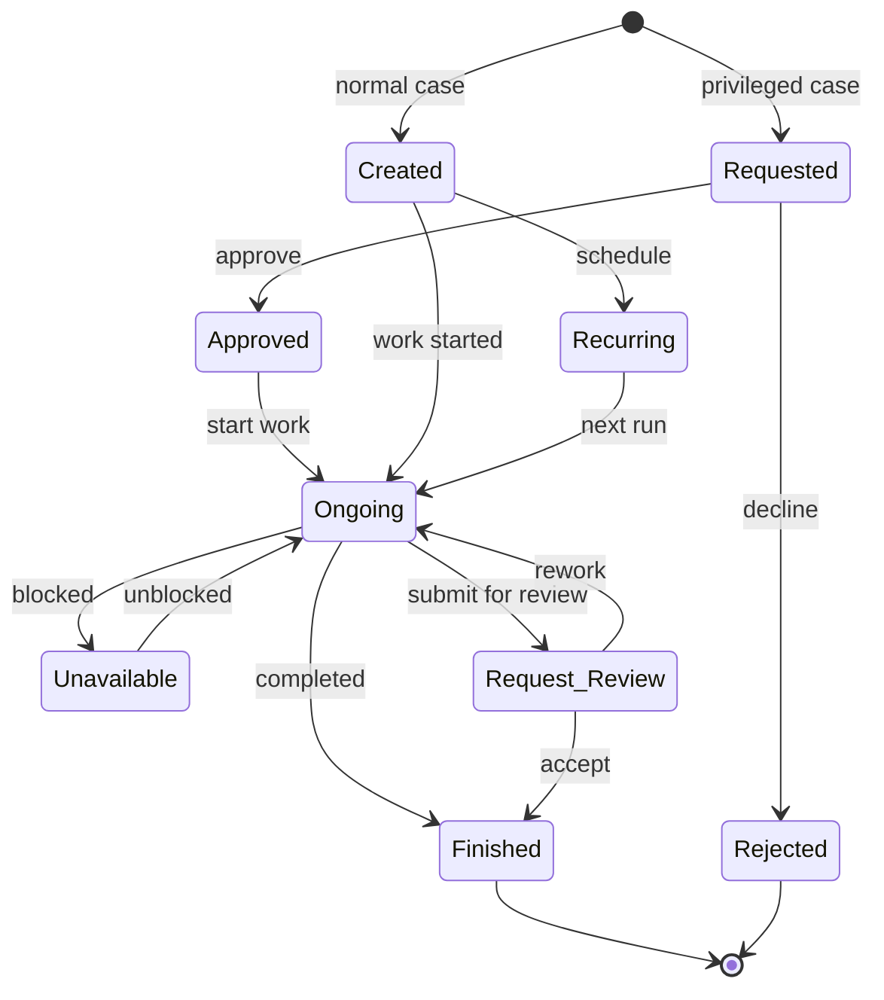

#### 2.3.5 Activity diagram

The activity diagram below shows the whole investigation workflow: create a case, add tasks, do the work, enrich and optionally synchronise with MISP, and finally report. A privileged (four-eye) case has two approval gates. The first is at the start: a new task is Requested and an approver must approve it before any work begins. The second is at the end: the finished work goes to Request Review, and a reviewer accepts it. A normal case skips both gates. The diagram ties together several use cases, mainly UC-02, UC-05, UC-13, UC-14 and UC-28.

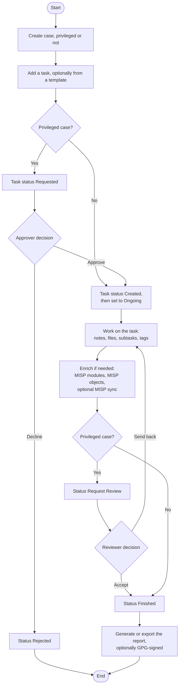

---

## 3. Data model

Flowintel uses a relational data model, built with SQLAlchemy and changed over time through versioned Alembic migrations. The model is shown at three levels: the conceptual schema (what data exists), the logical schema (attributes, keys and relationships, independent of any database system) and the physical schema (how it is built on the real database system, which is PostgreSQL in production and SQLite in development). All three come directly from the model definitions in `app/db_class/db.py` and the migrations in `migrations/`.

### 3.1 Conceptual schema

The conceptual schema shows the main entities and how they relate, without attributes. It is centred on Case and Task, surrounded by identity entities (User, Org, Role), classification entities (Taxonomy and Tag, Galaxy and Cluster, Custom Tag), and templating and integration entities (Connector, MISP object).

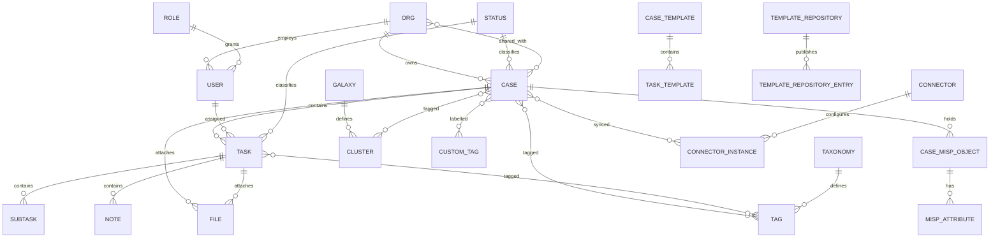

### 3.2 Logical schema

The logical schema adds attributes, primary keys (PK) and foreign keys (FK). It is still independent of the database system. The diagram below shows the core case-management group.

The identity, templating, classification and integration groups follow the same pattern, and the full column lists are in `app/db_class/db.py`. Many-to-many relationships use explicit association tables (for example `Case_Org`, `Task_User`, `Case_Tags`, `Case_Galaxy_Tags` and `Case_Connector_Instance`). 

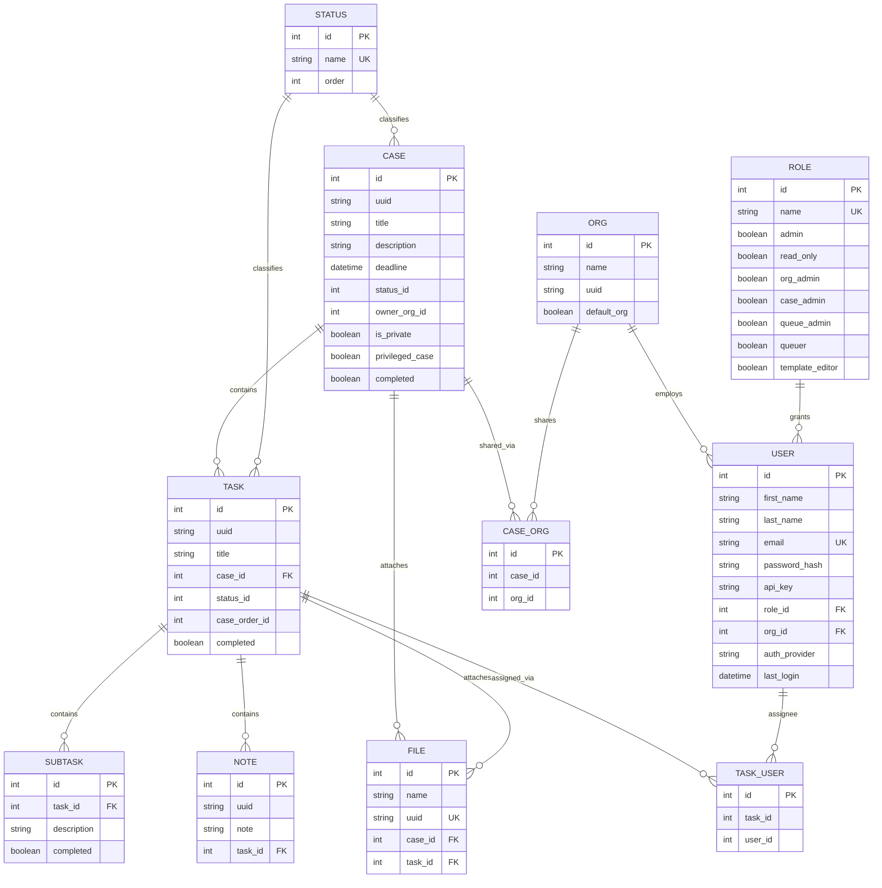

### 3.3 Physical schema

The physical schema describes how the logical model is built on the real database system, which is PostgreSQL in production. (SQLite is supported for development and demos only.) It is derived from the SQLAlchemy models and the Alembic migration history, so no running database is needed.

**Table naming.** Flask-SQLAlchemy builds the table names from the class names. It makes them lower case and adds an underscore before each capital inside the name. Several class names already contain an underscore, so the table names end up with double underscores. The table below is a representative selection, not the full list. All model classes follow the same rule.

| Model class | PostgreSQL table |
|---|---|
| `User` | `user` |
| `Case` | `case` |
| `Task` | `task` |
| `Note` | `note` |
| `Org` | `org` |
| `Case_Org` | `case__org` |
| `Task_User` | `task__user` |
| `Case_Template` | `case__template` |
| `Task_Template` | `task__template` |
| `Connector_Instance` | `connector__instance` |
| `Case_Misp_Object` | `case__misp__object` |
| `Task_Misp_Object` | `task__misp__object` |

A few models set the table name explicitly with `__tablename__`, but the result follows the same rule (for example `Template_Repository` maps to `template__repository`).

**Type mapping.** The SQLAlchemy column types map to PostgreSQL types like this:

| SQLAlchemy | PostgreSQL | Used for |
|---|---|---|
| `db.Integer` | `INTEGER` (`SERIAL` for auto-increment primary keys) | ids, foreign keys, counters, ordering |
| `db.String(n)` / `db.String` | `VARCHAR(n)` / `VARCHAR` | names, titles, uuids, emails |
| `db.Text` | `TEXT` | notes, rule content, chat messages |
| `db.Boolean` | `BOOLEAN` | flags (`completed`, `is_private`, role permissions) |
| `db.DateTime` | `TIMESTAMP` | creation, modification and deadline timestamps |
| `db.JSON` | `JSONB` / `JSON` | connector sync details, note-template parameters |

**Keys, indexes and integrity.**

- Every table has an auto-incrementing integer primary key called `id` (`SERIAL`).
- Foreign keys with `ON DELETE CASCADE` keep the ownership hierarchy consistent. Deleting a `case` row also deletes its `task` and `file` rows, and, through the tasks, the `subtask`, `note` and MISP-object rows. These are set where the models use `db.ForeignKey(..., ondelete="CASCADE")` together with `cascade="all, delete-orphan"` relationships.
- Columns marked `index=True` (for example `email`, `uuid`, `api_key`, `status_id`, `case_id`, `task_id` and the timestamps) become B-tree indexes. Columns marked `unique=True` (for example `User.email`, `Role.name`, `Status.name` and `File.uuid`) become unique indexes.
- Some relationships (tags, galaxy tags and connector links) use association tables that hold only integer id columns with indexes, instead of declared foreign-key constraints. For those, the service layer keeps the references consistent.

**Schema lifecycle.** The physical schema is created and changed only through Alembic migrations (`flask db upgrade`), which run automatically during an upgrade. The connection settings (host, port, database, user and password) come from environment variables (`DB_HOST`, `DB_PORT`, `DB_USER`, `DB_PASSWORD`, `DB_NAME`). Session data is stored in Valkey, not in PostgreSQL, so the transactional data and the session data stay separate.

---

## Appendix A. Mermaid diagram definitions

This appendix collects the source definitions of every diagram used in this document, for reference. The diagrams themselves appear, rendered, in the sections noted. Each entry below gives the title and purpose of a diagram, followed by its Mermaid definition.

### A.1 Layered architecture

*Purpose:* High-level view of the Flowintel process, showing the presentation and API, business-logic and data-access layers together with the data stores and optional external services (see 2.1.1).


### A.2 Class diagram: Identity and access

*Purpose:* Users, organisations and roles, and the permission flags that govern access (see 2.2.1a).


### A.3 Class diagram: Case management

*Purpose:* The core work items: cases, tasks, subtasks, notes, files and status (see 2.2.1b).


### A.4 Class diagram: Templating

*Purpose:* Reusable case, task and note templates and the repositories that publish them (see 2.2.1c).

```mermaid
classDiagram
    class Case_Template {
        +int id
        +string uuid
        +string title
        +int version
    }
    class Task_Template {
        +int id
        +string uuid
        +string title
        +int version
    }
    class Subtask_Template {
        +int id
        +int template_id
    }
    class Note_Template {
        +int id
        +int template_id
    }
    class Case_Task_Template {
        +int case_id
        +int task_id
        +int case_order_id
    }
    class Template_Repository {
        +int id
        +string name
        +string url
        +string local_path
    }
    class Template_Repository_Entry {
        +int id
        +int repository_id
        +string type
        +string download_url
    }
    Case_Template "1" --> "many" Case_Task_Template
    Task_Template "1" --> "many" Case_Task_Template
    Task_Template "1" *-- "many" Subtask_Template
    Task_Template "1" *-- "many" Note_Template
    Template_Repository "1" *-- "many" Template_Repository_Entry
```

### A.5 Class diagram: Classification

*Purpose:* Taxonomies, galaxies, clusters and custom tags used to label cases and tasks (see 2.2.1d).

```mermaid
classDiagram
    class Taxonomy {
        +int id
        +string name
        +string version
    }
    class Tags {
        +int id
        +string name
        +string color
        +int taxonomy_id
    }
    class Galaxy {
        +int id
        +string name
        +string type
    }
    class Cluster {
        +int id
        +string name
        +string tag
        +int galaxy_id
    }
    class Custom_Tags {
        +int id
        +string name
        +string color
        +bool is_active
    }
    Taxonomy "1" *-- "many" Tags
    Galaxy "1" *-- "many" Cluster
    Tags "many" ..> "many" Case : via Case_Tags
    Cluster "many" ..> "many" Case : via Case_Galaxy_Tags
    Custom_Tags "many" ..> "many" Case : via Case_Custom_Tags
```

### A.6 Class diagram: Integrations

*Purpose:* Connectors, their configured instances, synchronisation logs and MISP-module enrichment (see 2.2.1e).

```mermaid
classDiagram
    class Connector {
        +int id
        +string name
        +string uuid
    }
    class Connector_Instance {
        +int id
        +string name
        +string url
        +string type
        +int connector_id
    }
    class Case_Connector_Instance {
        +int case_id
        +int instance_id
        +datetime last_sync
    }
    class Connector_Sync_Log {
        +int id
        +int case_id
        +string direction
        +string status
        +int objects_synced
    }
    class Misp_Module {
        +int id
        +string name
        +string input_attr
    }
    class Misp_Module_Result {
        +int id
        +string uuid
        +string result
        +int user_id
    }
    Connector "1" *-- "many" Connector_Instance
    Connector_Instance "1" --> "many" Case_Connector_Instance
    Case_Connector_Instance "1" --> "many" Connector_Sync_Log
    Misp_Module "1" ..> "many" Misp_Module_Result : produces
```

### A.7 Class diagram: MISP objects

*Purpose:* MISP objects and their attributes attached to cases and tasks (see 2.2.1f).

```mermaid
classDiagram
    class Case_Misp_Object {
        +int id
        +int case_id
        +string template_uuid
        +string name
    }
    class Misp_Attribute {
        +int id
        +int case_misp_object_id
        +string type
        +string value
        +string object_relation
        +bool ids_flag
    }
    class Task_Misp_Object {
        +int id
        +int task_id
        +int misp_object_id
    }
    Case_Misp_Object "1" *-- "many" Misp_Attribute
    Case_Misp_Object "1" <-- "many" Task_Misp_Object : referenced by
    Task_Misp_Object "many" --> "1" Task
```

### A.8 Object diagram

*Purpose:* An instance-level snapshot of a phishing investigation at one moment in time (see 2.2.2).

```mermaid
flowchart LR
    c42["c42 : Case<br/>title = 'Phishing campaign'<br/>status = Ongoing<br/>owner_org = CSIRT"]
    t1["t1 : Task<br/>title = 'Triage email'<br/>status = Finished"]
    t2["t2 : Task<br/>title = 'Analyse URL'<br/>status = Ongoing"]
    u7["u7 : User<br/>nickname = 'alice'<br/>role = Editor"]
    org1["org1 : Org<br/>name = 'CSIRT'"]
    obj["o5 : Case_Misp_Object<br/>name = 'url'"]
    attr["a9 : Misp_Attribute<br/>type = 'url'<br/>value = 'http://bad.example'"]

    c42 --- t1
    c42 --- t2
    c42 --- org1
    t2 --- u7
    c42 --- obj
    obj --- attr
```

### A.9 Component diagram

*Purpose:* The Flask blueprints grouped by functional area and their dependencies on infrastructure and external systems (see 2.2.3).

```mermaid
flowchart TB
    subgraph flowintel["Flowintel application"]
        direction TB
        access["Access, calendar and profile<br/>(main, account, calendar, my_assignment)"]
        cases["Cases and tasks<br/>(case, task, MISP objects, timeline)"]
        templates["Templates<br/>(templating)"]
        tags["Tags<br/>(custom_tags)"]
        integ["Integrations<br/>(connectors, analyzer)"]
        admin["Administration and audit<br/>(admin, tools, audit_logs)"]
        notif["Notifications and alerts<br/>(notification, alerts)"]
        api["REST API (flask-restx)"]
        dbc["db_class (SQLAlchemy models)"]
    end

    postgres[("PostgreSQL")]
    valkey[("Valkey")]
    misp["MISP"]
    mispmod["misp-modules"]
    matrix["Matrix"]
    idp["Keycloak / Entra ID"]
    gitrepos["Template Git repositories"]

    access --> dbc
    cases --> dbc
    templates --> dbc
    tags --> dbc
    integ --> dbc
    admin --> dbc
    notif --> dbc
    api --> dbc
    dbc --> postgres
    access -. sessions .-> valkey
    access -. SSO .-> idp
    cases --> misp
    integ --> misp
    integ --> mispmod
    notif --> matrix
    templates -. git pull .-> gitrepos
```

### A.10 Use-case diagram

*Purpose:* The actors and the functional areas they work in (see 2.3.1).

```mermaid
flowchart LR
    anyuser(("Any user"))
    editor(("Editor"))
    foureye(("Queuer /<br/>Queue Admin /<br/>Case Admin"))
    tpled(("Template Editor"))
    admin(("Administrator"))
    auditor(("Audit Viewer"))
    misp(("MISP"))
    sso(("SSO provider"))

    subgraph sys["Flowintel"]
        access["Access and profile"]
        cases["Cases"]
        tasks["Tasks and calendar"]
        mispg["MISP and enrichment"]
        templates["Templates"]
        classif["Classification"]
        adminarea["Administration"]
        security["Platform security"]
    end

    anyuser --- access
    anyuser --- cases
    anyuser --- tasks
    editor --- cases
    editor --- tasks
    editor --- mispg
    foureye --- tasks
    tpled --- templates
    admin --- adminarea
    admin --- classif
    admin --- security
    auditor --- adminarea
    misp --- cases
    misp --- mispg
    sso --- access
```

### A.11 Sequence diagram: generic request

*Purpose:* The path a typical interactive request follows through the layers, including the session check (see 2.3.2).

```mermaid
sequenceDiagram
    actor User as Browser
    participant RP as Reverse proxy
    participant GU as Gunicorn/Flask worker
    participant V as View (blueprint route)
    participant AUTH as Flask-Login
    participant VK as Valkey
    participant C as Core service
    participant M as SQLAlchemy model
    participant DB as PostgreSQL

    User->>RP: HTTPS request
    RP->>GU: proxy HTTP (X-Forwarded-*)
    GU->>V: dispatch route
    V->>AUTH: @login_required
    AUTH->>VK: load session
    VK-->>AUTH: session data
    AUTH-->>V: current_user
    V->>C: call business logic
    C->>M: query / persist
    M->>DB: SQL
    DB-->>M: rows
    M-->>C: objects
    C-->>V: result
    V-->>GU: rendered HTML / JSON
    GU-->>RP: response
    RP-->>User: HTTPS response
```

### A.12 Sequence diagram: create a user (UC-11)

*Purpose:* The create-a-user flow, including the e-mail uniqueness check and both outcomes (see 2.3.2).

```mermaid
sequenceDiagram
    actor Admin
    participant V as admin.py (View)
    participant DEC as @admin_required
    participant F as RegistrationForm (WTForms)
    participant S as admin_core.add_user_core (Service)
    participant U as User model (DAO)
    participant DB as PostgreSQL

    Admin->>V: GET /admin/add_user
    V->>DEC: authorise
    DEC-->>V: ok (is_admin / is_org_admin)
    V->>F: build form (role and org choices)
    V-->>Admin: render add_user.html
    Admin->>V: POST /admin/add_user (form data)
    V->>F: validate_on_submit()
    F->>U: validate_email: query User by email
    U->>DB: SELECT user by email
    DB-->>U: existing user or none
    U-->>F: result
    alt email already registered
        F-->>V: invalid (Email already registered)
        V-->>Admin: re-render add_user.html with error
    else email is new
        F-->>V: valid
        V->>S: add_user_core(form_dict)
        S->>U: create User, hash password
        U->>DB: INSERT user
        DB-->>U: user id
        S-->>V: user created
        V-->>Admin: redirect to /admin/users (flash success)
    end
```

### A.13 Collaboration diagram: create a user

*Purpose:* The same create-a-user flow arranged around the links between participants, with numbered messages (see 2.3.3).

```mermaid
flowchart LR
    Admin(("Admin"))
    V["admin.py<br/>(View)"]
    S["add_user_core<br/>(Service)"]
    U["User model<br/>(DAO)"]
    DB[("PostgreSQL")]

    Admin -->|"1: submit form"| V
    V -->|"2: validate (email must be unique)"| V
    V -->|"3: add_user_core() if email is new"| S
    S -->|"4: create User and hash password"| U
    U -->|"5: INSERT"| DB
    DB -->|"6: id"| U
    S -->|"7: created"| V
    V -->|"8: redirect and flash"| Admin
```

### A.14 Statechart: task status

*Purpose:* The status transitions of a task on normal and privileged (four-eye) cases (see 2.3.4).

```mermaid
stateDiagram-v2
    [*] --> Created : normal case
    [*] --> Requested : privileged case

    Requested --> Approved : approve
    Requested --> Rejected : decline
    Approved --> Ongoing : start work
    Created --> Ongoing : work started

    Ongoing --> Unavailable : blocked
    Unavailable --> Ongoing : unblocked
    Ongoing --> Finished : completed
    Ongoing --> Request_Review : submit for review

    Request_Review --> Finished : accept
    Request_Review --> Ongoing : rework

    Created --> Recurring : schedule
    Recurring --> Ongoing : next run

    Finished --> [*]
    Rejected --> [*]
```

### A.15 Activity diagram: investigation workflow

*Purpose:* The end-to-end investigation workflow from creating a case to reporting, including the two approval gates (see 2.3.5).

```mermaid
flowchart TD
    start([Start]) --> create[Create case, privileged or not]
    create --> addtask[Add a task, optionally from a template]
    addtask --> priv{Privileged case?}

    priv -->|No| ongoing[Task status Created,<br/>then set to Ongoing]
    priv -->|Yes| requested[Task status Requested]
    requested --> appr{Approver decision}
    appr -->|Decline| rejected[Status Rejected]
    rejected --> done([End])
    appr -->|Approve| ongoing

    ongoing --> work[Work on the task:<br/>notes, files, subtasks, tags]
    work --> enrich[Enrich if needed:<br/>MISP modules, MISP objects,<br/>optional MISP sync]
    enrich --> gate{Privileged case?}

    gate -->|Yes| review[Status Request Review]
    review --> rev{Reviewer decision}
    rev -->|Send back| work
    rev -->|Accept| finished[Status Finished]
    gate -->|No| finished

    finished --> report[Generate or export the report,<br/>optionally GPG-signed]
    report --> done
```

### A.16 Conceptual schema

*Purpose:* The main entities and their relationships, without attributes (see 3.1).

```mermaid
erDiagram
    ORG ||--o{ USER : employs
    ROLE ||--o{ USER : grants
    ORG ||--o{ CASE : owns
    CASE ||--o{ TASK : contains
    TASK ||--o{ SUBTASK : contains
    TASK ||--o{ NOTE : contains
    CASE ||--o{ FILE : attaches
    TASK ||--o{ FILE : attaches
    USER ||--o{ TASK : assigned
    STATUS ||--o{ CASE : classifies
    STATUS ||--o{ TASK : classifies
    CASE }o--o{ ORG : shared_with
    CASE }o--o{ TAG : tagged
    TASK }o--o{ TAG : tagged
    TAXONOMY ||--o{ TAG : defines
    GALAXY ||--o{ CLUSTER : defines
    CASE }o--o{ CLUSTER : tagged
    CASE }o--o{ CUSTOM_TAG : labelled
    CASE ||--o{ CASE_MISP_OBJECT : holds
    CASE_MISP_OBJECT ||--o{ MISP_ATTRIBUTE : has
    CASE }o--o{ CONNECTOR_INSTANCE : synced
    CONNECTOR ||--o{ CONNECTOR_INSTANCE : configures
    CASE_TEMPLATE ||--o{ TASK_TEMPLATE : contains
    TEMPLATE_REPOSITORY ||--o{ TEMPLATE_REPOSITORY_ENTRY : publishes
```

### A.17 Logical schema

*Purpose:* The core case-management group with attributes, primary keys and foreign keys (see 3.2).

```mermaid
erDiagram
    USER {
        int id PK
        string first_name
        string last_name
        string email UK
        string password_hash
        string api_key
        int role_id FK
        int org_id FK
        string auth_provider
        datetime last_login
    }
    ORG {
        int id PK
        string name
        string uuid
        boolean default_org
    }
    ROLE {
        int id PK
        string name UK
        boolean admin
        boolean read_only
        boolean org_admin
        boolean case_admin
        boolean queue_admin
        boolean queuer
        boolean template_editor
    }
    CASE {
        int id PK
        string uuid
        string title
        string description
        datetime deadline
        int status_id
        int owner_org_id
        boolean is_private
        boolean privileged_case
        boolean completed
    }
    TASK {
        int id PK
        string uuid
        string title
        int case_id FK
        int status_id
        int case_order_id
        boolean completed
    }
    SUBTASK {
        int id PK
        int task_id FK
        string description
        boolean completed
    }
    NOTE {
        int id PK
        string uuid
        string note
        int task_id FK
    }
    FILE {
        int id PK
        string name
        string uuid UK
        int case_id FK
        int task_id FK
    }
    STATUS {
        int id PK
        string name UK
        int order
    }
    CASE_ORG {
        int id PK
        int case_id
        int org_id
    }
    TASK_USER {
        int id PK
        int task_id
        int user_id
    }

    ORG ||--o{ USER : employs
    ROLE ||--o{ USER : grants
    CASE ||--o{ TASK : contains
    TASK ||--o{ SUBTASK : contains
    TASK ||--o{ NOTE : contains
    CASE ||--o{ FILE : attaches
    TASK ||--o{ FILE : attaches
    STATUS ||--o{ CASE : classifies
    STATUS ||--o{ TASK : classifies
    CASE ||--o{ CASE_ORG : shared_via
    ORG ||--o{ CASE_ORG : shares
    TASK ||--o{ TASK_USER : assigned_via
    USER ||--o{ TASK_USER : assignee
```
