# Flowintel user manual


## Purpose of this manual

This manual helps you get started with Flowintel and make the most of it. It covers every part of the platform, from creating your first case to configuring advanced features.


## Related documentation

This user manual is part of a broader documentation set:

- [Flowintel installation manual](installation-manual.md): covers system requirements, installation, configuration, upgrades and backups.
- [Flowintel encryption guide](encryption-guide.md): explains the encryption options to consider before installation (full disk encryption and partition encryption).
- [Flowintel backup and restore guide](backup-restore.md): describes how to back up and restore the database, uploaded files and configuration.


## Prerequisites

To use Flowintel you need:

- A running **Flowintel instance**.
- A modern **web browser** (Chrome, Firefox, Safari or Edge).
- A **user account** created by an administrator. Flowintel does not offer self-registration; an administrator must create your account and provide you with your credentials through a secure channel.
- **Network access** to the Flowintel web interface (generally via HTTPS).


# Flowintel overview

## Flowintel information

**Basic information**

This user manual corresponds to the following product and version.

| Field | Value |
|---|---|
| Product | Flowintel |
| Version | 3.x |
| Licence | Open source (AGPL-3.0) |

**Supported operating systems**

The product has been successfully tested and can be installed in the following operating systems and versions:

| Operating system | Version |
|---|---|
| Ubuntu Linux | 22.04 LTS |
| Ubuntu Linux | 24.04 LTS |

Other Debian-based distributions may work but are not officially tested.

## About Flowintel

Flowintel is an **open-source case management platform**. If your team handles incidents, runs investigations or produces threat intelligence, Flowintel gives you a structured way to organise that work, from initial triage through to the final report.

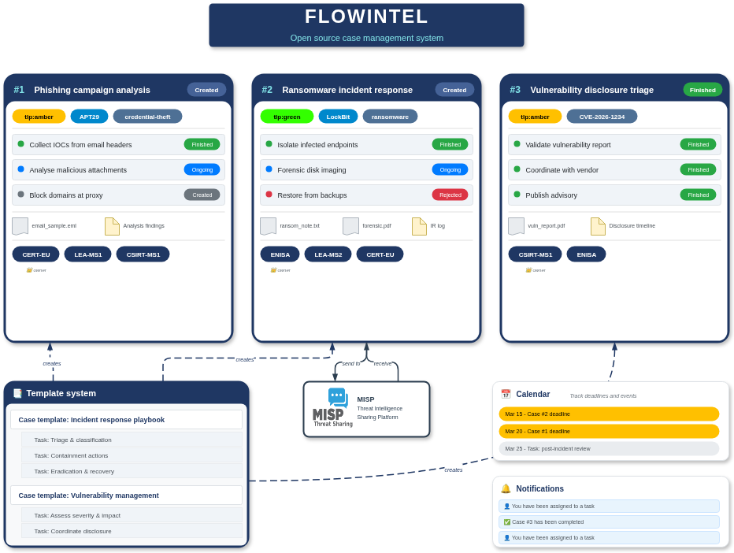

Teams often outgrow spreadsheets, shared documents and generic ticketing systems. Context gets lost between tools; there is no reliable way to track who did what and when; and classification is inconsistent because everyone invents their own labels. Flowintel addresses these problems by combining case and task tracking, threat intelligence classification using MISP community standards, cross-organisation collaboration and a full audit trail in one platform.

Unlike commercial alternatives, Flowintel is open source (AGPL-3.0) and self-hosted: you keep full control of your data, pay no per-user fees and avoid vendor lock-in. There are no artificial limits on cases, users, organisations or roles. The REST API and connector framework let you integrate Flowintel into your existing tooling rather than replacing everything at once.

## Components

From a user perspective, Flowintel is made up of the following components:

| Component | Description |
|---|---|
| **Web interface** | The primary way users interact with Flowintel. Provides access to cases, tasks, templates, the calendar, notifications and all administration features. |
| **REST API** | A complete programmatic interface that mirrors the actions available in the web interface. Used for automation, scripting and integration with external systems. Interactive Swagger documentation is built in. |
| **Case and task engine** | The core of the platform. Manages the creation, editing, assignment and lifecycle of cases and tasks, including status tracking, deadlines and the privileged case workflow. |
| **Contextualisation layer** | Taxonomy tags, galaxy clusters, custom tags and MISP objects. Provides structured classification using community standards from the MISP ecosystem. |
| **Template system** | Predefined case and task templates that allow teams to standardise repeatable workflows (for example, an incident response playbook or a vulnerability management process). |
| **Connector framework** | Integrations with external platforms, primarily MISP and AIL. Connectors can push data from Flowintel to these platforms or pull data back in. |
| **Analysis modules** | Enrichment capabilities powered by MISP modules. Allow analysts to query external services (such as Passive DNS, VirusTotal or Shodan) directly from within a case. |
| **Notification system** | Notifications that inform users about task assignments, case status changes, approaching deadlines and approval requests. |
| **Calendar** | A timeline view showing deadlines for cases and tasks, helping teams plan their workload. |
| **Audit log** | A record of all actions performed on each case, providing a full trail for accountability and review. |

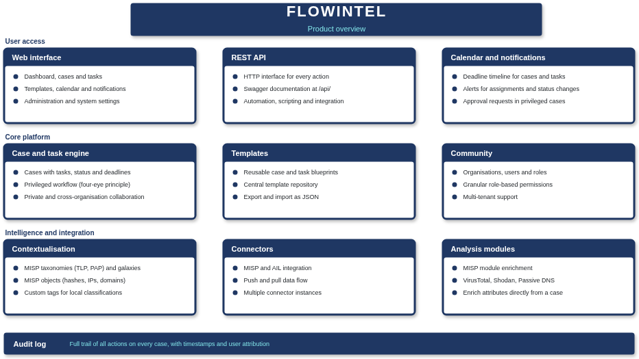

## Intended users of Flowintel

The table below describes who typically uses Flowintel and which role they map to.

| User type | Typical role | Description |
|---|---|---|
| **Analyst / Investigator** | Editor | The primary day-to-day user. Creates and works on cases and tasks, adds notes, attaches files, classifies data with tags and galaxies, and collaborates with colleagues. |
| **Team lead / Supervisor** | Editor with Case Admin or Queue Admin | Oversees investigations. Can mark cases as privileged, approve or reject task requests, and manage the workflow queue. |
| **Organisation administrator** | Editor with Org Admin | Manages users within their own organisation. Can create, edit and remove user accounts for their team. |
| **Platform administrator** | Admin | Manages the Flowintel instance itself: organisations, users, roles, connectors, taxonomies and system settings. Has full access to all features. |
| **Observer** | Read Only | Can view cases, tasks and other data but cannot create or modify anything. Suitable for management oversight or stakeholders who need visibility without write access. |
| **Auditor** | Editor with Audit Viewer | Can view history and audit logs, but also retains the full editing capabilities of the Editor role. Suitable for compliance officers who need access to audit trails and may still contribute to cases. |

The manual uses the following convention: when a section applies only to administrators, this is stated explicitly (for example, "Only users with the Admin system role can perform this action"). All other instructions apply to all user types, subject to the permissions granted by their role.


## Main features of Flowintel

- **Case management**: create, track and close investigation cases with deadlines, audit trails, privacy controls and a privileged workflow for regulated environments.
- **Task management**: break cases into tasks with their own status, deadlines, user assignments, notes, files and subtasks.
- **Cross-organisation collaboration**: assign multiple organisations to a case. Private cases restrict visibility to assigned organisations only.
- **Threat intelligence classification**: tag cases and tasks with MISP taxonomies (TLP, PAP, confidence levels), galaxy clusters (MITRE ATT&CK, threat actors, malware families) and custom tags.
- **MISP objects**: store structured indicators such as file hashes, IP addresses and domains directly on cases using standardised MISP object templates.
- **Connectors**: push case data to MISP or AIL, or pull data back in. Multiple instances with configurable data flow direction.
- **Analysis modules**: enrich MISP object attributes through MISP modules (Passive DNS, VirusTotal, Shodan and others).
- **Templates**: define reusable case and task blueprints for repeatable workflows such as incident response playbooks.
- **REST API**: automate any action available in the web interface. Interactive Swagger documentation is built in.
- **Role-based access control**: three system role types (Admin, Editor, Read Only) with granular additional permissions (Org Admin, Case Admin, Queue Admin, Queuer, Audit Viewer, Template Editor, MISP Editor, Importer).
- **Calendar and notifications**: track deadlines in a timeline view and receive alerts for assignments, status changes and approval requests.
- **File management and external references**: attach files to cases and tasks, convert text files to notes, and preserve external web page content directly in a task.


# Using Flowintel

## Accessing Flowintel

Open your web browser and navigate to your Flowintel instance:

```
https://flowintel.yourdomain.com
```

Log in with the credentials provided by your administrator. If you are the administrator and have just completed the installation, the default credentials are `admin@admin.admin` with the password `admin`. Change this password immediately after your first login.

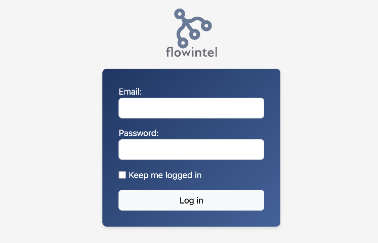


# Follow up on your work

Once you are logged in, Flowintel gives you several ways to keep track of what is happening and what needs your attention. This section covers the **home page**, **notifications** and your personal **task list**.

## The home page

After logging in, you land on the Flowintel home page. At the very top of the screen, the navigation bar contains a **search field** that lets you search for cases by title. As you type, matching cases appear in a dropdown with their title and description, allowing you to jump to any case quickly. This search is available on every page throughout Flowintel.

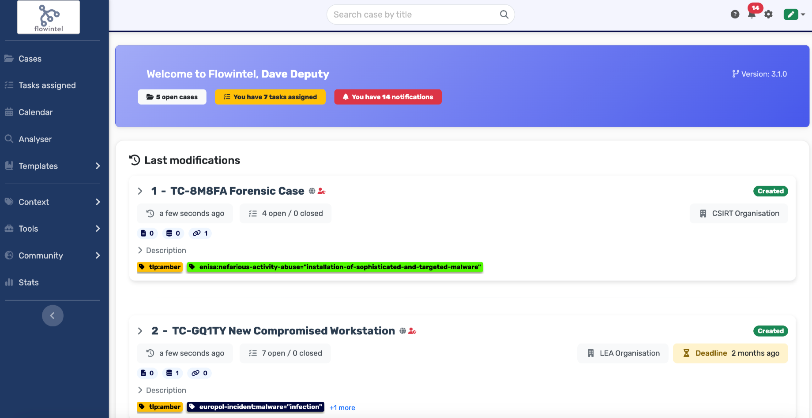

Below the navigation bar, a welcome banner greets you by name and shows three summary badges:

- The number of **open cases** you have access to, linking directly to the case list.
- The number of **tasks assigned** to you. If you have tasks waiting, the badge links to your personal task list. If you have none, the badge confirms that no tasks are assigned.
- The number of **unread notifications**. If there are any, the badge links to the notification page.

Below the welcome banner, the home page displays a list of the most recently modified cases. For each case, you can see the case ID and title, a relative timestamp showing when it was last changed, the description, the current status, how many tasks are open and closed, the deadline, and any tags, taxonomies or galaxy clusters attached to the case. Private cases only appear here if you belong to an organisation assigned to the case or if you are an administrator.

This list gives you a quick overview of where activity is happening across the cases you have access to, without needing to navigate to the full case list.

## Notifications

Flowintel keeps you informed through **notifications**. To view your notifications, click the bell icon in the top right corner. 

The notification page shows a list of notifications with an icon indicating the type, the message text, and a timestamp showing when it was received.

Notifications are created automatically when something relevant happens. The main events that trigger a notification are:

- You are **assigned to a task**, or removed from a task.
- A case is **completed**, revived or deleted.
- A task assigned to you is completed or revived.
- Your organisation is added to a case, removed from a case, or made the owner of a case.
- A deadline on a case or task you are involved in is approaching (within ten days).
- In a privileged case, a task is submitted for approval or a task you requested is approved or rejected.
- A user requests a **password reset** (sent to administrators).

### Filtering notifications

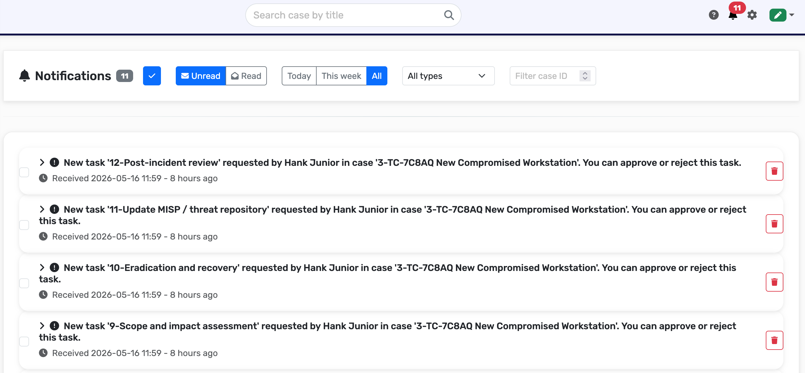

At the top of the notification page, you can switch between unread and read notifications. A time filter lets you narrow the list to notifications from today, this week, or all time. You can also filter by type or category. When a filter is active, a count shows how many notifications match out of the total.

### Acting on notifications

Each notification can be marked as read or unread by clicking the checkbox next to it. You can also mark all unread notifications as read at once using the button at the top of the list. To remove a notification permanently, click the delete button on that row. 

Clicking on a notification takes you to the related case but does not mark it as read. You must mark it as read explicitly. This prevents important messages from being dismissed before you have fully reviewed them.

## Tasks assigned to you

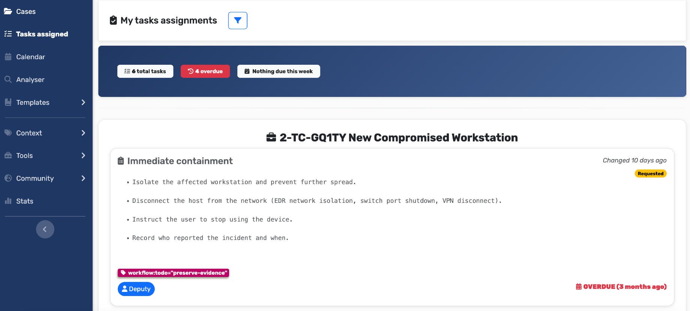

The **Tasks assigned** section in the sidebar shows a personal overview of every task currently assigned to you. Only tasks where you are listed as an assigned user appear here.

At the top, a statistics banner summarises your workload: the total number of tasks assigned to you, how many are overdue, and how many are due this week.

Tasks are grouped by the case they belong to. For each task, you can see the title, a relative timestamp of when it was last changed, the description, the current status, tags, the other users assigned, the deadline, and any incomplete subtasks. Deadlines are colour-coded to help you spot urgent items: overdue tasks are highlighted in red, tasks due today or tomorrow in yellow, and tasks further out or without a deadline in grey.

You can use the filter icon to switch between ongoing and finished tasks, and sort the list by title, last modification, deadline or status. The sort order can be reversed.


# Cases

Everything in Flowintel starts with a case. A case represents a situation that your team needs to investigate, respond to or track. There is no limit on how many cases Flowintel can store; it depends only on the available system resources.

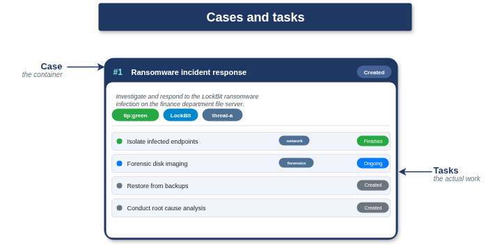

On its own, a newly created case is a **container**: it holds a title, a description, a deadline and contextual elements, but no actual work yet. The case comes to life once you start adding tasks, which represent the **individual steps of the investigation** or response. The first thing you do, therefore, is create the case itself; from there you fill it with tasks, notes, files and add contextual data.

A case is owned by the organisation of the user who creates it. Other organisations can be assigned to the case later, allowing cross-team collaboration. If you use Flowintel organisations to represent internal departments, this means each case naturally tracks which department initiated the investigation.

Each case is automatically assigned a unique **ID** (the number displayed in front of the case title) and a unique UUID. The ID is a simple sequential number used within Flowintel. The UUID is a universally unique identifier that can be used for integration with external systems.

## Listing cases

Navigate to **Cases** in the sidebar. The case list displays all the cases you have access to.

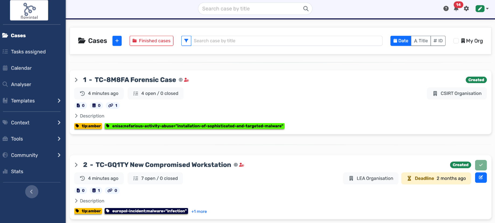

For each case, the list shows:

- the case ID and title
- whether the case is private or privileged
- the current status
- how many tasks are open and how many are finished
- the owner organisation and any other associated organisations
- the deadline
- when the case was last changed
- the tags, taxonomies and galaxies attached to the case
- a quick count of files, objects and linked cases

Clicking a case opens its detail page. If you have the appropriate permissions, you can also complete or edit a case directly from the list.

### Filter and sort cases

By default, cases are sorted by last modification time. At the top of the list, quick filter buttons let you sort by title (case insensitive), by case ID or limit the list to cases owned by your organisation.

For more granular control, click the filter icon. You can sort by:

- Last modification
- Creation date
- Title
- Deadline
- Status
- My Org

You can reverse the sort order at any time. You can also filter by specific contextual elements such as tags, taxonomies and galaxies.

The case description is by default collapsed, but if you click the chevron next to the label "description" it will get expanded.

One quick filter worth noting is **Finished cases**. This button switches the list between cases that are still open and cases that have been marked as finished. The concept of finishing cases is covered in a later section.

## Creating a case

Navigate to **Cases** in the sidebar and click the **Plus** button to create a new case.

The following fields are available:

- **Title** (required): a short name for the case. Must be unique across all cases in Flowintel.
- **Deadline date** (optional): the date by which the case should be finished.
- **Deadline time** (optional): a specific time for the deadline. Only applies when a deadline date has been set.
- **Time required** (optional): an estimate of how much effort the case will take, as free text (for example, "2 hours" or "3 days").
- **Ticket ID** (optional): a reference to an external ticketing system. Useful when Flowintel is used alongside another platform.
- **Description** (optional): a free-text field that supports Markdown. Use it to describe the situation, provide background or record initial findings.

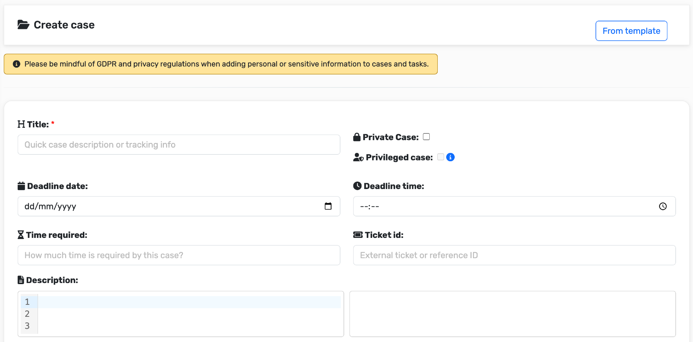

### Case behaviour settings

When creating or editing a case, two settings control how the case behaves:

- **Private case**: when enabled, only users whose organisation is assigned to the case can see it. Other users, except administrators, will not find the case in any listing. Use this for sensitive investigations that should not be visible to the entire platform.
- **Privileged case**: when enabled, certain actions on the case require authorisation from a user with elevated permissions. In a privileged case, a user with the Queuer permission cannot directly create tasks in the normal way. Instead, their tasks are created with a Requested status and must be approved by an administrator, Case Admin or Queue Admin before they become active. This enforces a four-eyes principle, ensuring that an analyst's work is verified by a supervisor.

In short, a private case controls who can see it, while a privileged case controls who can manage it.

### Adding contextual elements

Cases support several types of metadata that help with classification and searching. You can add these when creating a case or edit them afterwards.

- **Taxonomy tags**: tags from MISP taxonomies such as the Traffic Light Protocol (TLP) or the ENISA incident classification. These follow the same standards used in threat intelligence sharing and allow you to label cases consistently. A full list of available taxonomies and their documentation is available at <https://www.misp-project.org/taxonomies.html>.
- **Galaxy clusters**: entries from MISP galaxies, for example a specific threat actor from the Threat Actor galaxy or a technique from the MITRE ATT&CK framework. Attaching galaxy clusters to a case links it to known threats and attack patterns. The complete list of galaxies and their documentation is available at <https://www.misp-project.org/galaxy.html>.
- **Custom tags**: tags that are defined locally in your Flowintel instance, independent of any MISP taxonomy. Use these for labels that are specific to your team or organisation.

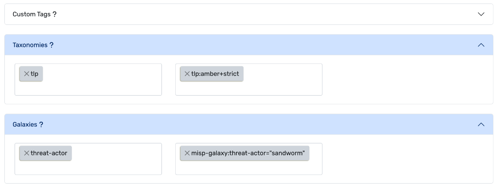


### Creating the case

After you click the **Create** button, the case is created. It is automatically assigned an ID and a unique **UUID**. You can find the UUID under the **Info** tab of the case details.

## Editing a case

After you have created a case, you can also edit it. Editing a case means changing the metadata, behaviour settings or contextual elements. It does not cover editing the tasks within the case.

From the case detail page, click the **Edit** button. You can change the title, description, deadline, time required, ticket ID, and the private and privileged toggles. The same form also lets you add or remove taxonomy tags, galaxy clusters and custom tags.

Only users who belong to an organisation assigned to the case can edit it. Administrators can always edit any case. In a privileged case, only an administrator or Case Admin can change the privileged toggle.

## Deleting a case

If you need to remove a case entirely, you can delete it from the case detail page. Open the case from the case list, then use the **Actions** menu at the top right and choose **Delete**.

Flowintel asks for confirmation before proceeding. Deleting a case removes the case itself, all its tasks, all attached files, the case history and all associated metadata (tags, galaxy clusters, MISP objects, connector data and linked cases). This action cannot be undone.

Only users who belong to an organisation assigned to the case can delete it. In a privileged case, only an administrator or Case Admin can delete the case.

## Case status

A case has two statuses: **Created** or **Finished**.

| Status | Meaning |
|---|---|
| **Created** | The case is open and active. This is the initial state when a case is created. |
| **Finished** | The case is complete. It moves out of the active case list and into the finished cases. |

To mark a case as finished, open the case and click the **Complete** button at the top right. Flowintel sets the case to **Finished**, records the finish date and automatically finishes any tasks that are still open. A notification is sent to all organisations involved in the case.

To revive a finished case, navigate to finished cases, open the case and click the **Revive** button. This brings the case back to the **Created** status and makes it appear in the active case list again. The tasks are not automatically revived; only the case itself returns to the open state. You can then reopen individual tasks as needed.

Flowintel does not require all tasks to be finished before you finish a case. You are free to finish a case at any point, regardless of the state of its tasks. When you later revive the case, each task keeps the status it had at the time the case was finished.

Reviving is useful when new information surfaces or when additional work is required on a case that was thought to be finished.

In a privileged case, only an administrator or Case Admin can complete or revive the case.

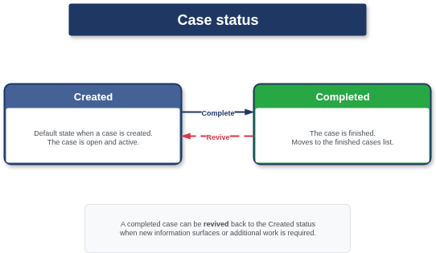

As described in the filtering section, you can quickly switch between open and finished cases with a single click.

## Assigning organisations to cases

By default, the case is assigned to the organisation of the user who created it. You can assign additional organisations to the case, which gives their users access to the case and its tasks. This is how you set up collaboration between teams. There is no functional limit on how many organisations can get assigned to a case.

When you add an organisation, all users in that organisation receive a notification. Likewise, when you remove an organisation, its users are notified and any task assignments for users in that organisation are automatically removed.

A case must always have exactly one owner organisation. You can transfer ownership to another organisation that is already assigned to the case. Changing the owner sends a notification to all users in the new owner organisation.

## Link cases

You can link a case to one or more other cases in Flowintel. This is useful when investigations are related, for example when one case is a follow-up to another or when two cases share the same threat actor. Links are bidirectional: linking case A to case B automatically makes case B link back to case A. You can link multiple cases at once and there is no limit on the number of links.

Linked cases appear on the case detail page, showing the title of each linked case as a clickable link. To remove a link, click the delete button next to it. Removing a link removes it from both sides.

## Create a case report

Flowintel can generate a structured report from the data in a case. Only users with the **Admin** system role can create reports.

To create a report, open the case detail page and select **Create case report** from the **Actions** menu at the top right. This opens the report builder.

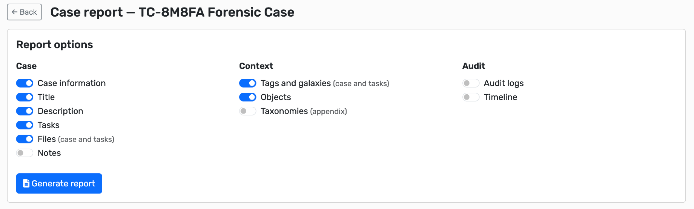

### Report options

The report builder presents a set of toggles, organised in three groups, that let you choose exactly what to include:

- **Case**: case information (metadata such as case ID, creation date, owner organisation, assigned organisations, linked cases, flags, deadline, connectors and task completion), title, description, tasks (with their status, assigned users, deadlines, subtasks, URLs and external references), files (from both the case and its tasks), and notes (case note and task notes).
- **Context**: tags and galaxy clusters (from both the case and its tasks), MISP objects with their attributes, and an optional taxonomy appendix.
- **Audit**: audit logs and the case timeline.

Each toggle can be enabled or disabled independently, so you can tailor the report to its audience. A practical approach is to generate one report with the case information, title, description, task list, files and contextual elements, and a separate report with the full notes content. If you need a compliance or accountability record, create a third report with the audit logs and timeline.

Reports are Markdown-based, which is consistent with how Flowintel handles all large text. One thing to be aware of is that if you include notes, any Markdown headings inside those notes appear at their original level in the report. A level-one heading in a note, for example, shows as a top-level heading in the generated output. Keeping note headings at level three or below avoids this.

### Generating and exporting the report

When you have selected your options, click **Generate report**. Flowintel assembles the content and displays a preview. You can switch between the rendered view and the raw Markdown.

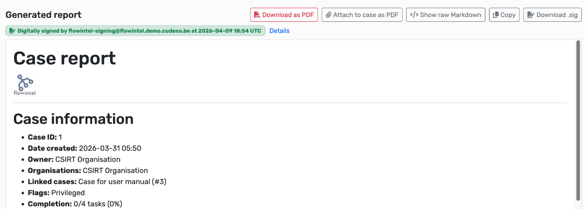

From the preview you have several options:

- **Download as PDF** to save the report locally.
- **Attach to case as PDF** to store the report as a file on the case. You can generate and attach multiple reports over time, which gives you a historical record of the case at different points in the investigation. Although report generation in itself requires Admin privileges, the reports that are attached as a file to a case remain accessible to users that can access case files. 
- **Copy** to place the Markdown content in your clipboard for pasting into another tool.

### Digitally signed report

If your Flowintel instance is configured with GPG signing, the report is automatically signed when it is generated. A signature banner appears above the preview, showing whether the signature is valid and which key was used. You can download the detached `.sig` file alongside the PDF. The signature provides cryptographic proof that the report has not been tampered with after generation, which is particularly useful when reports are shared outside your organisation or submitted as evidence.

## Downloading a case

You can download a case as a JSON file. This is useful when you want to store a point-in-time snapshot of the case in a version control system such as GitLab or GitHub, or when you need a machine-readable export for further processing. To download the case, open the **Actions** menu and choose **Download**.

The export includes the case title, description, deadline, time required, ticket ID, privacy and recurring settings, the case note, all tasks with their notes, subtasks, URLs and external references, all MISP objects with their attributes, and all taxonomy tags, galaxy clusters and custom tags. Uploaded files are not included in the export; if you need to preserve those, download them separately.

## Importing a case

You can import a previously exported case, or any JSON file that follows the Flowintel case schema, back into the platform. Navigate to the **Tools** section in the sidebar and choose **Importer**. Select the **Case** tab, then pick a file by browsing or by dragging it into the upload area. You can upload multiple files at once. Click **Upload cases** to start the import.

Only users with the **Admin** system role or the **Importer** permission can access the importer.

During import, Flowintel validates the JSON against its case schema and applies the same constraints as when creating a case manually. The case title must be unique; if a case with the same title already exists, the import is rejected. If the JSON contains a UUID that already exists in the database, Flowintel generates a new one rather than overwriting the existing case. Tags and galaxy clusters referenced in the file must already exist on your instance, with one exception: a toggle labelled **Create custom tags from JSON** lets the importer automatically create any custom tags that are present in the file but missing from your instance.

## Case history, info and audit trail

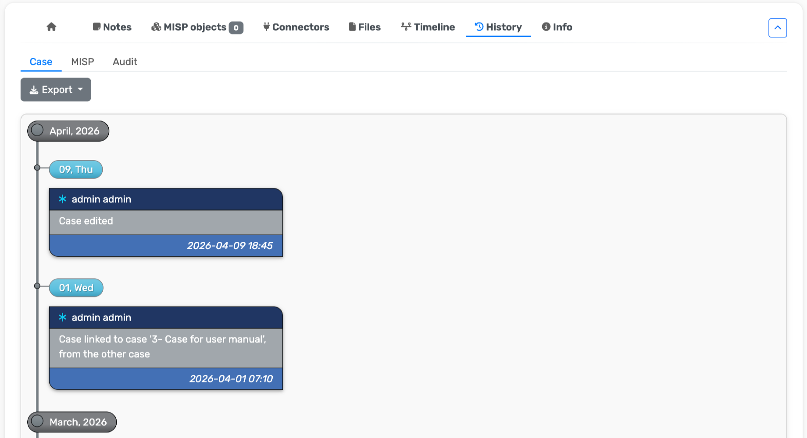

Every action performed on a case is recorded in its history. From the case detail page, open the **History** tab to see a chronological list of entries. Each entry shows the date and time, the name of the user who performed the action, and a description of what was done. Actions recorded include creating, editing and completing the case, adding or removing organisations, linking cases, modifying notes, uploading or deleting files, adding MISP objects and changing connector or template settings.

The history provides a full audit trail for accountability and review. Individual history entries cannot be deleted; the history is only removed when the case itself is deleted.

The **Info** tab shows additional case metadata: the creation date, the time required estimate, and the case UUID. The UUID is a universally unique identifier that can be used when integrating with external systems or referencing the case outside of Flowintel.


# Tasks

With the case in place, the next step is to add tasks. As described earlier, a case on its own is a container; tasks are where the actual work happens. Each task represents a single piece of work that needs to be carried out as part of the investigation or response. A case can contain any number of tasks.

## Listing tasks

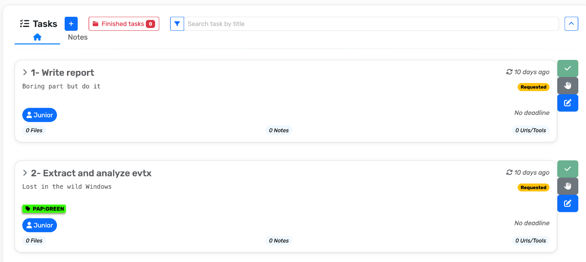

Tasks are listed on the case detail page. By default, they appear in the order they were created, with open tasks at the top and finished tasks at the bottom. You can reorder open tasks by dragging them into the position you prefer.

At the top of the task list, you can switch between open and finished tasks. You can also filter and sort tasks by title, status, deadline, last modification or assignment. A title search lets you find a specific task by name. Additionally, you can filter by contextual elements such as taxonomy tags, galaxy clusters and custom tags.

## Creating a task

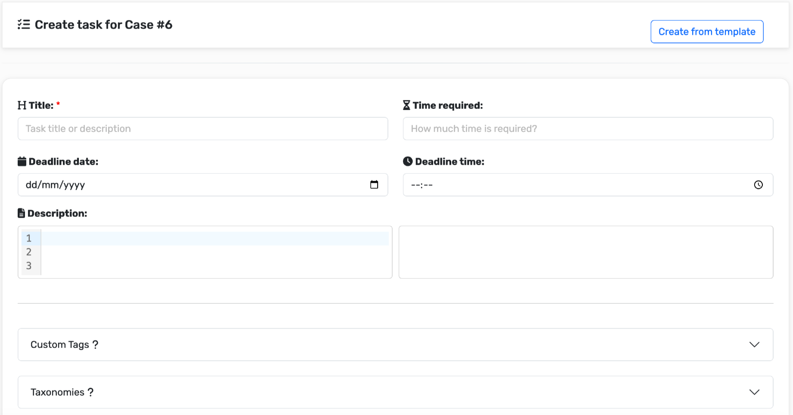

Open a case and click the **Plus** button to create a new task.

The following fields are available:

- **Title** (required): a short name for the task.
- **Description** (optional): a free-text field in Markdown. Use it to describe what needs to be done, include instructions or reference external resources.
- **Time required** (optional): an estimate of the effort needed, as free text.
- **Deadline date** (optional): the date by which the task should be finished.
- **Deadline time** (optional): a specific time for the deadline. Only applies when a deadline date has been set.

### Adding contextual elements to tasks

You can also add taxonomy tags, galaxy clusters and custom tags when creating a task. Tasks support the same contextual metadata as cases.

Adding contextual elements to individual tasks allows you to classify work at a more granular level than the case itself.

## Editing a task

From the case detail view, click the **Edit** button on the task pane. You can change the title, description, time required, deadline, and the tags, taxonomies and galaxies attached to the task.

Only users who belong to an organisation assigned to the case can edit tasks. In a privileged case, tasks with a **Requested** or **Rejected** status can only be edited by an administrator, Case Admin or Queue Admin.

## Task status

Each task goes through a set of statuses that track its progress:

| Status | Meaning |
|---|---|
| **Created** | The task has been created but work has not started. |
| **Ongoing** | Work on the task is in progress. |
| **Recurring** | The task repeats and is not expected to be completed once. |
| **Unavailable** | The task cannot be worked on at this time. |
| **Rejected** | The task has been rejected and will not be carried out. |
| **Finished** | The task has been completed. |

In a privileged case, three additional statuses apply. Privileged cases are covered in detail later in this manual.

| Status | Meaning |
|---|---|
| **Requested** | The task has been submitted by a Queuer and is waiting for approval from an administrator, Case Admin or Queue Admin. |
| **Approved** | The task has been approved and can proceed. |
| **Request Review** | The task has been submitted for review before it can be marked as finished. An administrator, Case Admin or Queue Admin must review and decide the next status. |

To change the status of a task, open the case, click on the task pane and select a new status from the dropdown in the Status section. The assigned users are notified when the status changes. In a privileged case, moving a task to **Requested** or **Request Review** triggers a notification to all approvers. Moving a task from **Requested** to **Approved** or **Rejected** notifies the assigned users.

To mark a task as finished, you can either set its status to **Finished** or click the **Complete** button. Completing a task records the finish date and moves the task to the list of completed tasks. To revive a completed task, click the same button again. This sets the task back to the **Created** status and places it at the end of the open task list.

## Assigning users

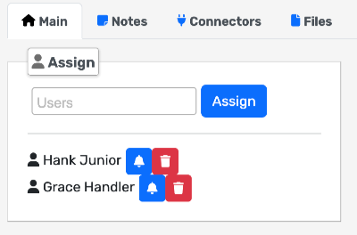

A task can be assigned to one or more users. Assigning a user makes it visible in their personal task list, which is accessible from the **Tasks assigned** section in the sidebar.

You can assign yourself to a task by clicking the **Take** button (the raising hand on the right side of the task), or assign other users from the assignment panel. To remove an assignment, use the **Remove** button next to the user's name. When a user is assigned by someone else, they receive a notification. Likewise, a user is notified when they are removed from a task.

## Subtasks

Each task can have a set of subtasks. Subtasks are simple checklist items that help you break a task down further. You can add a subtask by entering a short description. Subtasks can be ticked off as they are completed, edited if the description needs changing, reordered to reflect priority, or deleted when they are no longer relevant.

## URLs and tools

You can attach URLs or tool references to a task. This is a free-text list where each entry holds a name or address, for example, a link to an internal wiki page, the name of a forensic tool to use, or a URL to an online service. Entries can be added, edited and deleted from the task detail page.

## External references

External references allow you to preserve the content of an external source directly within a task. Where a URL or tool entry is simply a link or a name, an external reference goes further: you provide a URL, and Flowintel can fetch the content of that page and store it as a note on the task.

This is useful for sources that may not remain available indefinitely. If you are referencing a public advisory, a research paper, a blog post or a government notice, there is always a risk that the original page is taken down, moved or changed. By converting the external reference to a note, you preserve the content as it was at the time of retrieval, directly inside your case. The note includes a header showing the source URL and the date it was fetched.

To add an external reference, open the task and enter the URL. You can edit or delete it afterwards. To convert it to a note, click the convert button. Flowintel fetches the page, converts the HTML to Markdown and creates a new note on the task with the content.

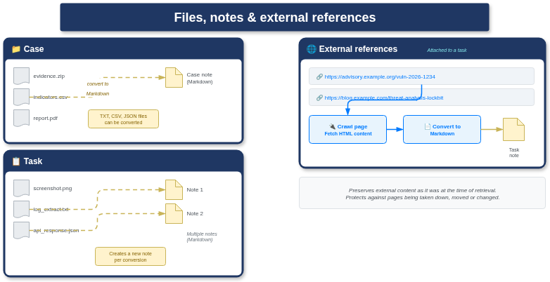


# Files and attachments

You can attach files and attachments to both cases and tasks. Files are useful for storing evidence, logs, exported data, reports, screenshots or any other supporting material.

The maximum file size for uploads is determined by your administrator in the server configuration. If you receive an error when uploading a large file, contact your administrator to check or increase the upload limit.

## Attach files to a case


From the case detail page, use the file upload area to attach files. You can upload multiple files at once. Each file is stored with its original name and can be downloaded at any time. To delete a file, click the delete button next to it. The file is removed permanently.

If you upload a TXT, CSV or JSON file, an additional option appears: you can convert the file to a note. This is covered in the Notes section below.

## Attach files to a task
 
As with cases, you can upload files to individual tasks. The upload, download and delete behaviour is the same.

A useful pattern is to attach general documents such as policies or background material to the case, and more specific evidence such as log extracts, screenshots or statements to the tasks where the actual analysis takes place.


# Notes

Notes allow you to document findings, analysis or anything relevant to the investigation. All notes in Flowintel are written in Markdown, which keeps them feature-rich and highly portable to other tools.

## Case notes

Each case has a single note. From the case detail page, navigate to the **Notes** tab to view and edit it. Click the **Save** button to save your changes. Flowintel displays the Markdown source and the rendered content side by side, so you can write and preview at the same time.

### Case notes based on templates

Instead of writing a case note from scratch, you can base it on a pre-defined note template. This is useful for standardising recurring deliverables such as investigation reports, handover notes or executive summaries. Note templates are managed by administrators under **Tools** and are separate from case and task templates.

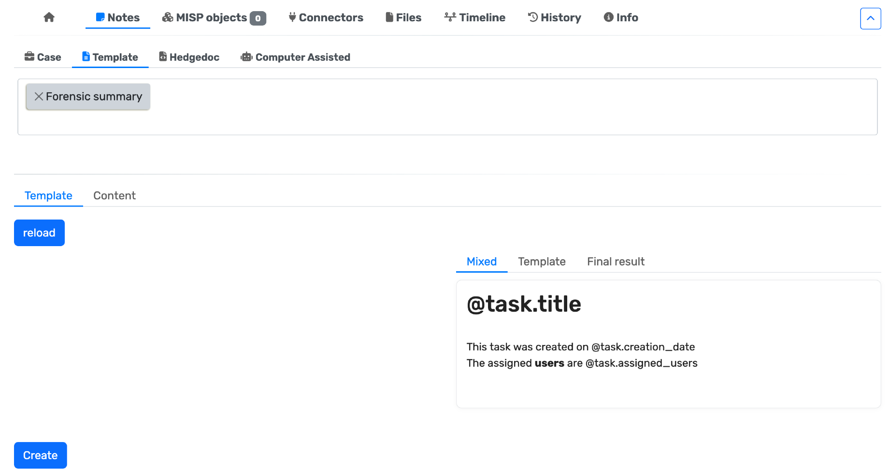

To use a note template, open the case and navigate to the **Notes** tab, then select the **Template** subtab. If no template is linked to the case yet, a dropdown lists all available note templates. 

When you are satisfied, click **Create** to link the template and its values to the case. After that, the **Create** button changes to **Save**, allowing you to update the parameter values at any time.

Once a template is linked, a second tab labelled **Content** becomes available. This opens a side-by-side Markdown editor where you can modify the rendered content directly. This is useful for making one-off adjustments to the output without changing the original template or its parameters. Note that any new Handlebars variables you add in the content editor will not generate parameter fields.

To export the rendered note, use the **Export** dropdown and choose **PDF** or **DOCX**. Flowintel compiles the current content with the filled-in parameter values and downloads the file.

If you want to start over with a different template, click **Remove** to unlink the current template from the case. This returns you to the template selection dropdown.

### Case notes based on a HedgeDoc 

Flowintel can integrate with [HedgeDoc](https://hedgedoc.org/), an open-source, web-based editor designed for real-time collaborative Markdown editing. When connected, you and your team-mates can edit the same note simultaneously and see each other's changes appear in real time.

HedgeDoc is not part of Flowintel; it must be hosted separately. To connect a HedgeDoc document to a case, open the **HedgeDoc** tab on the case detail page, paste the document URL into the URL field and click **Change URL**. Flowintel fetches the content and renders it within the case.

Use the HedgeDoc URL without the `?view` or `?edit` parameters, otherwise Flowintel cannot retrieve the content correctly.

### Converting files to notes

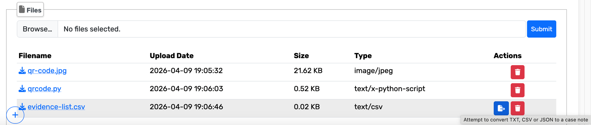

If an attached file is a TXT, CSV or JSON file, you can convert it to a note. This reads the content of the file and appends it to the case note. CSV files are converted to a Markdown table and JSON arrays of objects are also rendered as tables; other JSON is placed in a fenced code block. The original file is kept after conversion.

This is particularly useful in day-to-day case management. During an investigation, you often receive data as files: a CSV export from a log management system, a JSON response from an API, or a plain text summary from a colleague. Rather than asking everyone to open and read the file separately, you can convert it to a note, which makes the content directly visible on the case page. This keeps the information accessible without requiring a download and means the key data is part of the case narrative rather than buried in an attachment.

## Task notes

Unlike cases, a task can have multiple notes. From the case detail page, select the task and navigate to the **Notes** tab. Click the **Plus** button to add a new note. Each note is stored separately and can be edited or deleted individually.

The same file-to-note conversion is available on tasks. The difference is that converting a file on a task creates a new note rather than appending to an existing one.

As described in the External references section, you can also convert external references to task notes. Each conversion adds a separate note to the task.

The magnifying glass button on a task note lets you send the note content to the analysis modules for enrichment.


# Contextualisation for cases and tasks

Flowintel uses taxonomies, tags and galaxies to bring structure and consistency to your case data. These concepts come from the threat intelligence community and are shared with platforms like [MISP](https://www.misp-project.org/), which means the classifications you apply in Flowintel are directly compatible with the wider intelligence sharing ecosystem.

## Taxonomies

A taxonomy is a structured classification system: a controlled vocabulary with predefined categories and values. The purpose is to remove ambiguity. When everyone uses the same terms in the same way, data becomes comparable and searchable.

The Traffic Light Protocol illustrates why this matters. Without a controlled taxonomy, different teams might label the same sensitivity level as `TLP:clear`, `tlp:clear`, `tlp="clear"`, `tlp=clear` or even `trafficlight=clear`. A human reader might recognise these as equivalent, but a machine cannot. Inconsistent labelling breaks searches, prevents reliable correlation and makes automated processing nearly impossible.

Flowintel ships with a large library of community-developed taxonomies from the MISP project (see [MISP taxonomies](https://www.misp-project.org/taxonomies.html)). These cover common use cases such as:

- **Information sharing rules**: TLP (Traffic Light Protocol), PAP (Permissible Actions Protocol)
- **Confidence levels**: how reliable the source or assessment is
- **Threat types**: malware classification, incident types
- **Sectors**: industries and critical infrastructure sectors

Administrators can enable or disable specific taxonomies for their Flowintel instance.

## Tags

A tag is the label you actually apply to a case or task. It is a single instance of a taxonomy value attached to a piece of data. Where a taxonomy defines what labels exist and what they mean, a tag applies that meaning to a specific case or task.

For example, the TLP taxonomy defines the value `tlp:amber`. When you attach `tlp:amber` to a case, you have created a tag. That tag tells everyone who sees the case that it should be handled under TLP:AMBER rules.

Flowintel also supports **custom tags**, which are labels defined locally in your instance, independent of any published taxonomy. Use custom tags for classifications specific to your team or organisation that do not exist in any standard taxonomy.

## Galaxies and clusters

Taxonomies and tags provide simple labels, but some concepts need richer representation. A threat actor is more than a name. It may have aliases, known targets, preferred techniques and relationships to other actors or malware families. Capturing all of that in a single tag would be impractical.

Galaxies address this need. A galaxy is a collection of related knowledge organised into clusters. Each cluster represents a specific item, such as a particular threat actor, a malware family, a country, a sector, or an attack technique from the MITRE ATT&CK framework. Clusters can hold detailed metadata: descriptions, synonyms, references and relationships to other clusters.

Galaxies also support relationships between clusters. A threat actor cluster can link to the malware it uses, the sectors it targets and the techniques it favours. These relationships let analysts trace connections across their data, for instance from an actor to the tools it deploys and the industries it targets.

In Flowintel, you can attach galaxy clusters to cases and tasks just as you attach tags. The cluster brings along all its metadata, making it immediately visible on the case or task page.

## Benefits of consistent tagging

In day-to-day work, taxonomies, tags and galaxies help answer questions quickly:

- **Filtering and searching**: find all cases tagged with a specific threat actor, malware family, sector or confidence level, rather than relying on free-text search.
- **Governance and sharing**: TLP tags control distribution rules. PAP tags indicate what recipients may do with the data.
- **Automation**: tags drive automated workflows. They describe which cases should be pushed to external platforms, how they should be processed and which detection controls receive them.
- **Operationalisation**: when combined with MISP objects and connectors, tags control which indicators reach detection systems. Indicators can be marked as suitable for blocking, for alerting only, or not yet validated.
- **Context for decisions**: tags and galaxy clusters supply the surrounding context: why it matters, how confident the source is and what action is expected.

## Advised set of contextual elements

With so many taxonomies and galaxies to choose from, it helps to start with a practical baseline. The list below is a suggested set; the exact choice depends on your organisation and use case.

### Taxonomies

- **TLP (Traffic Light Protocol)**: maintained by FIRST, TLP defines how far information may travel. All cases should carry a TLP tag. When intelligence arrives with a TLP marking, recipients immediately know whether they can share it with colleagues, the wider organisation, or external parties. Applying TLP at the point of creation prevents accidental over-sharing.
- **Data classification**: identifies content that requires handling beyond TLP, such as personal data, financially sensitive information, research data, or material under legal restrictions.
- **Admiralty Scale**: also known as the NATO system, this taxonomy expresses confidence in intelligence by rating two dimensions: how reliable is the source, and how credible is the information itself.
- **PAP (Permissible Actions Protocol)**: tells investigators what actions they may take with a piece of intelligence. 
- **Estimative language**: provides standardised terms for expressing uncertainty in analytical judgements.

### Galaxies

- **Threat actors**: the MISP threat actor galaxy contains clusters for named adversaries.
- **Sectors and countries**: the MISP sector galaxy categorises intelligence by targeted industry. The country galaxy does the same for geographic targeting.
- **Malware and tools**: the Malpedia galaxy describes families of malicious software. When the same malware family appears in different incidents, these clusters help analysts connect the dots, even when network indicators or file hashes differ.
- **Tactics, techniques and procedures**: the MITRE ATT&CK Attack Pattern galaxy catalogues adversary tactics, techniques, and procedures observed in real-world intrusions.

## How taxonomies, tags and galaxies work together

The taxonomy defines what labels exist and what they mean. The tag applies that meaning to a specific case or task. Galaxies go further by grouping related concepts into structured clusters with richer metadata. Used together, they give your case data the structure and consistency needed for searching, comparison and automation.

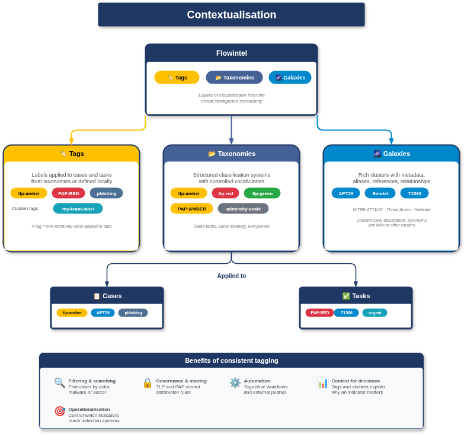

## Tags, taxonomies, galaxies and clusters in Flowintel

You can add tags, galaxy clusters and custom tags to both cases and tasks. As a general principle, apply context to the case when the classification covers the entire investigation, and apply it to individual tasks when more specific labelling is needed.

There is no limit to how many tags or clusters you can apply, but keeping the set manageable makes it easier for analysts to work with the data.

### Adding context to a case

Open the case detail page and navigate to the **Taxonomies**, **Galaxies** or **Custom Tags** section. From there you can search for and attach the relevant context elements. Taxonomy tags and galaxy clusters are drawn from the libraries that administrators have enabled for the instance.

### Adding context to a task

Open the task from the case detail page. At the bottom of the task edit form you will find the same context fields: taxonomy tags, galaxy clusters and custom tags. Select the elements you need and save the task.

## Managing taxonomies and galaxies

Flowintel ships with the full library of MISP taxonomies and galaxies, but not all of them need to be active at the same time. An administrator can enable or disable individual taxonomies and galaxies to keep the selection relevant to your team's work.

To manage taxonomies, navigate to **Tags > Taxonomies**. The page lists all available taxonomies with their name, description and current status. Use the toggle button to enable or disable a taxonomy. A disabled taxonomy no longer appears in the tag selection dropdowns when users create or edit cases and tasks. Any tags that were already applied from a disabled taxonomy remain on the cases and tasks where they were added; disabling a taxonomy does not remove existing tags.

Galaxy management works in the same way. Navigate to **Tags > Galaxies** to see the list of available galaxies and their clusters. Use the toggle to enable or disable a galaxy. Disabled galaxies no longer appear in the cluster selection menus, but clusters already attached to cases and tasks are preserved.

Both the taxonomy and galaxy management pages support pagination and a name filter. If you are looking for a specific taxonomy or galaxy, type part of its name in the search field to narrow the list.

Only users with the **Admin** system role can enable or disable taxonomies and galaxies.


## Managing custom tags

Custom tags are tags that exist only within your Flowintel instance and are not part of any MISP taxonomy. They are useful for labels that are specific to your team, organisation or workflows, for example internal priority levels, department names or project codes.

To manage custom tags, navigate to **Tags > Custom Tags**. From this page you can:

- **Create a custom tag**: click the **Plus** button and provide a name and a colour (in hexadecimal format, for example `#FF5733`). Optionally, select a FontAwesome icon to display alongside the tag. Click **Save** to create the tag.
- **Edit a custom tag**: click the edit button on an existing tag to change its name, colour or icon.
- **Delete a custom tag**: click the delete button to remove a custom tag. Deleting a custom tag removes it from all cases and tasks where it was applied.

Custom tags are available to all authenticated users when tagging cases and tasks. Creating, editing and deleting custom tags requires at least the **Editor** role.


# MISP objects

MISP objects let you attach **structured data** directly to a case. Where tags and galaxies provide classification labels, MISP objects store the actual details: technical **indicators** such as file hashes, IP addresses, domain names and URLs, but also broader investigation data such as persons of interest, financial records, or even physical elements such as vehicles, vessels and drones (uav). Each object follows a standardised structure from the MISP project, making the data portable and consistent across tools.

MISP objects can only be added to cases, not to individual tasks.

A MISP object is based on an **object template**. Flowintel ships with the full library of MISP object templates, which define what attributes an object of a given type can hold. The **file** template, for instance, has attributes for filename, MD5, SHA-1, SHA-256, file size and more. The **ip-port** template covers IP address, port, protocol and domain. The **email** template includes sender, recipient, subject line and header fields.

You do not need to fill in every attribute that a template defines. Fill in the required attributes along with any optional ones that are relevant to your investigation.

## Creating a MISP object

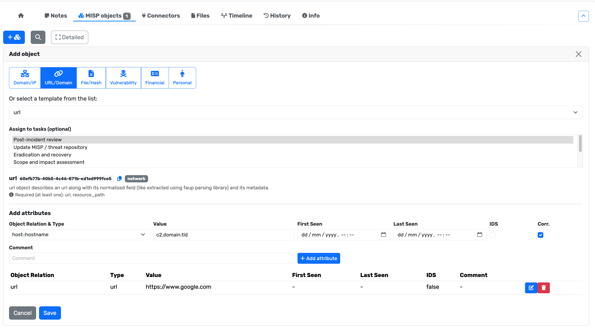

To add a MISP object to a case, open the case detail page and navigate to the **MISP objects** tab. Click the **Plus** button to create a new object. Flowintel presents a list of commonly used object templates at the top, but you can also pick any other template from the full library list.

Once you have selected a template, you can start entering attributes. The template displays which attributes are required at minimum, for instance: *"requires one of: url, resource_path"*. For each attribute, you can provide:

- **Object Relation** and **Type** (required): the MISP attribute type (`ip-dst`, `md5`, `filename`, `email-src` and so on).
- **Value** (required): the actual data, such as `192.168.1.100` or `malware.exe`.
- **First seen** (optional): when the indicator was first observed.
- **Last seen** (optional): when the indicator was last observed.
- **Comment** (optional): a free-text annotation.
- **IDS flag**: marks the attribute as actionable for detection. 
- **Disable correlation**: prevents the attribute from being automatically linked to matching values in other cases or objects.

Click **Add attribute** to include it in the object. When you have finished adding attributes, click **Save changes** to save the object to the case.

When you export indicators to other tools, the IDS flag signals that you want to actively do something with the value: block it, log activity against it, use it as a pivot for further research, and so on. Not every attribute deserves this flag. For example, if you are documenting that a piece of malware performs a connectivity check to Google DNS (`8.8.8.8`), that IP address is useful context for understanding the malware's behaviour, but you would not want to alert on every request to `8.8.8.8`. Leave the IDS flag off. On the other hand, an IP address tied to a threat actor's command-and-control infrastructure is something you do want to alert or log on, so you would set the IDS flag to true.

The flag to disable correlation is useful for keeping the database clean when an attribute has a common or benign value. A connection on port 80, for instance, would match countless other objects and produce noise rather than insight, so disabling correlation makes sense. A connection on an unusual port such as 223344, however, is a strong indicator worth correlating across cases.

## Detailed view of an object

By default, Flowintel shows a compact view of the object so you can scan its contents at a glance. To see additional columns for first seen, last seen, IDS, correlation and comment, click the **Detailed** button.

## Editing and deleting attributes

Each attribute within an object can be edited or deleted individually. Open the object, find the attribute and use the **Edit** or **Delete** button. Deleting an attribute removes it permanently.

## Deleting an object

To delete an entire MISP object, open the object and click the **Delete** button. This removes the object and all its attributes from the case. The deletion cannot be undone.

## Searching for attribute values

You can search across all MISP object attributes to find cases that contain a particular value. This is useful when you come across an indicator, for example an IP address, a domain name or a file hash, and want to know whether it has appeared in other investigations on the platform.

To run a search, open the **Tools** section in the sidebar and select **Search Attr**. The form has three fields:

- **Attribute value**: the text to search for. The search is case-insensitive and matches partial values, so entering `192.168` will match `192.168.1.1` as well as `10.192.168.0`.
- **Start date** and **End date** (optional): limit the results to attributes that were added to Flowintel within the given date range.

Click **Search** to run the query. Flowintel returns a list of cases that contain at least one matching attribute. For each case, the results show the title, description, privacy status, case status and creation date, with a link to open the case. The search respects access control: non-administrators only see public cases and cases where their organisation is assigned.

Note that the search covers MISP object attributes on cases only; it does not search task-level data. The results show which cases matched, not the individual attributes within them. To inspect which specific object or attribute triggered the match, open the case and review its MISP objects.

## Analysing objects

The analysis feature is one of the more powerful capabilities of Flowintel. It lets you query external services to contextualise, enrich and validate the attributes stored in your MISP objects, without leaving the platform. The mechanism behind this is the integration with MISP modules.

MISP modules are standalone services originally designed to extend MISP with capabilities such as expansion, import, export and workflow actions. Flowintel reuses these same modules for its own enrichment workflow. With the default installation, a local instance of the MISP modules server runs alongside Flowintel. When you submit an analysis request, Flowintel sends it to this local server, which handles the queries to external services and returns the results.

There are a few caveats to be aware of:

- **Data leaves your environment.** Many modules query external services, which means attribute values are sent to third-party providers. A DNS lookup for a benign domain or a VirusTotal hash check is relatively harmless. However, querying the DNS information of a domain belonging to a subject under investigation could alert them. Always check the PAP (Permissible Actions Protocol) tag assigned to the case or task before submitting data for analysis.
- **Some modules require credentials.** This is most often an API key, but some services also require a username and password.
- **Some modules are commercial.** Certain providers offer a free tier (such as VirusTotal), while others require a paid subscription.

Flowintel works perfectly well without the analysis modules. If you choose not to use them, the only feature you lose is the ability to enrich attributes from within the interface. Likewise, if you prefer not to use commercial modules, the freely available options still provide useful results.

### Available modules

A full list of all available MISP modules and their documentation is at [https://misp.github.io/misp-modules/](https://misp.github.io/misp-modules/).

The table below highlights some of the more useful modules for day-to-day work in Flowintel:

| Module | Description |
|---|---|
| AbuseIPDB | Check whether an IP address has been reported for malicious activity. Useful for triaging suspicious source or destination addresses in network-based investigations. |
| BTC Scam Check | Query a DNS blacklist to check whether a Bitcoin address has been linked to fraud. |
| BTC Steroids | Retrieve the blockchain balance for a Bitcoin address. |
| Censys Enrich | Enrich attributes by querying the Censys internet scanning platform. Helpful for understanding what services a host exposes. |
| CIRCL Passive DNS | Look up historical DNS resolutions for a domain or IP address. One of the most commonly used modules for mapping infrastructure during an investigation. |
| CIRCL Passive SSL | Look up historical SSL certificate associations. |
| Country Code | Expand a country code into its full country name. |
| CPE Lookup | Query the CVE search API with a CPE identifier to find related vulnerabilities. |
| CVE Advanced Lookup | Retrieve detailed information about a CVE from the CIRCL CVE search API. Useful when a case involves vulnerability exploitation. |
| DNS Resolver | Resolve an IP address or domain name. A quick first step before deeper enrichment. |
| Google Safe Browsing | Check whether a URL is flagged as unsafe by Google Safe Browsing. |
| Google Threat Intelligence | Have an observable scored by Google Threat Intelligence. |
| GreyNoise | Query IP and CVE information from GreyNoise. Helps distinguish targeted activity from background internet noise. |
| CIRCL Hashlookup | Check whether a file hash belongs to a known set such as the NSRL (National Software Reference Library). Useful for quickly ruling out legitimate system files. |
| Have I Been Pwned | Check whether an email address or domain appears in known data breaches. |
| IPASN-History | Query the historical IP-to-ASN mapping for an address. |
| GeoIP Enrichment | Enrich an IP address with geolocation and ASN information. |
| AlienVault OTX | Retrieve threat intelligence from the AlienVault Open Threat Exchange. |
| QR Code Decode | Decode QR codes from attachments or remote URLs. Relevant for anti-quishing investigations. |
| Shodan | Query Shodan for information about internet-facing hosts and services. |
| URLhaus | Query the URLhaus database for known malicious URLs. |
| URLScan | Submit or look up a URL on urlscan.io for a detailed page analysis. |
| VirusTotal (Public API) | Enrich observables using the VirusTotal v3 public API. Widely used for file hash, domain and URL reputation checks. |
| Whois | Perform a WHOIS lookup for domain registration details. |

### Using the analysers

To start an analysis, click the magnifying glass button on a MISP object.

The analyser guides you through three steps:

1. **Select and configure** - choose the attribute values you want to analyse and pick the modules to run.
2. **Review results** - inspect what the modules returned.
3. **Save to case** - add the findings to a case note or a task note. Some modules also let you save the results as a new MISP object on the case.

#### Select and configure

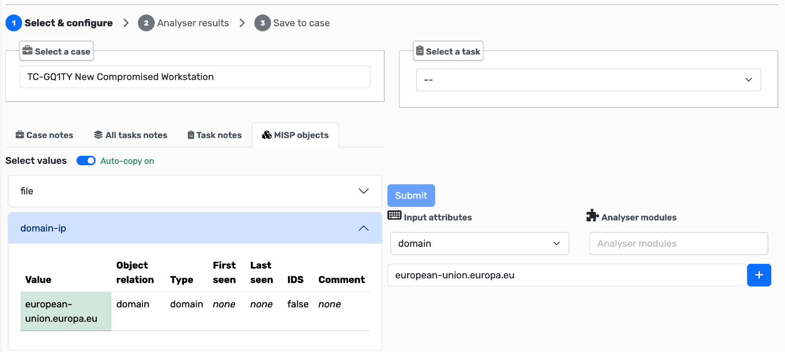

When the analyser window opens, the **MISP objects** tab is selected automatically and displays all objects belonging to the current case. If you want to analyse objects from a different case, select that case from the dropdown at the top.

To pick attribute values for analysis, enable the **Auto-copy** toggle. With auto-copy on, clicking a value in an object copies it straight into the attribute field. If you want to analyse more than one attribute at a time, click the **Plus** button next to the selected value before clicking the next one; otherwise the new value overwrites the previous one.

The attribute type is set automatically based on the value in the object. This matters because the attribute type determines which analyser modules are available. A CVE identifier, for example, would not produce useful results from a Passive DNS module.

You can select multiple analyser modules for a single run. Bear in mind that the more modules you select, the longer the analysis takes and the more complex the output becomes.

When you are ready, click **Submit**.

#### Review results

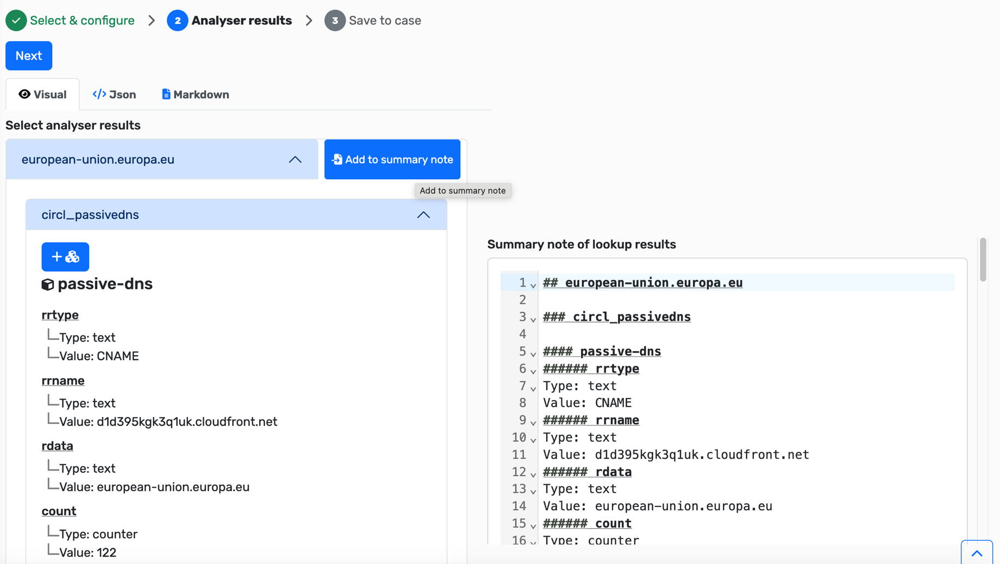

If the modules return results, you can review them in three formats: a **visual** view (best for human review), the raw **JSON** returned by the module, or a **Markdown** rendering. The Markdown view is the one you will typically want to save.

Click **Add to summary note** to copy the content of the currently active tab into a temporary summary note. If the JSON tab is active, the JSON is copied; otherwise the Markdown content is used. The summary note is not yet saved to your case; that happens in the next step.

If a module returns no results, the query simply produced no matches. If there is a functional error (for example, a network timeout or missing credentials), it appears in the **Errors** section.

Once you have reviewed the results and added what you need to the summary note, click **Next**.

#### Save results to case

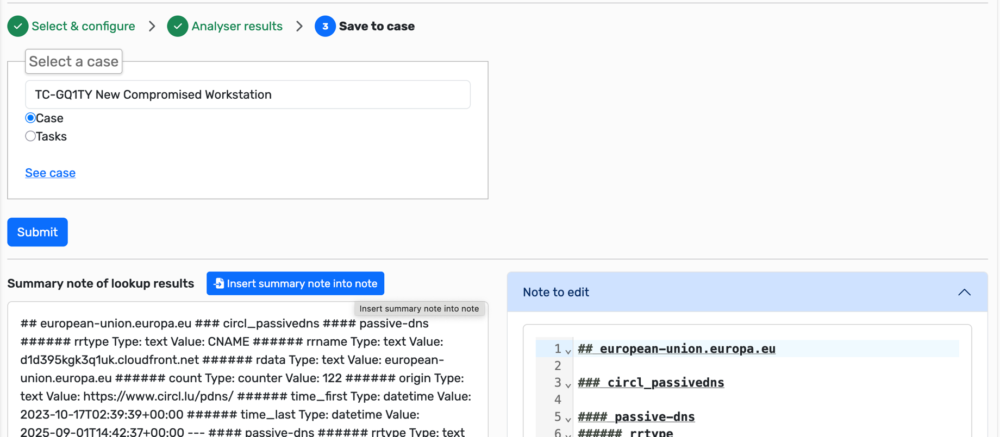

In the final step you choose where to store the summary note. Click **Insert summary note into note** to append it to the case note.

If the results are more relevant to a specific task, switch to **Tasks** at the top, select the task on the right, and choose whether to append to an existing note or create a new one.

#### Convert results into new MISP objects

Some analyser modules return structured data that can be saved as a new MISP object, not just as text. The CVE module, for instance, returns vulnerability details in object form. When this happens, an additional button appears that lets you add the analysis results as a new MISP object on the case.

This opens up a pivoting workflow: you start with one object, run an analysis on one of its attributes, and the results become a new object on the case. You can then analyse attributes of that new object in turn, chaining lookups across different modules. Since MISP objects can only be attached to cases, this option is not available when you have selected a task as the destination in the save step.

#### Configure the analyser modules

Many modules require credentials before they can query their external service. Flowintel stores these settings per user, so each analyst can use their own API keys without affecting anyone else.

To configure the modules, open **Analyser** from the sidebar and click the **Config** button. Flowintel lists all available modules and highlights those that accept configuration settings. Enter the required values (typically an API key) and click **Save**.

### Analyser history

The analyser configuration screen also includes a **History** tab. This tab shows a chronological record of all the analysis queries you have run.

You can revisit any previous result and walk through the same three-step process again: review the output, then save it to a different case or task. This is useful when you want to reuse earlier findings without re-running the query.


# Use connectors to connect to external platforms

Connectors link a case or task to external platforms such as MISP or AIL. Before you can use connectors, the platform administrator must configure at least one connector and its instances under **Tools > Connectors**. You also need the **MISP Editor** role to work with connectors on cases and tasks.

To manage connectors with regards to your daily operational work, open the case or task detail page and navigate to the **Connectors** tab. The workflow described below applies equally to cases and tasks, unless noted otherwise.

## Adding a connector to a case or a task

Click the **Plus** button to add a connector and select one or more of the configured connector instances from the list. For each instance, you can optionally enter an identifier. The identifier is the external reference that links the case to the remote platform. For MISP connectors, this is the UUID of the MISP event.

You can attach multiple connector instances to the same case or task. For example, you might link one MISP instance for internal sharing and another for community sharing, or one instance configured to send data and another to receive. Each instance operates independently, so you have full control over where data flows.

## The connector identifier

Every connector attached to a case or task has an identifier field. For MISP connectors, this holds the UUID of the corresponding MISP event. When you push case data to MISP for the first time, Flowintel creates a new event and automatically fills in the identifier with the event UUID. Subsequent pushes use that identifier to update the same event rather than creating a new one.

You can also enter the identifier manually when adding a connector. This is useful when a MISP event already exists and you want to link it to your case or task. For receive connectors, the identifier is required because Flowintel needs to know which event to fetch.

Once the identifier is set on a MISP connector, Flowintel displays it as a direct link to the event on the MISP instance.

## Editing and removing connectors

You can edit the identifier of an attached connector or remove the connector entirely. Removing a connector from a case does not delete any data on the external platform; it only breaks the link between the case and the remote instance.

## Pushing data to MISP

Once a MISP connector of the **send_to** type is attached, you can push data to the MISP instance. Because connectors can be added to both cases and tasks, and you can attach multiple connectors to the same case or task, you can push to several MISP instances at once or use different push modes side by side.

When you click the send button on a case-level connector, Flowintel offers two push modes:

- **Full case export** creates or updates a MISP event that mirrors the entire case. This includes the case title and description, all tasks with their notes, subtasks and external references, all MISP objects and their attributes, taxonomy tags, galaxy clusters, case notes and, if enabled in the configuration, file attachments.
- **MISP objects only** pushes only the MISP objects already attached to the case, without the wider case metadata.

When you push from a task-level connector, Flowintel creates or updates a MISP event with the task information, its notes and, if enabled, file attachments.

In all modes, the first push creates a new MISP event on the remote instance and stores the event UUID as the connector identifier. Every push afterwards updates that same event, so the MISP event stays in sync as the case or task evolves.

Taxonomy tags and galaxy clusters are synchronised to the MISP event. Custom tags, however, are not included in the push because they are local to your Flowintel instance and have no equivalent in MISP. Depending on your configuration, files attached to the case or task are synchronised as well.

## Receiving data from MISP

If the connector instance is configured as a **receive_from** type, you can pull data from MISP into a case. Flowintel fetches the MISP event using the identifier and creates or updates local MISP objects and their attributes to match. As with send connectors, you can attach multiple receive connectors to the same case to pull from different MISP instances.

The receive operation synchronises MISP objects and attributes only. It does not pull event-level metadata such as tags or galaxies back into the case. If you need those, add them to the case manually.


# Templates

Templates let you define reusable blueprints for cases and tasks. Instead of creating every investigation from scratch, you prepare a standard set of tasks, notes, subtasks and contextual tags once and then create a new case from the template whenever the same type of incident occurs. This keeps investigations consistent and ensures that no critical step is overlooked.

Templates are accessible from the **Templates** section in the sidebar.


## Case templates

A case template describes the structure of an entire investigation. It includes a title, a description, an optional time estimate and a list of tasks. You can also attach taxonomy tags, galaxy clusters and custom tags to a case template so that every case created from it starts with the correct contextualisation.

To create a case template, navigate to **Templates** in the side menu and choose **Cases**. Click the **Plus** button to start a new case template. Fill in the following fields:

- **Title** (required): a short name for the template. Must be unique.
- **Description** (optional): a Markdown description of what the template covers.
- **Time required** (optional): an estimate of how long the investigation typically takes.
- **Task templates** (optional): select one or more existing task templates to include. You can add or remove task templates later from the template detail view.
- **Tags and clusters** (optional): select taxonomy tags, galaxy clusters and custom tags so that every case created from this template starts with the correct contextualisation.

Click **Create** when you are happy with the result.

Once saved, open the case template detail view to refine it further. From there you can reorder tasks, edit the template's tags and clusters, and write a case-level note that will be copied into every new case.

Creating, editing and deleting case templates requires the **Template Editor** role.

## Task templates

Task templates are the building blocks of case templates, but they also exist as standalone objects. You can create a task template independently and reuse it across multiple case templates, or add it to a specific case template after creation.

To create a standalone task template, navigate to **Templates** in the side menu and choose **Tasks**. Click the **Plus** button to start a new task template. Fill in the following fields:

- **Title** (required): a short name for the task. Must be unique.
- **Description** (optional): a Markdown description of the work involved.
- **Time required** (optional): an estimate of how long the task typically takes.
- **Tags and clusters** (optional): select taxonomy tags, galaxy clusters and custom tags, just like a case template.

Click **Create** when you are happy with the result.

Once saved, open the task template detail view to add further detail. Notes that provide guidance, checklists or reference information for the analyst working on the task. Subtasks that break the work into smaller checkable items and URLs and tools that link to external resources or internal tooling relevant to the task.

Creating, editing and deleting task templates requires the **Template Editor** role.

## Note templates

Note templates are reusable Markdown documents designed for structured, repeatable notes on cases. Where case and task templates define the structure of an investigation, note templates define the structure of a document produced during or after the investigation, such as a report, a handover note or an executive summary.

To manage note templates, navigate to **Templates** in the side menu and choose **Notes**. Click the **Plus** button to start a new note template. Provide a **title**, an optional **description**, and the **content** in Markdown. The content editor has a live preview panel beside it, so you can see the rendered result as you type.

To edit an existing template, open it from the list. You can update the title and description separately from the content. Deleting a template removes it permanently. If a case still has that template linked, Flowintel will detect the missing template and automatically unlink it the next time the case is opened.

Creating, editing and deleting note templates requires the **Template Editor** role. All authenticated users can view the available templates and use them within cases.


### @-variables

Note templates (and all notes in Flowintel) also support **@-variables**. These are live references that resolve to actual case, task or user data at render time.

The syntax follows a dot-separated path. A few common examples:

| Variable | Resolves to |
|---|---|
| `@this.case.title` | Title of the current case |
| `@this.case.status` | Status of the current case |
| `@this.case.deadline` | Deadline of the current case |
| `@this.case.owner_org` | Owner organisation of the current case |
| `@this.case.tags` | All tags on the current case, comma-separated |
| `@this.task.title` | Title of the current task |
| `@this.task.assigned_users` | Users assigned to the current task |
| `@user.full_name` | Full name of the current user |
| `@now` | Current date and time |
| `@today` | Current date |

You can also reference data from other cases or tasks by ID. For instance, `@case.42.title` resolves to the title of case 42, and `@task.10.status` resolves to the status of task 10.

Nested paths let you reach deeper into the data. `@this.case.tasks.1.title` returns the title of the first task in the case, `@this.task.subtasks.2.description` returns the description of the second subtask, and `@this.case.misp_objects.1.attributes.3.value` returns the value of the third attribute on the first MISP object.

When editing a note or template, typing `@` triggers an autocomplete dropdown that suggests available variables based on what you have typed so far. Select one of the suggestions and press **Tab** to insert it. This makes it easy to discover and use the correct path without having to memorise the syntax.

In edit mode, the raw `@variable` syntax is shown. In the rendered preview, each variable is replaced with its current value from the database.

A complete reference of all available @-variables is accessible from **Tools > Variable Syntax** in the sidebar. This page lists every supported variable path with a description, organised by category: case, task, user, nested collections (tasks, subtasks, notes, MISP objects and attributes) and date helpers. If you are unsure which path to use, consult this page.

## Creating a case from a template

To turn a case template into an actual case, open the template detail view and select **Create case from template**. You will be asked for a case title. Flowintel then creates a new case that inherits the template's description, tasks, tags, clusters, custom tags, connector instances and case-level notes. Each task in the new case also receives the notes, subtasks and URLs defined in its task template.

The new case is an independent copy. Changes you make to the case afterwards do not affect the template, and changes to the template do not propagate to cases that have already been created from it.

## Creating a template from a case

You can create a template from an existing case. Open the case detail page and use the **Actions** menu at the top right. Choose **Template** and enter a name for the new template.

Flowintel copies the case description, taxonomy tags, galaxy clusters and custom tags to the new case template. Each task in the case becomes a task template. If a task template with the same title already exists, Flowintel reuses it instead of creating a duplicate. For each new task template, the task's description, tags, clusters, custom tags, subtasks and URL/tool links are carried over. Task ordering within the case is preserved.

Notes, files, connector instances, deadlines, assignments and recurring settings are not copied. If you need connector instances on the template, add them afterwards from the template detail view.

You need the **Template Editor** role to create a template from a case.

## Exporting templates

You can download a case template as a JSON file from the template detail view. The export includes the full case structure together with all task templates and their metadata. This is useful for sharing templates between Flowintel instances or for version-controlling your templates in a code repository.

## Importing templates

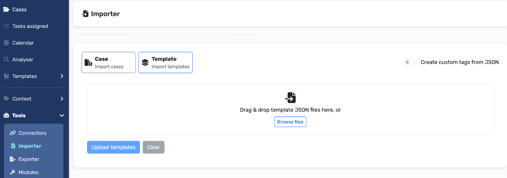

To import a template from a JSON file, navigate to **Tools > Importer** and select **Template** as the import type. Upload one or more JSON files and click **Import**. Flowintel validates each file against its template schema and creates the corresponding case or task templates, including their tags, clusters, custom tags, notes, subtasks and URL/tool links.

If the JSON file contains custom tags that do not yet exist in your instance, you can enable the **Create custom tags** option on the import form. When enabled, Flowintel automatically creates any missing custom tags during import. When disabled, unknown custom tags are silently skipped.

The importer accepts the same JSON format as the template export described above. You can also import templates through the REST API by posting to `/api/importer/template`.

Importing requires the **Template Editor** role.

An alternative way to bring in templates is through the central template repository feature described next.

## Central template repository

The central template repository lets you manage a collection of template files on the server's filesystem and import them into Flowintel through the web interface. This is useful when you maintain a shared library of templates across multiple Flowintel instances, or when you distribute templates as part of a version-controlled code repository.

It also works well when one authoritative organisation wants to share standardised workflows, processes and procedures with other teams, so that everyone works in a consistent way.

### How it works

Template repositories are local directories on the server, not remote URLs. If your templates live in a Git repository, an administrator clones it onto the server inside the base directory before Flowintel can see it. The web interface cannot add repositories by itself; the directory must already exist on disk.

This design is deliberate. Organisations that work in isolated or air-gapped networks can clone the repository on a connected system, review the contents, and then transfer the directory to the Flowintel server without ever giving the server direct internet access.

Each repository directory must contain a `manifest.json` file that describes the repository. Inside the repository directory, template files are organised into two subdirectories:

- `case/` for case template JSON files
- `task/` for standalone task template JSON files

Case template JSON files can also contain embedded task templates in a `tasks_template` array. When Flowintel scans the repository, it registers both the case template and each embedded task template as separate entries, so they can be imported individually.

The base directory where Flowintel looks for repositories defaults to `modules/repositories` relative to the project root. This can be changed with the `REPOSITORY_BASE_PATH` setting. If you provide an absolute path, it is used as-is; a relative path is resolved from the project root. More details can be found in the section on administrating Flowintel.

### Managing repositories

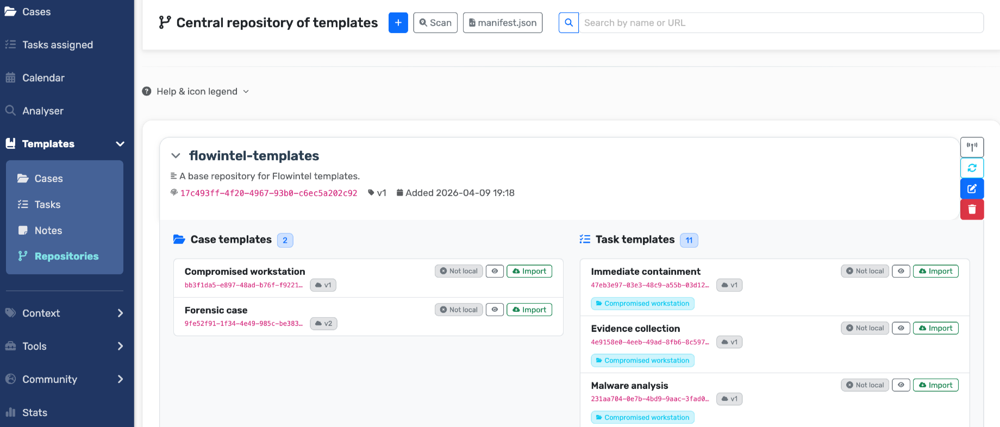

Navigate to **Templates > Repositories** to see the repository management page. From here you can:

1. **Scan** the base directory to discover new repository directories. Flowintel looks on the local system for subdirectories that contain a valid `manifest.json`.
2. **Add** a discovered directory as a registered repository in Flowintel.
3. **Refresh** a registered repository to pick up changes from the filesystem. Flowintel re-reads the manifest, scans the `case/` and `task/` subdirectories, and updates, adds or removes entries to match what is on disk.
4. **Browse** the entries (case and task templates) inside a registered repository.
5. **Import** individual entries into your local Flowintel instance. If a template with the same UUID already exists locally, it is updated to the repository version.

### Permissions

Only users with the **Template Editor** role can manage repositories and import templates from them.

# Case behaviour: private and privileged cases

## Private cases

When you create or edit a case, you can tick the **Private case** checkbox to restrict who can see it. A private case is hidden from the general case list. Only users whose organisation is directly assigned to the case and administrators can view or interact with it. Everyone else, including users with the Editor role, will not see the case at all. They will receive an access denied message if they try to open it by URL.

Private cases are useful when an investigation involves sensitive information that should not be visible to the wider community of Flowintel users. For example, an internal HR investigation, a case involving personal data protected under privacy regulations, or an ongoing insider threat assessment might all warrant the private flag.

The private flag can be set at creation time or toggled later by editing the case. Changing a case from public to private immediately hides it from users who are not part of the assigned organisations. Changing it back to public restores normal visibility.

## Four-eye-review process with privileged cases

The four-eye principle requires that a second person reviews and approves a piece of work before it is accepted. No single person can take a task from start to finish alone, which reduces the risk of errors, oversights and unauthorised actions.

Flowintel supports this through **privileged cases**. When a case is marked as privileged, tasks go through an approval cycle: a reviewer must approve the task before work can begin, and must review the finished work again before the task can be closed.

### How the privileged case workflow operates

In a standard case, any Editor can freely create tasks, update their status and complete them. A privileged case adds a review layer controlled by two permission types: the **Queuer** permission (for the person doing the work) and the approver permissions (**Admin**, **Case Admin** or **Queue Admin**).

When a Queuer adds a task to a privileged case, the task starts in a **Requested** state rather than Created. It is a proposal, not yet active. Approvers are notified and can either:

- **Approve** the task, moving it to Approved so the Queuer can begin work, or
- **Reject** it, moving it to Rejected and notifying the requester.

Once approved, the Queuer works on the task normally: setting it to Ongoing, attaching files and writing notes. When the work is done, the Queuer sets the task to **Request Review**. An approver then reviews the completed work and either marks the task as **Finished** or sends it back for further work. This second review closes the loop and keeps the four-eye principle intact from proposal to completion.

Users with the Editor role but without the Queuer permission can still create tasks in a privileged case. Their tasks start with the normal Created status and skip the review workflow entirely. The Queuer permission is what opts a user into the approval process.

### Task editing restrictions

While a task is in the Requested or Request Review state, only approvers (Admin, Case Admin or Queue Admin) can edit it. This prevents a Queuer from changing a proposal while it is awaiting approval.

### Automatic approver assignment

If the `PRIVILEGED_CASE_ADD_ADMIN_ON_TASK_REQUEST` setting is enabled, approvers are automatically assigned to a task when it enters the Requested or Request Review status. This makes the task appear in the approvers' personal assignment list under **My assignments**, so they do not need to rely solely on notifications to spot pending reviews.

### Status flow summary

The following diagram shows the complete lifecycle of a task in a privileged case:

```
Queuer creates task ─► Requested ─► Approved ─► Ongoing ─► Request Review ─► Finished
                            │                                      │
                            ▼                                      ▼
                         Rejected                          (back to Ongoing)
```

### Role and permission summary

The following table summarises what each role can do in a privileged case:

| Role or permission | Create tasks | Approve or reject tasks | Complete or revive case | Mark case as privileged |
|---|---|---|---|---|
| Admin | Yes (Created status) | Yes | Yes | Yes |
| Case Admin | Yes (Created status) | Yes | Yes | Yes |
| Queue Admin | Yes (Created status) | Yes | No | No |
| Queuer | Yes (Requested status) | No | No | No |
| Editor (no privileged permissions) | Yes (Created status) | No | No | No |
| Read Only | No | No | No | No |


# Calendar


The calendar gives you a visual overview of your cases and tasks over time. It is accessible from **Calendar** in the sidebar. Cases are shown in blue and tasks in green, making it easy to tell them apart at a glance.

The calendar shows cases that belong to your organisation and tasks that are assigned to you. Two filters in the toolbar let you control what is displayed:

- **Type**: show or hide cases and tasks independently using the checkboxes.
- **Date**: choose whether the calendar plots items by their **deadline** or by their **creation date**.

You can also jump to a specific month using the month picker.

Clicking an event opens a summary panel with the title, status, dates, tags, clusters and description. From there you can navigate directly to the case or task detail page.

## Calendar and list view

The calendar defaults to a monthly grid. If you prefer a flat list, click the **List** button in the top-right corner of the calendar to switch to a list view that shows all events for the current month in chronological order.

## Downloading calendar data

Each individual event has a download button that exports it as an ICS file, so you can add it to your personal calendar application. To export everything at once, click **Download Calendar Feed** in the toolbar. This produces a single ICS file containing all your cases and tasks.

The same feed is available through the REST API at `/api/calendar/feed`, which is useful for integrating Flowintel deadlines into external calendar tools or dashboards.


# REST API

Flowintel includes a full REST API that lets you automate and integrate your case management workflows. Every action available through the web interface (creating cases, adding tasks, uploading files, managing users) can also be done through the API.

## Swagger documentation

The built-in Swagger documentation is available at `/api/` on your Flowintel instance. Open `https://<your-host>/api/` in a browser to see a complete, interactive reference of all available endpoints. You can try out requests directly from the Swagger page after entering your API key.

## Authentication

All API requests must include an API key in the `X-API-KEY` HTTP header. Every Flowintel user has a personal API key, visible on the profile page (blurred by default, click the eye icon to reveal it). If you need a new key, use the reset button; the old key is invalidated immediately.

Requests without a valid API key receive a `403 Forbidden` response. The API key carries the same permissions as the user it belongs to: an API key for a Read Only user cannot create cases, and an API key for a non-admin user cannot manage organisations.

**Tip:** for automation scripts, create a dedicated service account with only the permissions the script needs. Avoid using a personal admin key in unattended processes.

## Use cases

The API is designed for scenarios such as:

- **Automation**: create cases and tasks from external triggers, for example, a ticketing system, an alert pipeline or a SOAR playbook.
- **Reporting**: retrieve case statistics, list open cases or export data for dashboards and compliance reports.
- **User provisioning**: bulk-create users or synchronise user accounts from an identity provider.
- **Calendar integration**: pull the Flowintel calendar feed into external calendar tools.
- **Evidence upload**: attach files to cases or tasks programmatically from collection scripts.
- **Template management**: create, list or import case and task templates.

## API services

The API is organised into services, each grouping related endpoints under a common path prefix. The Swagger documentation at `/api/` lists every endpoint; the table below gives an overview of what each service covers.

| Service | Path prefix | Description |
|---|---|---|
| **Case** | `/api/case` | Create, edit, delete, list and search cases. Manage case status, assigned organisations, linked cases, recurring schedules, history, notes, files and MISP objects. Create tasks within a case. |
| **Task** | `/api/task` | Retrieve, edit, delete and complete tasks. Manage task notes, file attachments, user assignments, status changes, taxonomies and galaxies on a task. |
| **Admin** | `/api/admin` | Manage users, organisations and roles. Requires administrator privileges. |
| **Analyzer** | `/api/analyzer` | Submit queries to MISP enrichment modules and retrieve their status and results. |
| **Connectors** | `/api/connectors` | Create and manage connectors and their instances (MISP, AIL). Configure connection type, URL and API key. |
| **Custom tags** | `/api/custom_tags` | Create, edit, delete and list custom tags used to classify cases and tasks outside the taxonomy system. |
| **My assignment** | `/api/my_assignment` | Retrieve the list of tasks assigned to a specific user. |
| **Templating** | `/api/templating` | Manage case and task templates, including ordering, subtasks, connector bindings, and creating cases from templates. |
| **Importer** | `/api/importer` | Import cases or case templates from JSON. Accepts the same format as the template and case export. |
| **Case from MISP** | `/api/case_from_misp` | Create a Flowintel case directly from a MISP event, specifying the MISP instance and event identifier. |
| **Calendar** | `/api/calendar` | Download the full calendar feed in ICS format for integration with external calendar tools. |

## Key services in detail

The sections below highlight commonly used services with full parameter syntax and working examples. All examples use `YOUR_API_KEY` and `flowintel.yourdomain.com` as placeholders. Replace them with your actual API key and domain name.

### Service: Create a case

| | |
|---|---|
| **Purpose** | Create a new investigation case in Flowintel. |
| **Functionality** | Creates a case with a title, optional description, deadline, contextualisation (taxonomy tags, galaxy clusters, custom tags), privacy and privileged-case flags, estimated time and an external ticket reference. Returns the new case identifier. |
| **Parameters** | `POST /api/case/create` |

```
POST /api/case/create
Content-Type: application/json
X-API-KEY: <api_key>

{
  "title":            "<string, required>",
  "description":      "<string>",
  "deadline_date":    "<YYYY-MM-DD>",
  "deadline_time":    "<HH-MM>",
  "tags":             ["<taxonomy:value>", ...],
  "clusters":         ["<galaxy-cluster>", ...],
  "custom_tags":      ["<custom-tag-name>", ...],
  "time_required":    "<string>",
  "is_private":       <true|false>,
  "privileged_case":  <true|false>,
  "ticket_id":        "<string>"
}
```

| Response code | Meaning |
|---|---|
| `201` | Case created. Body contains `message` and `case_id`. |
| `400` | Validation error (missing title, duplicate title, or invalid data). Body contains `message`. |
| `403` | Forbidden (invalid API key, insufficient permissions, or non-admin attempting to create a privileged case). |

**Example (curl)**

```bash
curl -s -X POST \
  -H "X-API-KEY: YOUR_API_KEY" \
  -H "Content-Type: application/json" \
  -d '{
    "title": "Phishing campaign targeting finance",
    "description": "Multiple employees reported suspicious emails with invoice attachments.",
    "tags": ["tlp:amber"],
    "deadline_date": "2026-03-20",
    "ticket_id": "RTIR-2026-0042"
  }' \
  https://flowintel.yourdomain.com/api/case/create
```

Response:

```json
{
  "message": "Case created, id: 7",
  "case_id": 7
}
```

**Example (Python)**

```python
import requests

API_URL = "https://flowintel.yourdomain.com/api"
headers = {
    "X-API-KEY": "YOUR_API_KEY",
    "Content-Type": "application/json"
}

case_data = {
    "title": "Phishing campaign targeting finance",
    "description": "Multiple employees reported suspicious emails with invoice attachments.",
    "tags": ["tlp:amber"],
    "deadline_date": "2026-03-20",
    "ticket_id": "RTIR-2026-0042"
}
response = requests.post(f"{API_URL}/case/create", json=case_data, headers=headers)
case_id = response.json()["case_id"]
print(f"Created case {case_id}")
```

Output:

```
Created case 7
```

### Service: Create a task in a case

| | |
|---|---|
| **Purpose** | Add a task to an existing case. |
| **Functionality** | Creates a task linked to the specified case, with its own title, description, deadline, contextualisation, connector bindings and estimated time. Returns the new task identifier. |
| **Parameters** | `POST /api/case/<cid>/create_task` |

```
POST /api/case/<cid>/create_task
Content-Type: application/json
X-API-KEY: <api_key>

{
  "title":            "<string, required>",
  "description":      "<string>",
  "deadline_date":    "<YYYY-MM-DD>",
  "deadline_time":    "<HH-MM>",
  "tags":             ["<taxonomy:value>", ...],
  "clusters":         ["<galaxy-cluster>", ...],
  "connectors":       ["<connector-instance-id>", ...],
  "custom_tags":      ["<custom-tag-name>", ...],
  "time_required":    "<string>"
}
```

| Response code | Meaning |
|---|---|
| `201` | Task created. Body contains `message` and `task_id`. |
| `400` | Validation error (missing title or invalid data). Body contains `message`. |
| `403` | Forbidden (invalid API key or insufficient permissions). |
| `404` | Case not found. |

**Example (curl)**

```bash
curl -s -X POST \
  -H "X-API-KEY: YOUR_API_KEY" \
  -H "Content-Type: application/json" \
  -d '{
    "title": "Analyse email headers",
    "description": "Extract and analyse the email headers from the reported phishing emails."
  }' \
  https://flowintel.yourdomain.com/api/case/7/create_task
```

Response:

```json
{
  "message": "Task 14 created for case id: 7",
  "task_id": 14
}
```

**Example (Python)**

```python
import requests

API_URL = "https://flowintel.yourdomain.com/api"
headers = {
    "X-API-KEY": "YOUR_API_KEY",
    "Content-Type": "application/json"
}

task_data = {
    "title": "Analyse email headers",
    "description": "Extract and analyse the email headers from the reported phishing emails."
}
response = requests.post(f"{API_URL}/case/7/create_task", json=task_data, headers=headers)
task_id = response.json()["task_id"]
print(f"Created task {task_id}")
```

Output:

```
Created task 14
```

### Service: List and retrieve cases

| | |
|---|---|
| **Purpose** | Retrieve cases from Flowintel, either as a full list, filtered by status, or individually by identifier or title. |
| **Functionality** | Returns case metadata including title, description, status, deadline, task counts, tags and organisations. Separate endpoints provide open cases, completed cases, all cases, or a single case by ID or title. |
| **Parameters** | |

```
GET  /api/case/all                        # All cases
GET  /api/case/not_completed              # Open cases only
GET  /api/case/completed                  # Completed cases only
GET  /api/case/<cid>                      # Single case by ID
POST /api/case/title                      # Single case by title
     Content-Type: application/json
     { "title": "<string, required>" }
POST /api/case/search                     # Search cases
     Content-Type: application/json
     { "search": "<string, required>" }

Headers (all requests):
  X-API-KEY: <api_key>
```

| Response code | Meaning |
|---|---|
| `200` | Success. Body contains the case object(s). |
| `403` | Forbidden (invalid API key or insufficient permissions). |
| `404` | Case not found (single-case endpoints only). |

**Example: list open cases (curl)**

```bash
curl -s -H "X-API-KEY: YOUR_API_KEY" \
  https://flowintel.yourdomain.com/api/case/not_completed
```

Response (abbreviated):

```json
{
  "cases": [
    {
      "id": 1,
      "title": "Compromised workstation",
      "description": "Investigation on a compromised workstation found at institution ABC.",
      "creation_date": "2026-03-09 09:22",
      "status_id": 1,
      "completed": false,
      "nb_tasks": 7,
      "tags": [ ... ]
    }
  ]
}
```

**Example: get a single case (curl)**

```bash
curl -s -H "X-API-KEY: YOUR_API_KEY" \
  https://flowintel.yourdomain.com/api/case/7
```

Response (abbreviated):

```json
{
  "id": 7,
  "title": "Phishing campaign targeting finance",
  "description": "Multiple employees reported suspicious emails with invoice attachments.",
  "creation_date": "2026-03-10 09:54",
  "status_id": 1,
  "completed": false,
  "nb_tasks": 1,
  "deadline": "2026-03-20 00:00",
  "ticket_id": "RTIR-2026-0042",
  "tags": [
    {
      "name": "tlp:amber",
      "color": "#FFC000"
    }
  ]
}
```

**Example: list open cases (Python)**

```python
import requests

API_URL = "https://flowintel.yourdomain.com/api"
headers = {"X-API-KEY": "YOUR_API_KEY"}

response = requests.get(f"{API_URL}/case/not_completed", headers=headers)
for case in response.json()["cases"]:
    print(f"  Case #{case['id']}: {case['title']}")
```

Output:

```
  Case #1: Compromised workstation
  Case #2: Forensic investigation
  Case #5: Suspicious network traffic
```

### Service: Delete a case

| | |
|---|---|
| **Purpose** | Permanently remove a case and all its associated data. |
| **Functionality** | Deletes the specified case, including its tasks, notes, files, tags and history. This action cannot be undone. |
| **Parameters** | `GET /api/case/<cid>/delete` |

```
GET /api/case/<cid>/delete
X-API-KEY: <api_key>
```

| Response code | Meaning |
|---|---|
| `200` | Case deleted. Body contains `message`. |
| `403` | Forbidden (invalid API key or insufficient permissions). |
| `404` | Case not found. |

**Example (curl)**

```bash
curl -s -H "X-API-KEY: YOUR_API_KEY" \
  https://flowintel.yourdomain.com/api/case/7/delete
```

Response:

```json
{
  "message": "Case deleted"
}
```

### Service: Manage users (admin)

| | |
|---|---|
| **Purpose** | Create, list, edit and delete user accounts. Restricted to administrators. |
| **Functionality** | Retrieve all users or a single user by ID or last name. Create users with a role and organisation assignment. Edit user details or delete accounts. |
| **Parameters** | |

```
GET  /api/admin/users                     # All users
GET  /api/admin/user/<uid>                # User by ID
GET  /api/admin/user?lastname=<name>      # User by last name

POST /api/admin/add_user                  # Create a user
     Content-Type: application/json
     X-API-KEY: <api_key>
     {
       "first_name":  "<string, required>",
       "last_name":   "<string, required>",
       "email":       "<string, required>",
       "password":    "<string, required>",
       "role":        "<role_id, required>",
       "org":         "<org_id>"
     }

POST /api/admin/edit_user/<uid>           # Edit a user
     Content-Type: application/json
     X-API-KEY: <api_key>
     {
       "first_name":  "<string>",
       "last_name":   "<string>",
       "email":       "<string>",
       "role":        "<role_id>",
       "org":         "<org_id>"
     }

GET  /api/admin/delete_user/<uid>         # Delete a user
     X-API-KEY: <api_key>
```

| Response code | Meaning |
|---|---|
| `200` | Success. Body contains the user object(s) or a confirmation message. |
| `201` | User created. |
| `400` | Validation error (missing required fields or duplicate email). |
| `403` | Forbidden (non-admin API key). |
| `404` | User not found. |

**Example: list users (curl)**

```bash
curl -s -H "X-API-KEY: YOUR_API_KEY" \
  https://flowintel.yourdomain.com/api/admin/users
```

Response (abbreviated):

```json
{
  "users": [
    {
      "id": 1,
      "first_name": "admin",
      "last_name": "admin",
      "email": "admin@example.org",
      "org_id": 1,
      "role_id": 1,
      "creation_date": "2026-02-25 18:36"
    }
  ]
}
```

**Example: list organisations (curl)**

```bash
curl -s -H "X-API-KEY: YOUR_API_KEY" \
  https://flowintel.yourdomain.com/api/admin/orgs
```

Response (abbreviated):

```json
{
  "orgs": [
    {
      "id": 1,
      "name": "CIRCL",
      "description": "Computer Incident Response Center Luxembourg",
      "uuid": "7f3c4cc4-7d37-40cb-8a62-a50898cde8ed",
      "default_org": true
    }
  ]
}
```

---

The five services above illustrate the pattern that all Flowintel API endpoints follow: authenticate with `X-API-KEY`, send JSON for write operations, and receive JSON responses with standard HTTP status codes. In total, the API exposes **over 110 endpoints** across the 11 services listed in the table. Documenting every endpoint in this manual is not practical; use the interactive Swagger documentation at `/api/` for the complete and always up-to-date reference.

## Error handling

The API returns standard HTTP status codes:

| Code | Meaning |
|---|---|
| `200` | Success |
| `201` | Resource created |
| `400` | Bad request (missing or invalid parameters) |
| `403` | Forbidden (invalid API key or insufficient permissions) |
| `404` | Resource not found |
| `500` | Internal server error |

Error responses include a JSON body with a `message` field explaining what went wrong. For example:

```json
{
  "message": "Title already exist"
}
```


# Flowintel community administration


## The Flowintel community

The Flowintel community is built around three concepts: organisations, users and roles. Together they define who can access the platform and what they are allowed to do. You manage all three from the **Community** section in the sidebar, which contains links to **Orgs**, **Users** and **Roles**.

Flowintel does not impose any licence limits on the number of organisations, users or roles you can create. You are free to set up as many as your deployment requires.

Every user must belong to exactly one organisation and must have exactly one role assigned. A user cannot exist without an organisation, and a user cannot hold more than one role at a time.

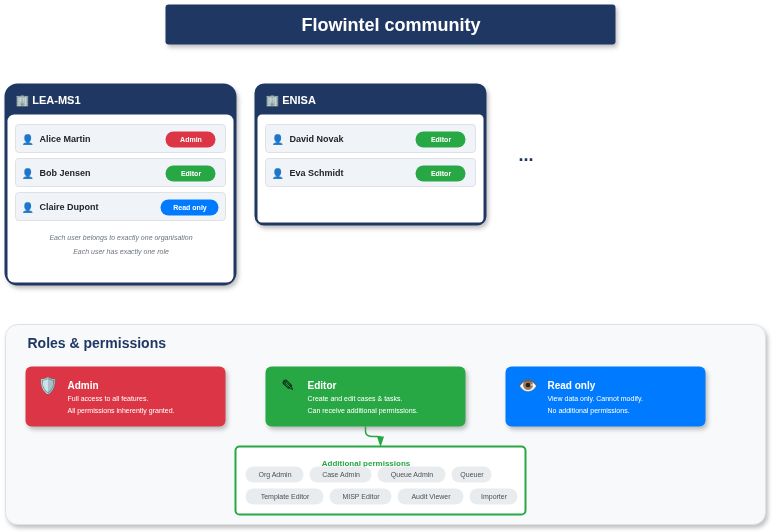


## Organisations

Organisations in Flowintel represent the teams or entities that work on cases. In a multi-tenant deployment, each organisation typically maps to a separate company, partner or constituent. In a single-organisation setup, you can use organisations to represent internal departments or teams, for instance Legal, Audit, Forensics and First-line response. This allows you to track case ownership per department and control visibility through private cases.

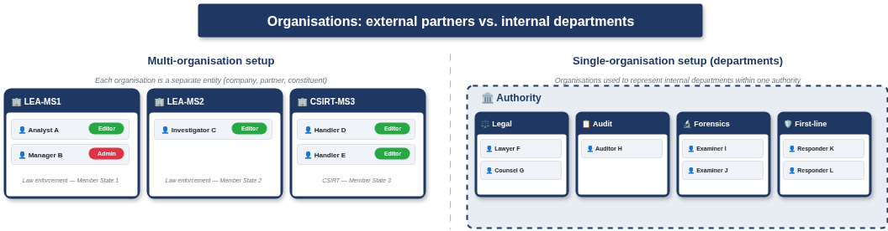

### Who can manage organisations

You must be logged in and hold the **Admin** system role. Only administrators can create, edit or delete organisations.

### Creating an organisation

Navigate to **Community > Orgs** and click the button to add a new organisation.

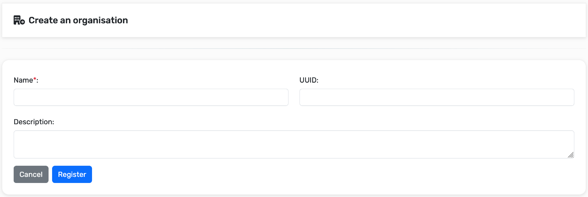

You need to provide:

- **Name** (required): the display name of the organisation. Must be unique across the platform.
- **UUID** (optional): a universally unique identifier for the organisation. If you leave this field empty, Flowintel generates one for you automatically. It is recommended to supply your own UUID if you want consistency with external systems.
- **Description** (optional): a free-text description of the organisation.

### Editing an organisation

From the **Community > Orgs** page, locate the organisation you wish to change and click the edit button. You can update the name, UUID or description. Changes take effect straight away.

### Deleting an organisation

You can delete an organisation from the same **Community > Orgs** page. Flowintel will not allow you to delete an organisation if it still has users or if it owns cases. You must first reassign or remove the users and transfer or delete the associated cases before the organisation can be removed.


## Users

### Who can manage users

You must be logged in with sufficient privileges. There are two levels of user management:

- **Admin**: full control over all users across all organisations.
- **Org Admin** (an Editor permission): can create and edit users, but only within their own organisation. An Org Admin cannot assign the Admin system role and cannot move a user to a different organisation.

### Creating a user

Navigate to **Community > Users** and click the button to add a new user.

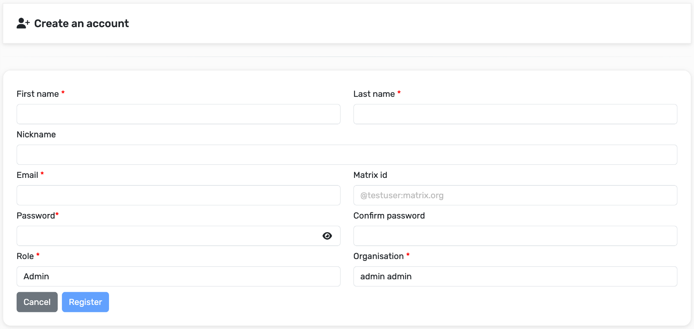

The following fields are available:

- **First name** (required)
- **Last name** (required)
- **Nickname** (optional)
- **Email** (required): this also serves as the login. The email address must be unique within Flowintel; no two users can share the same email.
- **Matrix ID** (optional): for integration with Matrix messaging.
- **Password** (required): must be between 8 and 64 characters and contain at least one uppercase letter, one lowercase letter and one digit.
- **Confirm password** (required): must match the password.
- **Role** (required): select one of the available roles.
- **Organisation** (required): select the organisation the user belongs to.

Because Flowintel does not send email notifications, the administrator sets the initial password and must share it with the user through a separate, secure channel. There is no self-service signup or automated password distribution.

### Editing a user

From the **Community > Users** page, find the user and click the edit button. You can change any of the fields listed above. If you need to reset the password, tick the **Change password** option and enter the new credentials. Again, communicate the new password through a secure channel outside of Flowintel.

Changes to a user profile take effect immediately. The user does not need to log out and log back in.

### Deleting a user

When you delete a user, Flowintel asks for confirmation first. Once confirmed, the deletion is permanent and cannot be undone.

Note that you cannot delete your own account.


### Microsoft Entra ID single sign-on (optional)

If your organisation uses Microsoft Entra ID (formerly Azure Active Directory), Flowintel can authenticate users through single sign-on. When SSO is enabled, a **Sign in with Microsoft** button appears on the login page alongside the standard email and password fields.

When a user clicks **Sign in with Microsoft**, they are redirected to the Microsoft login page. After successful authentication, Microsoft sends them back to Flowintel. Flowintel then reads the user's email address and Entra ID group memberships from the authentication token and either logs them into an existing account or creates a new account automatically.

Entra ID group membership determines the user's role. The administrator maps Entra ID groups to Flowintel roles in the server configuration. The mapping follows a priority order: Admin, Editor, Case Admin, Queue Admin, Queuer, then Read Only. A user who belongs to multiple groups receives the highest-priority role. If a user is not a member of any mapped group, login is denied.

Because Flowintel creates accounts automatically on first SSO login, there is no need for the administrator to create user records in advance. New users are assigned to the default organisation and receive the role that matches their Entra ID group membership. Administrators are notified when a user in the Admin group logs in for the first time, so they can review the account.

SSO and local authentication can coexist. Users who do not have a Microsoft account can still log in with their email and password. SSO configuration, including the Azure tenant ID, client ID, client secret and group mappings, is managed in the server configuration file (`conf/config.py`). Refer to the [installation manual](installation-manual.md) for detailed setup instructions.


## Roles

### Who can manage roles

You must be logged in with the **Admin** system role. Only administrators can create, edit or delete roles.

### Understanding roles: system roles

A role combines a system role type with optional additional permissions. Every role starts with one of three system role types:

| System role | Description |
|---|---|
| **Admin** | Full access to all features and settings. An Admin inherently has all additional permissions. |
| **Read Only** | Can view data but cannot create or modify anything. Cannot have additional permissions. |
| **Editor** | Can create and edit content such as cases and tasks. Additional permissions can be granted to extend what an Editor is allowed to do. |

The three system roles - Admin, Read Only and Editor - are mutually exclusive. You select one per role.

### Additional permissions

When you choose Editor as the system role type, you can grant further permissions from the categories listed below. These permissions have no effect on Admin roles (which already have full access) or Read Only roles (which cannot perform any write actions).

**Organisation Management**

| Permission | Description |
|---|---|
| Org Admin | Allows the user to add, edit or remove users within their own organisation. |

**Privileged Cases**

| Permission | Description |
|---|---|
| Case Admin | Can create and complete cases, and can mark a case as privileged. |
| Queue Admin | Can approve tasks within privileged cases. |
| Queuer | Can request tasks within privileged cases. |

**Audit and Logging**

| Permission | Description |
|---|---|
| Audit Viewer | Allows the user to view history and audit logs. |

**Editor Tools**

| Permission | Description |
|---|---|
| Template Editor | Allows the user to manage case, task or note templates. |
| MISP Editor | Allows the user to manage MISP integration settings. |
| Importer | Allows the user to import data into Flowintel. |

### Creating a role

Navigate to **Community > Roles** and click the button to add a new role.

You need to provide:

- **Name** (required): must be unique.
- **Description** (optional).

Then select the system role type and, if applicable, the additional permissions.

### Editing a role

From the **Community > Roles** page, find the role and click the edit button. You can change the name, description and permissions. Changes to a role take effect immediately for all users who hold that role. Users do not need to log out and log back in.

Note that the three built-in system roles (Admin, Read Only, Editor) cannot be edited or deleted.

### Deleting a role

You can delete a custom role from the **Community > Roles** page. Flowintel will not allow you to delete a role that is currently assigned to one or more users. You must first reassign those users to a different role.

## Your own profile

Your user profile is accessible from the top right of the screen. The navigation bar displays your first and last name together with a coloured badge that gives a quick visual indication of your role: a red shield for Admin, a blue eye for Read Only, or a green pen for Editor. If your Editor role includes additional permissions such as Org Admin or Queue Admin, small icons appear inside the badge as well.

Clicking your name opens a dropdown menu with a link to **My profile**. From there you can view your account details including your name, email, organisation, role and API key.

### Editing your profile

To edit your profile, click the **Edit** button on the profile page. You can change your first name, last name, nickname, Matrix ID and email address. To change your password, tick the **Change password** checkbox and fill in the new password and confirmation fields.

You cannot change your own role or organisation. Only an administrator can do that.

Your API key is shown on the profile page in a blurred state. You can reveal it by clicking the eye icon next to it. If you need a new API key, use the reset button to generate one. The old key is invalidated immediately.

All changes to your profile take effect straight away without needing to log out and log back in.

## Community statistics

Administrators can view statistics about the Flowintel community under **Tools > Stats** on the **Community** tab. This page shows the total number of organisations and users, along with charts for users per organisation, users per role, open cases per organisation and tasks per user.

This tab is only accessible to users with the Admin system role.

## Password reset

Users can change their own password at any time from their profile page. However, if a user forgets their password, they cannot request an automated reset by email. This is by design, for security reasons.

Instead, the password reset process works as follows:

1. The user attempts to log in and enters incorrect credentials.
2. After the failed login attempt, Flowintel shows a link to request a password reset.
3. The user confirms their email address and submits the request.
4. All administrators receive a notification informing them that the user has requested a password reset.
5. An administrator navigates to **Community > Users**, finds the user and manually resets their password.
6. The administrator shares the new password with the user through a separate, secure channel.

Flowintel applies rate limiting to both login attempts and password reset requests to prevent abuse.

Also for security reasons the password reset link is not shown immediately on the login page, it is only accessible after a failed login.


## Flowintel administration and system settings

After installation, an administrator can adjust a number of settings to match your organisation's policies and branding. Most of these settings are available under **Tools > System settings** in the web interface. Settings marked with **CLI** on the system settings page can only be changed in the configuration file (`conf/config.py`) and require a restart of the application.

This section covers the settings that are most relevant to how your organisation uses Flowintel day to day.

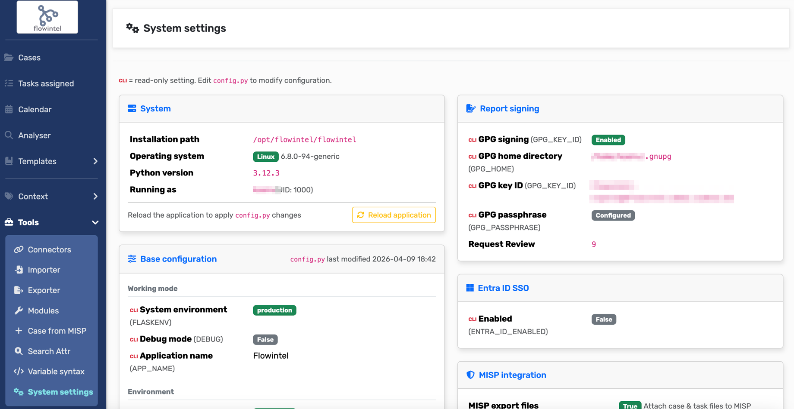

Note that the section does **not cover installation specific settings**, please refer to the installation manual for configuration settings such as the secret key, Flask url and port, session storage, SSO integration or proxy configuration.

## Privilege cases and restrict view for non-admin users

The settings in this section control how the privileged case workflow behaves and whether users can see members of other organisations.

### Privileged case enforcement

The `ENFORCE_PRIVILEGED_CASE` setting controls whether every new case is automatically created as a privileged case. When set to `True`, the privileged checkbox on the case creation form is ticked and locked, and users cannot create non-privileged cases. When set to `False` (the default), users can choose whether to make a case privileged on a case-by-case basis.

| Setting | Default | Changeable from UI |
|---|---|---|
| `ENFORCE_PRIVILEGED_CASE` | `False` | Yes |

Enable this setting when your organisation requires every investigation to follow a review workflow, for example in regulated environments where all analyst work must be checked before it is accepted.

### Privileged case admin assignment

`PRIVILEGED_CASE_ADD_ADMIN_ON_TASK_REQUEST` controls whether approvers (Admin, Case Admin and Queue Admin users) are automatically assigned to a task when it enters the Requested or Request Review status. When enabled, the task appears in the approvers' personal task list. When disabled (the default), approvers rely on notifications to find tasks that need their attention.

| Setting | Default | Changeable from UI |
|---|---|---|
| `PRIVILEGED_CASE_ADD_ADMIN_ON_TASK_REQUEST` | `False` | No (CLI only) |


### Task status identifiers

The privileged case workflow uses four special task statuses that are created during installation. The following settings map those statuses to their database identifiers. Under normal circumstances, you do not need to change these values.

| Setting | Default | Description |
|---|---|---|
| `TASK_REQUESTED` | `7` | A task proposed by a Queuer, awaiting approval. |
| `TASK_APPROVED` | `8` | A task approved by an Admin, Case Admin or Queue Admin. |
| `TASK_REJECTED` | `5` | A task rejected by an approver. |
| `TASK_REQUEST_REVIEW` | `9` | A completed task submitted for final review before it can be marked as Finished. |

### Organisation view restriction

The `LIMIT_USER_VIEW_TO_ORG` setting controls whether non-admin users can see users from other organisations. When enabled, each user can only see other users within their own organisation. Administrators always see all users regardless of this setting.

| Setting | Default | Changeable from UI |
|---|---|---|
| `LIMIT_USER_VIEW_TO_ORG` | `False` | Yes |

Enable this setting when your deployment hosts multiple organisations that should not be aware of each other's membership. When disabled (the default), all users can see users from all organisations in the community user list.

## Theming and customisations

Flowintel can be adapted to match your organisation's visual identity and communication policies. The settings below let you change the application name, replace logos, add welcome text to the login page and configure a GDPR notice. Most of these can be changed from the web interface without restarting the application.

### Application name

The `APP_NAME` setting controls the name that appears in browser tab titles, alt text for logos and other places where the application identifies itself. Change it if you want the platform to carry your organisation's branding instead of the default "Flowintel" name.

| Setting | Default | Changeable from UI |
|---|---|---|
| `APP_NAME` | `Flowintel` | No (CLI only) |


### Logos and branding

Flowintel allows you to customise the visual appearance of the platform to match your organisation's identity.

| Setting | Default | Description |
|---|---|---|
| `MAIN_LOGO` | `/static/image/flowintel.png` | The logo displayed in the main navigation bar. |
| `TOPRIGHT_LOGO` | Not set | An optional second logo displayed in the top right corner of the navigation bar. Useful for displaying your organisation's logo alongside the Flowintel logo. |
| `WELCOME_TEXT_TOP` | Not set | Text displayed above the login form on the welcome page. Use it to show your organisation's name or a greeting. |
| `WELCOME_TEXT_BOTTOM` | Not set | Text displayed below the login form on the welcome page. Use it for additional information or a short message. |
| `WELCOME_LOGO` | Not set | An optional logo displayed on the welcome (login) page. |
| `FOOTER_1_LOGO` | Not set | An optional logo displayed in the footer area of the application. Useful for displaying a project logo. |
| `FOOTER_2_LOGO` | Not set | An second optional logo displayed in the footer area of the application. Useful for displaying a project logo. |

To use a custom logo, place the image file in the `app/static/image/` directory (or any location accessible to the web server) and set the path accordingly. For example, to use your organisation's logo as the main navigation logo, place it at `app/static/image/myorg-logo.png` and set `MAIN_LOGO` to `/static/image/myorg-logo.png`.


### GDPR and privacy notice

When `SHOW_GDPR_NOTICE` is enabled, Flowintel displays an informational banner on the case creation form and the case detail page. The banner reminds users to be mindful of privacy regulations when entering personal or sensitive data.

| Setting | Default | Changeable from UI |
|---|---|---|
| `SHOW_GDPR_NOTICE` | `True` | Yes |
| `GDPR_NOTICE` | *Please be mindful of GDPR and privacy regulations when adding personal or sensitive information to cases and tasks.* | Yes |

You can customise the notice text to reference your organisation's own data handling policies. To remove the notice entirely, disable `SHOW_GDPR_NOTICE`.


## Report signing with GPG

Flowintel can sign generated case reports with a GPG key (digital report signing). When configured, every report includes a detached ASCII-armoured signature, the identity of the signing key and the signing timestamp. Recipients can verify the signature to confirm that the report was produced by your Flowintel instance and has not been altered.

The following three settings control the behaviour:

| Setting | Description |
|---|---|
| `GPG_BINARY` | Absolute path to the gpg binary. |
| `GPG_HOME` | Absolute path to the `.gnupg` directory that holds the signing key. Leave empty to use the default keyring of the process owner (`~/.gnupg`). |
| `GPG_KEY_ID` | Fingerprint or email address that identifies the signing key. Must match a key in the keyring. This is the only setting that enables or disables signing: leave it empty to disable signing entirely. |
| `GPG_PASSPHRASE` | Passphrase to unlock the private key. Leave empty if the key has no passphrase or if you rely on the `gpg-agent` cache. |

To disable signing, clear `GPG_KEY_ID`. Setting `GPG_HOME` or `GPG_PASSPHRASE` to an empty string does not disable signing: an empty `GPG_HOME` falls back to the default keyring, and an empty passphrase allows the `gpg-agent` to provide cached credentials.

For detailed instructions on generating a GPG key and configuring Flowintel for report signing, refer to the [installation manual](installation-manual.md).


## Logging

Flowintel writes two types of log output: general application logs and audit logs. Both are written to the same log file.

| Setting | Default | Changeable from UI |
|---|---|---|
| `LOG_FILE` | `record.log` | Yes |
| `AUDIT_LOG_PREFIX` | `AUDIT` | Yes |

The `LOG_FILE` setting specifies the name of the log file, relative to the Flowintel root directory. All application messages, warnings and errors are written here.

The `AUDIT_LOG_PREFIX` setting defines the prefix that Flowintel adds to audit log entries. Audit entries record security-relevant actions such as case creation, user management and report generation. The prefix makes it straightforward to filter audit entries from the general log using standard tools:

```bash
grep '^AUDIT' record.log
```

Change the prefix if your log aggregation system expects a different format, or if you run multiple Flowintel instances and need to distinguish their audit streams.


## MISP integration settings

When Flowintel pushes a case to MISP, it creates or updates a MISP event with the case metadata, tags, objects and attributes. The settings below control the default values applied to those events and whether attached files are included.

| Setting | Default | Description |
|---|---|---|
| `MISP_EXPORT_FILES` | `False` | When enabled, case and task files are attached to the MISP event during a push. When disabled, only metadata, tags and MISP objects are exported. |
| `MISP_EVENT_THREAT_LEVEL` | `4` (Undefined) | The threat level assigned to new MISP events. Possible values: `1` = High, `2` = Medium, `3` = Low, `4` = Undefined. |
| `MISP_EVENT_ANALYSIS` | `0` (Initial) | The analysis state assigned to new MISP events. Possible values: `0` = Initial, `1` = Ongoing, `2` = Complete. |
| `MISP_ADD_LOCAL_TAGS_ALL_EVENTS` | `curation:source="flowintel"` | A local tag (or list of tags) added to every MISP event that Flowintel creates or updates. This makes it easy to identify Flowintel-originated events on the MISP side. Leave empty to skip tagging. |

These settings apply globally to all MISP push operations. They do not affect how data is pulled from MISP into Flowintel.


## Central template repository settings

The central template repository feature lets you maintain a shared library of case and task templates on the server's filesystem and import them into Flowintel through the web interface. Template repositories are local directories on the server. Flowintel does not fetch them from a remote source. If your templates live in a Git repository, you first clone that repository onto the server, then register it in Flowintel.

### Setting up a repository

Before adding a repository in the Flowintel interface, clone it to the server:

```bash
cd /opt/flowintel/flowintel
git clone <repository-url> modules/repositories/<name>
```

The base directory where Flowintel looks for repositories defaults to `modules/repositories` relative to the project root. This can be changed with the `REPOSITORY_BASE_PATH` setting in `conf/config.py`.

| Setting | Default | Changeable from UI |
|---|---|---|
| `REPOSITORY_BASE_PATH` | `modules/repositories` | No (CLI only) |

Each repository directory must contain a `manifest.json` file with at least the following fields: 

```json
{
  "name": "My Template Repository",
  "description": "A short description of what this repository contains.",
  "uuid": "xxxxxxxx-xxxx-4xxx-yxxx-xxxxxxxxxxxx",
  "version": 1
}
```

Template files are organised into `case/` and `task/` subdirectories within the repository.

Once the directory is in place, navigate to **Templates > Repositories** in the web interface. Click **Scan** to discover the new directory, then add it as a registered repository.

### Repository actions

| Action | Description |
|---|---|
| **Check** | Verify the local path and validate `manifest.json`. |
| **Sync** | Re-scan the repository directory and refresh the template list to pick up changes from the filesystem. |
| **Edit** | Update the repository name, URL or local path. |
| **Delete** | Remove the repository from Flowintel. This does not delete the files on disk. |

### Template actions

| Action | Description |
|---|---|
| **View** | Preview the raw template JSON from the repository. |
| **Diff** | Compare the repository version with your local copy to see what has changed. |
| **Refresh** | Re-import the template to update an already-imported local copy with the latest repository version. |
| **Import** | Add this template to Flowintel for the first time. |

Only users with the **Template Editor** role can manage repositories and import templates.


## Managing connectors and instances

Connectors allow Flowintel to exchange data with external platforms such as MISP and AIL. They are managed under **Tools > Connectors** in the sidebar.

A connector represents a type of external platform, for example MISP or AIL. Each connector can have one or more **instances**, where each instance is the actual connection to a specific server. You could, for instance, have a single MISP connector with two instances: one pointing to your production MISP and another to a community MISP.

The connector page lists all configured connectors as expandable cards. Clicking a card reveals the instances underneath it. A search bar at the top lets you filter connectors by name.

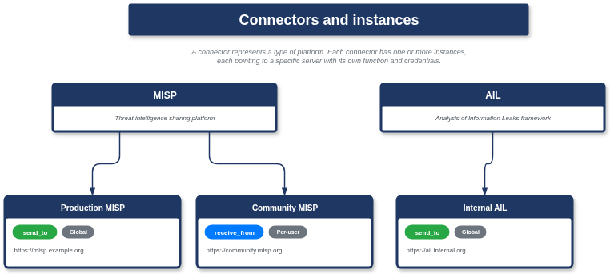

### Adding a connector

To add a connector, navigate to **Tools > Connectors** and click the **Plus** button. Fill in the following fields:

- **Name** (required): a unique name for the connector, such as "MISP" or "AIL".
- **Description** (optional): a short explanation of what this connector represents.
- **Icon** (optional): choose an icon from the icon library. The icon is purely cosmetic and helps identify the connector at a glance.

Click **Create** to save.

### Editing and deleting a connector

To edit a connector, click the **Edit** button on the connector card and update the name, description or icon. To delete a connector, click the **Delete** button. If the connector still has instances, the delete button is disabled. You must remove all instances before the connector itself can be deleted.

### Icons

Administrators can manage a library of connector icons under **Tools > Connectors > Icons**. Each icon is a small image file uploaded to the server. When you create or edit a connector, you select an icon from this library. Connectors that have no icon assigned use a default icon.

### Permissions

Only users with the **Admin** role can create, edit or delete connectors, connector instances and connector icons at the platform level. Users with the **MISP Editor** role can add, edit and delete instances, but not the connectors themselves. All authenticated users can view the list of configured connectors and their instances.

To use connectors within cases (attaching them, pushing or pulling data), you need the **MISP Editor** role. How connectors are used on cases and tasks is covered in the **Connectors** section for cases and tasks earlier in this manual.

At present, the connector functionality is primarily focused on MISP integration. Support for AIL is available but will be extended further in future releases.

### Instances

An instance is the actual connection to an external server. It stores the server URL, the connection type, an optional description and the API key needed to authenticate. Instances belong to a connector and cannot exist independently.

#### Adding an instance

To add an instance, open the connector card and click the **Plus** button. Fill in the following fields:

- **Name** (required): a descriptive label, such as "Production MISP" or "Community MISP".
- **URL** (required): the base URL of the external server (e.g. `https://misp.example.org`). The URL must start with `http://` or `https://`.
- **Description** (optional): a short explanation of what this instance is used for.
- **Type** (required): determines how the instance interacts with the external platform. Flowintel discovers the available types automatically from its modules directory. Three types are available:
  - **send_to**: push data from Flowintel to the external instance. For MISP, this exports cases, objects and attributes as MISP events.
  - **receive_from**: pull data from the external instance into Flowintel. For MISP, this imports or updates cases from existing MISP events.
  - **notify_user**: send notifications to Flowintel users through the external platform. Built-in modules support email (via SMTP) and Matrix messaging.
- **API key** (optional): the authentication key for the external service. See the section on API key modes below.
- **Global connector** (checkbox): determines whether the instance and its API key are shared across all users. See the section on API key modes below.

Click **Create** to save.

#### API key modes

Each instance can store its API key in one of two ways:

- **Global (shared)**: when the **Global connector** checkbox is enabled, the API key is stored on the instance itself and shared across all users. Every user who interacts with this instance uses the same key. The instance is visible to all authenticated users.
- **Per-user**: when the checkbox is left unchecked, the API key is stored against each individual user. Only users who have configured their own key for this instance can see and use it. This is useful when each analyst has a personal MISP API key tied to their own MISP account.

When a user creates a per-user instance, only they have access initially. Other users who need access must add their own API key for that instance.

#### Editing and deleting an instance

To edit an instance, click the **Edit** button on the instance row. You can update any field. If you leave the API key field blank during editing, the existing key is preserved.

To delete an instance, click the **Delete** button. If the instance is still linked to one or more cases or tasks, the delete button is disabled. You must remove the instance from all cases and tasks before it can be deleted.

#### Checking connectivity

For MISP instances, a **Check connectivity** button is available on each instance row. Clicking it attempts to connect to the MISP server using the configured URL and API key (global or per-user, depending on the mode). The result is shown as a notification indicating whether the connection succeeded or failed. This is a quick way to verify that the URL and API key are correct without having to push or pull data.

### Setting up a MISP connector

A typical setup for MISP integration involves the following steps:

1. Navigate to **Tools > Connectors** and create a connector named "MISP" if one does not already exist.
2. Open the MISP connector and click the **Plus** button to add an instance.
3. Provide the instance name, the MISP server URL, select the type and enter the API key. Choose whether the key should be global or per-user.
4. Optionally, use the **Check connectivity** button to verify the connection.

A common configuration is to have one **send_to** instance for pushing intelligence to your production MISP and one **receive_from** instance for pulling updates back.

### Multiple instances

There is no limit on the number of instances you can configure. You might have separate instances for:

- An internal MISP server and a community MISP server.
- A production MISP and a staging MISP.
- A MISP instance for sending and another for receiving.
- Different external platforms entirely (MISP and AIL).
- A notification instance for email alerts and another for Matrix messages.

Each instance operates independently. When you attach connectors to a case, you select specific instances, so you have full control over where data flows.


# Frequently asked questions

**A user has lost their password. What should I do?**

There are two options. If you are an administrator or Org Admin, you can reset the password directly from **Community > Users** by editing the user and ticking **Change password**. Share the new password with the user through a secure channel. Alternatively, ask the user to attempt a login so that Flowintel offers them the option to submit a password reset request. Administrators and Org Admins will then receive a notification and can follow up from there.

**I want users to only be able to consult data, not alter it.**

Assign a role with the **Read Only** system role type to those users. A Read Only user can view cases, tasks and other data but cannot create or modify anything.

**How do I know which users are defined under an organisation?**

Navigate to **Community > Orgs** and click on the organisation. The list of users belonging to that organisation will be displayed, together with their roles.

**Can I link two cases together?**

Yes. On the case detail page, use the link function to connect one case to another. The link is bidirectional: once created, it appears on both cases. To remove it, delete the link from either side.

**Can I create a recurring case?**

Yes. On the case detail page you can set one of four recurrence patterns: once (a specific date), daily, weekly (on a chosen day) or monthly (on a chosen date). Setting a recurrence changes the case status to Recurring. The actual duplication of the case is handled by a background process (`startNotif.py`), so make sure it is running.

**How do I create a case template from an existing case?**

Open the case detail page and use the option to create a template. Flowintel copies the case structure, including tasks, tags, galaxy clusters, custom tags, subtasks and URL tools. Notes, files, deadlines and user assignments are not included in the template.

**What is HedgeDoc integration and how does it work?**

Flowintel can display content from a HedgeDoc collaborative note inside a case. Set the HedgeDoc URL on the case detail page and the content will be fetched and rendered read-only. Flowintel only reads from HedgeDoc; it never writes back. Make sure the URL does not include query parameters.

**Can I download my case data?**

Yes. You can download a case as a JSON file from the case detail page. The export includes the case metadata, tasks and MISP objects, but does not include uploaded files. To export case templates, use the download option under **Templating > Case templates**.

**How do I import a case or case template from JSON?**

Navigate to **Tools > Importer**.  The JSON format must match the structure Flowintel expects, which is the same format produced by the template and case export.

**I deleted a custom tag. Will it be removed from all cases and tasks?**

Yes. Deleting a custom tag removes it from every case, task, case template and task template where it was used. This action cascades and cannot be undone. If you want to keep the tag on existing items but prevent it from being assigned to new ones, consider deactivating it instead of deleting it.

**How do I create a case report?**

Open the case and click **Report**. The report builder page presents a set of toggle switches grouped into three columns: Case (metadata, title, description, tasks, files, notes), Context (tags and galaxies, MISP objects, taxonomies appendix) and Audit (audit logs, timeline). Enable the sections you want and click **Generate report**. The output is rendered as formatted Markdown in your browser. From there you can copy the text, view the raw Markdown, download the report as a PDF or attach the PDF directly to the case as a file. The report builder is available to administrators.

**How do I get a digitally signed case report?**

If your administrator has configured GPG signing on the server, every generated report is signed automatically. You do not need to do anything extra. After the report is generated, a green banner appears showing the identity of the signing key and the timestamp. 

**Can I convert an external URL into a task note?**

Yes. If a task has an external reference (a URL), you can convert the content of that page into a Markdown note. Click the conversion button next to the external reference on the task detail page. Flowintel sends the URL to the MISP modules service, which fetches the page and converts the HTML to Markdown. The result is saved as a new note on the task, prefixed with the source URL and the conversion timestamp.

**Does Flowintel support email or Matrix notifications?**

Flowintel can send notifications through email (SMTP) and Matrix messaging. These are configured as connector instances of the **notify_user** type. An administrator needs to set up the SMTP or Matrix server details in the configuration. Once configured, notifications such as task assignments and deadline reminders can be pushed to users through those channels.

**Who can see case history and audit logs?**

Any logged-in user can view the history and audit log of a case, provided the case is not private. For private cases, only users whose organisation is assigned to the case and administrators can access the history. Both history and audit logs can be downloaded as plain text or Markdown files.


# Troubleshooting

This section covers common issues that users may encounter when using Flowintel.

**I cannot see a case that I know exists.**

The case is most likely marked as private. Private cases are only visible to users whose organisation is assigned to the case and to administrators. Ask the case owner to add your organisation, or contact an administrator.

**I cannot create or edit a case.**

Check your role. Users with the **Read Only** system role cannot create or modify any data. If you have the **Editor** role, confirm that your organisation is assigned to the case. In a privileged case, only users with the Admin, Case Admin or Queue Admin role can perform certain actions.

**My file upload fails or I receive a "413 Request Entity Too Large" error.**

The file exceeds the maximum upload size configured on the server. Contact your administrator to check or increase the `MAX_CONTENT_LENGTH` setting in the Flowintel configuration and the `client_max_body_size` directive in the NGINX configuration.

**I cannot push data to MISP.**

Verify that you have the **MISP Editor** permission. Then check that a connector instance of the **send_to** type is attached to the case or task. If the push still fails, use the **Check connectivity** button on the connector instance under **Tools > Connectors** to verify the connection. Common causes include an incorrect URL, an expired or invalid API key, or a network issue between Flowintel and the MISP server.

**I cannot pull data from MISP.**

Ensure that a connector instance of the **receive_from** type is attached to the case and that the connector identifier (MISP event UUID) is set correctly. Use **Check connectivity** to verify the connection to the MISP instance.

**The analyser returns no results.**

This is not necessarily an error. The external service may simply have no data for the attribute you queried. If you see an error message instead, check that the module is configured with a valid API key under **Analyser > Config**. Some modules require a paid subscription.

**I forgot my password.**

Flowintel does not support automated password recovery by email. On the login page, after a failed login attempt, you will see a link to request a password reset. Submit the request and your administrators will be notified. They will reset your password manually and share it with you through a secure channel.

**Notifications are not appearing.**

Notifications are created automatically based on events such as task assignments and case status changes. If you are not receiving notifications, check that you are assigned to the relevant tasks or that your organisation is assigned to the case. Notifications are user-specific and respect access control.

**I cannot delete a connector instance.**

A connector instance cannot be deleted if it is still linked to one or more cases or tasks. Remove the instance from all cases and tasks first, then delete it from the connector management page.

**The calendar does not show my cases or tasks.**

The calendar displays cases owned by your organisation and tasks assigned to you. If an item is missing, check that the case has a deadline set (or a creation date, depending on which date filter you are using). Cases and tasks without dates do not appear on the calendar.

**I cannot delete an organisation.**

Flowintel prevents you from deleting an organisation that still has users assigned to it or that owns cases. Reassign or remove all users first, then transfer or delete any cases owned by that organisation. Only then will the delete action become available.

**I cannot delete a role.**

A role cannot be deleted while it is still assigned to one or more users. Navigate to **Community > Users**, find the users who hold that role and reassign them to a different role. Once no users hold the role, you can delete it. The three built-in system roles (Admin, Read Only, Editor) cannot be deleted at all.

**The HedgeDoc content does not load on the case page.**

Check that the HedgeDoc URL is correct and accessible from the Flowintel server.

**I cannot assign a user to a task.**

Only users whose organisation is assigned to the case can be assigned to tasks within that case. If the user you are looking for does not appear in the assignment list, check whether their organisation has been added to the case. Also verify that you have permission to assign users: in a privileged case with a restricted task (Requested, Rejected or Request Review status), only Admin, Case Admin and Queue Admin users can make changes.

**Changes I made to a custom tag are not reflected on existing cases.**

Editing a custom tag (for example, changing its name, colour or icon) updates the tag definition globally. However, your browser may be caching the old values. Try a hard refresh. If you deactivated a tag, it remains attached to cases and tasks where it was already in use, but it will no longer appear in the tag picker when tagging new items.

**I pushed a case to MISP but the event is empty or incomplete.**

Verify that the MISP connector instance attached to the case is of the **send_to** type. If you are pushing MISP objects from a task, make sure the objects and their attributes have been saved correctly before pushing. Common issues include an expired MISP API key, an incorrect server URL or the MISP user not having permission to create events. Use the **Check connectivity** button to rule out connection problems first.


# Setting up Flowintel for demo or test environments

Flowintel ships with sample cases and a community data set that you can use to populate a fresh instance for testing, training or live demonstrations. A development installation imports the sample cases automatically during setup, so users have something to explore straight away. A production installation starts with a clean database and skips this data entirely.

If you are setting up a production instance for demo or training purposes, you can import the test data manually. There are two approaches, depending on what you need:

| Approach | Use case | Method | What it creates |
|---|---|---|---|
| **Sample cases only** | Quick testing or exploration | Imports directly into the database; Flowintel does not need to be running | Two pre-built cases under the admin user |
| **Full community data set** | Demos and training | Uses the REST API; requires an admin API key and Flowintel to be running | Step 1: organisations, users and roles. Step 2: cases assigned across organisations with the privileged workflow active |

## Test data

### What gets created

Flowintel looks for JSON files matching the pattern `case_*.json` inside the `tests/testdata/` directory. Each file describes a complete case with its tasks, tags, subtasks, notes and any associated MISP objects. The files shipped with Flowintel include:

| Case | Tasks | Highlights |
|---|---|---|
| Forensic Case | 4 (Extract disk, Create timeline, Extract and analyse event logs, Write report) | Notes on each task, TLP and ENISA taxonomy tags |
| New Compromised Workstation | 7 (Containment through to post-incident review) | Subtasks, deadlines, time estimates, URLs and tools, workflow and PAP tags, a MISP file object |

These sample cases are designed to show a variety of Flowintel features in action: task status progression, contextualisation with tags and galaxies, subtask checklists, file-level MISP objects and time tracking.

### Adding your own test data

You can add your own demonstration cases by placing additional JSON files in `tests/testdata/`. The file name must start with `case_` and end with `.json`. The easiest way to create one is to build a case manually in Flowintel, then download the case template as JSON from **Templating > Case templates > (your template) > Download**. Place the exported file in the `tests/testdata/` directory and it will be picked up the next time test data creation runs.


## Adding test data for demonstrations

Before you start, make sure you are in the folder where you installed Flowintel.

```bash
cd /opt/flowintel/flowintel
```

### Approach 1: Quick testing or exploration

You can trigger it in two ways:

- **As part of a full initialisation:** run `bash launch.sh -i`, which initialises the database, loads taxonomies and galaxies, updates MISP modules and then creates the default test cases.
- **Standalone:** run `python3 app.py -td` (or `python3 bin/create_test_data.py`) to create the test cases. The database must already exist and contain at least one admin user.


### Approach 2: Demos and training

For a more complete demo environment, you can import the full community data set. The community data set is defined in `tests/testdata/test-data-community.json`. It creates two organisations with a total of eight users spread across four custom roles, simulating a multi-team environment where you can demonstrate collaboration, case ownership and the privileged case workflow.

**What the community data set contains**

| Organisation | Users | Roles represented |
|---|---|---|
| LEA Organisation | Alice Manager, Bob Officer, Carol Officer, Dave Deputy, Eve Comms | OrgAdmin, CaseAdmin, QueueAdmin, Queuer, Read Only |
| CSIRT Organisation | Frank TeamLead, Grace Handler, Hank Junior | OrgAdmin, CaseAdmin, Queuer |

The four custom roles created are:

| Role | Permissions |
|---|---|
| OrgAdmin | Org Admin, Case Admin, Audit Viewer, Template Editor, MISP Editor, Importer |
| CaseAdmin | Case Admin |
| QueueAdmin | Queue Admin |
| Queuer | Queuer |

The built-in Read Only role (created during installation) is reused for Eve Comms.

When the script creates the community users, it generates a single random passphrase (for example `BrightCastle42`) and sets it as the password for all eight users. The script prints this shared password to the terminal, so take note of it. You need it to log in as different users during the demo. Each user also receives a unique API key, which the script saves to `tests/testdata/.community-api-keys.json` for use by the case import step.

#### Step 1: Create organisations, roles and users

The full community import uses the REST API, so Flowintel must be running. You need an admin API key for this step. You can find it in the Flowintel web interface under your profile.

Run the import through `launch.sh` (the `-tdc` flag stands for "test data community"):

```bash
bash launch.sh -tdc <your-admin-api-key>
```

Or call the script directly:

```bash
source env/bin/activate
python3 tests/testdata/init_community_data.py create --api-key <your-admin-api-key>
```

If Flowintel is running on a non-default address or port, add the `--url` flag:

```bash
python3 tests/testdata/init_community_data.py create --api-key <your-admin-api-key> --url http://192.168.1.50:7006
```

The script reads the organisation and user definitions from `test-data-community.json`, creates the roles, organisations and users through the admin API, and prints a summary:

```
Creating roles...
  Created: OrgAdmin
  Created: CaseAdmin
  Created: QueueAdmin
  Created: Queuer
Creating organisations...
  Created: LEA Organisation
  Created: CSIRT Organisation
Creating users...
  Created: Alice Manager (OrgAdmin)
  Created: Bob Officer (CaseAdmin)
  Created: Carol Officer (QueueAdmin)
  Created: Dave Deputy (Queuer)
  Created: Eve Comms (Read Only)
  Created: Frank TeamLead (OrgAdmin)
  Created: Grace Handler (CaseAdmin)
  Created: Hank Junior (Queuer)

API keys saved to /opt/flowintel/flowintel/tests/testdata/.community-api-keys.json

Shared password for all community users: CalmMeadow77
```

#### Step 2: Create community cases

Once the organisations, roles and users exist, import the sample cases through the REST API. This step does not require an admin API key because it reads the per-user keys from `.community-api-keys.json`, saved in the previous step.

```bash
bash launch.sh -tdcc
```

Or directly:

```bash
source env/bin/activate
python3 tests/testdata/init_community_cases.py create
```

The script creates each case as a CaseAdmin user from a randomly selected organisation, sets each case as privileged, creates tasks as a Queuer user (which triggers task-requested notifications for approvers), and adds notes, subtasks, URL tools and MISP objects from the case files. Each case title is prefixed with a random identifier (for example `TC-ABC47`) so you can run the import multiple times without name collisions. Every case description is tagged with `[community-test-case]` so the cleanup script can find and remove them later.

#### Create a demo admin account

The default admin account created during installation is intended for system administration, not for handing out to demo participants. Create a separate admin account that you can share with users who need to explore the admin interface during the demo.

Log in as the installation admin and navigate to **Community > Users**. Click the **Plus** button and create a new user with the following details:

| Field | Value |
|---|---|
| First name | Demo |
| Last name | Admin |
| Email | `admin-demo@account.test` |
| Password | Choose a password you are comfortable sharing |
| Admin | Yes |

This gives demo participants access to system settings, user management, connectors and other admin-only features without exposing the real admin credentials.

#### Set up a central template repository

The Flowintel project maintains a public template repository at [https://github.com/flowintel/flowintel-templates](https://github.com/flowintel/flowintel-templates). Cloning it into the demo environment gives users a ready-made set of templates to browse, compare and import.

From the Flowintel installation directory:

```bash
cd /opt/flowintel/flowintel
git clone https://github.com/flowintel/flowintel-templates modules/repositories/flowintel-templates
```

Then in the web interface, navigate to **Templates > Repositories** and click **Scan**. Flowintel detects the new directory and shows it as an available repository. Click **Add** to register it, then **Sync** to load the template list.

Demo users with the Template Editor role can now browse the repository, view and diff templates, and import them into the local instance.

## Sharing access with demo users

Once the community data set and cases have been imported, you can share the following information with the people who will be using the demo environment. Copy the block below, fill in the URL and password placeholders, and distribute it.

---

**Flowintel demo environment**

URL: `https://<your-flowintel-host>`

This environment contains two pre-built cases:

- **Forensic Case** a forensic investigation with four tasks: disk extraction, timeline creation, event log analysis and report writing. Tasks include notes and are tagged with TLP and ENISA taxonomy tags.
- **New Compromised Workstation** a malware investigation with seven tasks covering containment, evidence collection, malware analysis, impact assessment, eradication, MISP updates and post-incident review. Tasks include subtasks, deadlines, time estimates, URL tools, workflow and PAP tags, and a MISP file object.

Both cases are set as privileged, so tasks follow the approval workflow.

The following user accounts are available. All accounts share the same password.

**Password:** `<shared-password>`

**LEA Organisation** (Law enforcement agency)

| Name | Email | Role |
|---|---|---|
| Alice Manager | alice.manager@lea-org.test | OrgAdmin |
| Bob Officer | bob.officer@lea-org.test | CaseAdmin |
| Carol Officer | carol.officer@lea-org.test | QueueAdmin |
| Dave Deputy | dave.deputy@lea-org.test | Queuer |
| Eve Comms | eve.comms@lea-org.test | Read Only |

**CSIRT Organisation** (Computer security incident response team)

| Name | Email | Role |
|---|---|---|
| Frank TeamLead | frank.teamlead@csirt-org.test | OrgAdmin |
| Grace Handler | grace.handler@csirt-org.test | CaseAdmin |
| Hank Junior | hank.junior@csirt-org.test | Queuer |

**Admin access**

To explore system settings, user management and connectors, use the demo admin account:

| Email | Password |
|---|---|
| `admin-demo@account.test` | `<admin-demo-password>` |

---

## Removing test data

There are three ways to remove imported data, depending on how much you want to clean up.

### Remove community cases only

This deletes all cases whose description contains the `[community-test-case]` tag. It does not remove the community users, roles or organisations.

```bash
bash launch.sh -dtdcc
```

Or directly:

```bash
source env/bin/activate
python3 tests/testdata/init_community_cases.py delete
```

### Remove community users, roles and organisations

This removes the users, roles and organisations created by the community data script. You need the admin API key again:

```bash
bash launch.sh -dtdc <your-admin-api-key>
```

Or directly:

```bash
source env/bin/activate
python3 tests/testdata/init_community_data.py delete --api-key <your-admin-api-key>
```

The script also deletes the `.community-api-keys.json` file. When removing the full community data set, delete the cases first (with `-dtdcc`), then the users, roles and organisations (with `-dtdc`).

### Remove all cases and templates

To wipe all case data from the database (not just community test data), use the database cleaner script:

```bash
source env/bin/activate
python3 bin/clean_database.py
```

The script shows a summary of what will be deleted and asks for confirmation. To skip the prompt (for example in a scripted setup), pass the `--force` flag:

```bash
python3 bin/clean_database.py --force
```

This removes all cases, tasks, notes, subtasks, templates, notifications and file records. It does not remove user accounts, organisations, roles, taxonomies or MISP module data.

## Quick-reference table

| Action | `launch.sh` flag | Direct command |
|---|---|---|
| Import sample cases (database) | Built into `-i` (dev init) | `python3 app.py -td` |
| Create community users, roles and organisations | `-tdc <api-key>` | `python3 tests/testdata/init_community_data.py create --api-key <key>` |
| Create community cases | `-tdcc` | `python3 tests/testdata/init_community_cases.py create` |
| Delete community cases | `-dtdcc` | `python3 tests/testdata/init_community_cases.py delete` |
| Delete community users, roles and organisations | `-dtdc <api-key>` | `python3 tests/testdata/init_community_data.py delete --api-key <key>` |
| Wipe all cases and templates | — | `python3 bin/clean_database.py` |

## Demo walkthrough: the privileged case workflow

This walkthrough guides you through a hands-on demonstration of Flowintel's core features, centred around the four-eye review process described earlier in this manual. The steps follow a realistic investigation scenario where analysts propose work, approvers review it, and no single person can complete a task without oversight.

You will need two browser windows throughout: one for the approver and one for the analyst. Use two different browsers, or open one window in normal mode and the other in incognito (private browsing) mode.

### Prerequisites

- A running Flowintel instance with the database initialised.
- The community data set imported (see the sections above). This gives you the demo admin account and several community users with different roles.
- The demo admin account created (`admin-demo@account.test`).

### Step 1: Log in as the demo admin

In the first browser window, log in to Flowintel using the demo admin account (`admin-demo@account.test`). This window will serve as the approver's view throughout the walkthrough.

Navigate to the notification bell in the top bar and review any pending notifications. If you imported the community data set earlier, you will already see notifications for task requests created by the import script. This gives a first impression of how the notification system works.

### Step 2: Password reset and initial exploration

In the second browser window, attempt to log in as Grace Handler (`grace.handler@csirt-org.test`) but deliberately enter an incorrect password. After the failed attempt, Flowintel shows a link to request a password reset. Submit the request.

Switch to the admin window. A notification appears informing you that Grace Handler has requested a password reset. Navigate to **Community > Users**, find Grace Handler's account, click **Edit** and set a new password. Share that password with the person playing Grace (or note it down for yourself).

Back in the second browser, log in as Grace Handler with the new password. From the start page, browse the list of cases. Then navigate to the task list to see tasks across all accessible cases. This demonstrates how a newly onboarded user finds their way around.

### Step 3: Create and enrich a case as the Queuer

Log out of Grace Handler in the second browser and log in as Dave Deputy (`dave.deputy@lea-org.test`). Dave has the Queuer role, which means his tasks will go through the approval workflow.

Create a new case. Give it a descriptive title and tick the **Privileged case** checkbox. On the case detail page:

- **Add tags and galaxies.** Use the tag picker to attach TLP, PAP or other taxonomy tags. Add one or more galaxy clusters to contextualise the case.
- **Add a HedgeDoc note.** Set the HedgeDoc URL to a sample document (for example `https://hdoc.csirt-tooling.org/lFtyVLejS_uHbieYTycslQ`) and confirm that the content is rendered on the case page.
- **Add MISP objects.** Create a URL object and a file object to associate indicators with the case.
- **Upload a file.** Attach a sample CSV file to the case to demonstrate the file upload feature.

### Step 4: Request tasks as the Queuer

Still logged in as Dave Deputy, create two tasks on the case. Because Dave has the Queuer role, both tasks are created with the **Requested** status instead of the usual Created status. This is the four-eye principle in action: the Queuer proposes work, but an approver must accept it before the work can begin.

### Step 5: Approve a task as the Queue Admin

Log out of Dave Deputy in the second browser and log in as Carol Officer (`carol.officer@lea-org.test`). Carol has the QueueAdmin role.

Check the notification bell. Carol should see notifications about the two pending task requests. Open the case and review the tasks.

- **Approve** one of the two requested tasks. The task status changes to Approved, and Dave Deputy will be notified.
- Review the users assigned to the task. This shows how assignment and responsibility tracking work within a privileged case.

### Step 6: Work on the approved task as the Queuer

Switch to the second browser and log back in as Dave Deputy. Check the notifications to confirm that the task has been approved.

Open the approved task and change its status to **Ongoing**. Enrich the task to demonstrate the available features:

- **Add tags** to the task, such as workflow status tags or priority indicators.
- **Upload files** relevant to the analysis.
- **Add URL tools** linking to external references or resources.
- **Create subtasks** to break the work into smaller steps and tick some of them off.

When the work is complete, change the task status to **Request Review**. This sends a notification to the approvers, asking them to check the finished work before it can be closed.

### Step 7: Review, approve and decline

Switch to Carol Officer's browser. Check the notifications for the review request.

- Open the task that is awaiting review. If the work looks satisfactory, change the status to **Finished**. The four-eye cycle for this task is now complete.
- Open the second task, which is still in the Requested state. **Decline** it by changing the status to Rejected. Dave Deputy will be notified that the proposal was not accepted.
- Open the case detail page to review the overall case status and the history of actions).
- **Download the case** as a JSON file from the case detail page to demonstrate the export feature.

### Step 8: Calendar view

Still logged in as Carol Officer, navigate to the **Calendar** page. The calendar shows cases and tasks that have deadlines or dates associated with them. If you set deadlines on the case or tasks in earlier steps, they will appear here. This view helps users plan their work across multiple cases and spot upcoming deadlines.

### Step 9: Central template repository

Navigate to **Templates > Repositories**. If you set up the central template repository during the demo environment setup, the Flowintel community templates are already available. Browse the repository entries, view the raw JSON of a template, use **Diff** to compare a repository template with a local copy, and **Import** a template into your instance.

This demonstrates how organisations can distribute standardised case and task templates across multiple Flowintel deployments, keeping procedures consistent and up to date.
